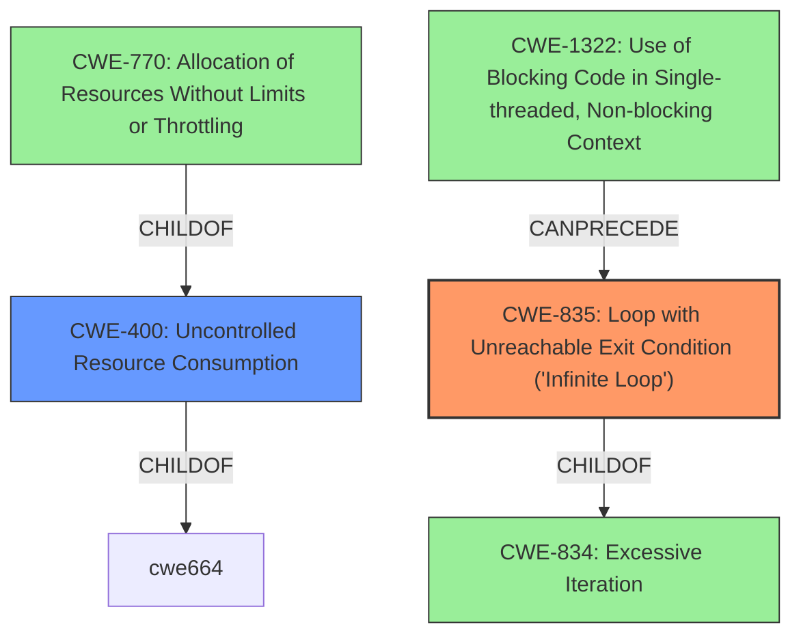

# Analysis for CVE-2021-3737

# Summary
| CWE ID  | CWE Name                                                      | Confidence | CWE Abstraction Level | CWE Vulnerability Mapping Label | CWE-Vulnerability Mapping Notes |
| :-------- | :------------------------------------------------------------ | :--------- | :---------------------- | :------------------------------ | :------------------------------ |
| CWE-835   | Loop with Unreachable Exit Condition ('Infinite Loop')       | 0.9        | Base                    | Primary                         | Allowed                       |
| CWE-400   | Uncontrolled Resource Consumption                             | 0.6        | Class                   | Secondary                       | Discouraged                    |

## Evidence and Confidence

*   **Confidence Score:** 0.8
*   **Evidence Strength:** HIGH

## Relationship Analysis

The primary CWE is CWE-835 (Loop with Unreachable Exit Condition), which is a Base level CWE. It is child of CWE-834 (Excessive Iteration). The secondary CWE is CWE-400 (Uncontrolled Resource Consumption), which is a Class level CWE. CWE-400 is a parent of CWE-770 (Allocation of Resources Without Limits or Throttling). CWE-835 can be a result of CWE-1322 (Use of Blocking Code in Single-threaded, Non-blocking Context). The selection of CWE-835 as primary is due to its direct match with the vulnerability description mentioning "infinite loop".

## Vulnerability Chain

The vulnerability chain starts with an **improperly handled HTTP response** leading to an infinite loop which results in consuming CPU time, thus affecting system availability.

## Summary of Analysis

The initial assessment focused on identifying the root cause and impact of the vulnerability. The vulnerability description explicitly mentions an "infinite loop," making CWE-835 a strong candidate. The retriever results also ranked CWE-835 as the top match. The description also says the CPU time is consumed, resulting in an impact to system availability, which makes CWE-400 a secondary candidate.

The evidence is strong, with the vulnerability description key phrases directly supporting the selection of CWE-835. The graph relationships further solidify this choice, as CWE-835 is a base-level CWE that accurately represents the weakness.

CWE-444 (Inconsistent Interpretation of HTTP Requests) was considered but not selected as the primary CWE because the description focuses on the "infinite loop" caused by the **improperly handled HTTP response** rather than an inconsistency in interpreting the HTTP request. However, the root cause **improperly handled HTTP response** could have an inconsistency as the root cause, but that is not present in the description.

CWE-674 (Uncontrolled Recursion) was considered but not selected because the description explicitly states an infinite loop, making CWE-835 a better fit. Recursion is not mentioned.

CWE-400 (Uncontrolled Resource Consumption) was considered as a secondary CWE because the infinite loop leads to consuming CPU time, which is a resource consumption issue. However, CWE-400 is a Class-level CWE and is discouraged when more specific CWEs are available. The more specific CWE is the CWE-835.

The selected CWEs are at the optimal level of specificity, with CWE-835 being a base-level CWE that directly matches the vulnerability description.
# Relevant CWE Information:

## Vulnerability Description
A flaw was found in python. An **improperly handled HTTP response** in the HTTP client code of python may allow a remote attacker, who controls the HTTP server, to make the client script enter an infinite loop, consuming CPU time. The highest threat from this vulnerability is to system availability.

### Vulnerability Description Key Phrases
- **rootcause:** **improperly handled HTTP response**
- **impact:** infinite loop, consuming CPU time
- **attacker:** remote attacker
- **product:** python
- **component:** HTTP client code

## Retriever Results

### Top Combined Results

| Rank | CWE ID | Name | Abstraction | Usage  | Retrievers | Individual Scores |
|------|--------|------|-------------|-------|------------|-------------------|
| 1 | 835 | Loop with Unreachable Exit Condition ('Infinite Loop') | Base | Allowed | sparse | 0.422 |
| 2 | 444 | Inconsistent Interpretation of HTTP Requests ('HTTP Request/Response Smuggling') | Base | Allowed | sparse | 0.320 |
| 3 | 674 | Uncontrolled Recursion | Class | Allowed-with-Review | sparse | 0.313 |
| 4 | 201 | Insertion of Sensitive Information Into Sent Data | Base | Allowed | sparse | 0.311 |
| 5 | 1333 | Inefficient Regular Expression Complexity | Base | Allowed | sparse | 0.305 |
| 6 | 1050 | Excessive Platform Resource Consumption within a Loop | Base | Allowed | dense | 0.501 |
| 7 | 1322 | Use of Blocking Code in Single-threaded, Non-blocking Context | Base | Allowed | graph | 0.002 |
| 8 | 93 | Improper Neutralization of CRLF Sequences ('CRLF Injection') | Base | Allowed | sparse | 0.300 |
| 9 | 400 | Uncontrolled Resource Consumption | Class | Discouraged | sparse | 0.299 |
| 10 | 295 | Improper Certificate Validation | Base | Allowed | sparse | 0.297 |

### CWE-835: Loop with Unreachable Exit Condition ('Infinite Loop')
**Technical Explanation:** The vulnerability allows a remote attacker to cause the client script to enter an **infinite loop**. This directly aligns with the description of CWE-835, which defines a loop with an exit condition that cannot be reached.
**Security Implications:** An infinite loop consumes CPU time, leading to a denial-of-service condition, affecting system availability.
**Relationship Analysis:** CWE-835 is a Base-level CWE and is a child of CWE-834 (Excessive Iteration).
**Mapping Guidance Influence:** The MITRE mapping guidance allows for the use of CWE-835 and its description fits the vulnerability.
**Justification:** The evidence is the phrase "infinite loop" found in the vulnerability description, which directly matches the CWE-835 description.
**Confidence:** 0.9

### CWE-400: Uncontrolled Resource Consumption
**Technical Explanation:** The infinite loop consumes CPU time, which is a limited resource. This aligns with CWE-400, where the product does not properly control the allocation and maintenance of a limited resource (CPU), leading to resource exhaustion.
**Security Implications:** Resource exhaustion leads to a denial-of-service condition, affecting system availability.
**Relationship Analysis:** CWE-400 is a Class-level CWE.
**Mapping Guidance Influence:** The MITRE mapping guidance discourages the use of CWE-400 when more specific CWEs are available. In this case, CWE-835 is more specific.
**Justification:** The evidence is the phrase "consuming CPU time" found in the vulnerability description.
**Confidence:** 0.6