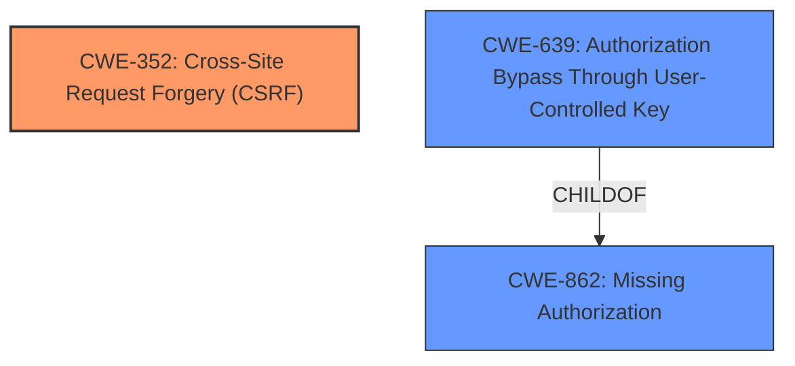

# Enhanced Analysis for CVE-2021-37381

# Summary
| CWE ID  | CWE Name                                                                                | Confidence | CWE Abstraction Level | CWE Vulnerability Mapping Label | CWE-Vulnerability Mapping Notes |
| :-------- | :--------------------------------------------------------------------------------------- | :---------- | :---------------------- | :------------------------------ | :-------------------------------- |
| CWE-352   | Cross-Site Request Forgery (CSRF)                                                        | 1          | Compound                  | Primary                         | Allowed                           |
| CWE-639   | Authorization Bypass Through User-Controlled Key                                       | 0.75        | Base                      | Secondary                      | Allowed                           |
| CWE-862   | Missing Authorization                                                                  | 0.6         | Class                     | Secondary                      | Allowed-with-Review              |

## Evidence and Confidence

*   **Confidence Score:** 0.85
*   **Evidence Strength:** MEDIUM

## Relationship Analysis
The primary weakness is CWE-352 [Cross-Site Request Forgery (CSRF)], a compound weakness comprised of multiple contributing factors. The vulnerability description explicitly mentions that the system is vulnerable to CSRF attacks. CWE-639 [Authorization Bypass Through User-Controlled Key] and CWE-862 [Missing Authorization] are related because the CSRF attack is possible because the system **improperly controls access** to the user's data, allowing attackers to access private information by manipulating the student number. CWE-862 is a parent of CWE-639, reflecting a hierarchical relationship where the more specific CWE-639 describes how authorization is bypassed via a user-controlled key.



## Vulnerability Chain
The vulnerability chain starts with the **improper access control**, leading to a vulnerability to Cross-Site Request Forgery (CSRF). The attacker can then access private information such as photos.
The chain: **Improper Access Control** -> **CSRF vulnerability** -> **Access Private Information**.

## Summary of Analysis
The initial assessment strongly pointed towards CWE-352 [Cross-Site Request Forgery (CSRF)] due to the explicit mention of CSRF attacks in the vulnerability description: "Southsoft GMIS 5.0 is vulnerable to CSRF attacks. Attackers can access other users private information such as photos through CSRF." The description also indicates an **improper access control** issue, as attackers can access other users' private information. The analysis was refined to include CWE-639 [Authorization Bypass Through User-Controlled Key] because the vulnerability allows attackers to access other user's data by modifying the key value (student number). This shows that the system's authorization functionality **does not properly** check the data access operation. I also added CWE-862 [Missing Authorization] to reflect the **missing authorization** checks that allow the CSRF to succeed.

I considered the retriever results. CWE-352 [Cross-Site Request Forgery (CSRF)] was the top combined result with a score of 0.645, further supporting its selection as the primary CWE. CWE-639 [Authorization Bypass Through User-Controlled Key] was also considered because the vulnerability involved modifying a key value to access other user's data. I also considered CWE-862 [Missing Authorization] because the system **does not perform** an authorization check.

I am confident in my assessment. The selection of CWE-352 [Cross-Site Request Forgery (CSRF)] is based on explicit evidence, while the addition of CWE-639 [Authorization Bypass Through User-Controlled Key] and CWE-862 [Missing Authorization] is based on a deeper analysis of the vulnerability's root cause and the relationships between CWEs. The selected CWEs are at the optimal level of specificity, providing a comprehensive understanding of the vulnerability.

Relevant CWE Information:

# Enhanced Context (25 CWEs)

## CWE-639: Authorization Bypass Through User-Controlled Key
**Abstraction Level**: Base
**Similarity Score**: 0.77
**Source**: dense

**Description**:
The system's authorization functionality does not prevent one user from gaining access to another user's data or record by modifying the key value identifying the data.

**Mapping Guidance**:
- Usage: Allowed
- Rationale: This CWE entry is at the Base level of abstraction, which is a preferred level of abstraction for mapping to the root causes of vulnerabilities.

**Vulnerability Description Key Phrases**
- **rootcause:** **improper access control**
- **weakness:** **cross-site request forgery**

The vulnerability description states, "Attackers can access other users private information such as photos through CSRF... The code in [2] is the student number of any student. The attacker can carry out CSRF attack on the system by modifying [2] without modifying [1]." This aligns with CWE-639 [Authorization Bypass Through User-Controlled Key] because the attacker is modifying the student number (key value) to access another user's data, bypassing authorization checks.

## CWE-352: Cross-Site Request Forgery (CSRF)
**Abstraction Level**: Compound
**Similarity Score**: 6956.53
**Source**: sparse

**Description**:
The web application does not, or can not, sufficiently verify whether a well-formed, valid, consistent request was intentionally provided by the user who submitted the request.

**Mapping Guidance**:
- Usage: Allowed
- Rationale: This is a well-known Composite of multiple weaknesses that must all occur simultaneously, although it is attack-oriented in nature.

The vulnerability description states, "Southsoft GMIS 5.0 is vulnerable to CSRF attacks. Attackers can access other users private information such as photos through CSRF." This directly aligns with CWE-352 [Cross-Site Request Forgery (CSRF)].

## CWE-862: Missing Authorization
**Abstraction Level**: Class
**Similarity Score**: 0.500
**Source**: sparse

**Description**:
The product does not perform an authorization check when an actor attempts to access a resource or perform an action.

**Mapping Guidance**:
- Usage: Allowed-with-Review
- Rationale: This CWE entry is a Class and might have Base-level children that would be more appropriate

The vulnerability description indicates that the system **does not properly** check if the user is authorized to access the requested data. The vulnerability description states, "Attackers can access other users private information such as photos through CSRF." This aligns with CWE-862 [Missing Authorization] because the system **does not perform** an authorization check to ensure that the user is allowed to access the requested student's photo.

I also considered CWE-79 [Improper Neutralization of Input During Web Page Generation ('Cross-site Scripting')] and CWE-89 [Improper Neutralization of Special Elements used in an SQL Command ('SQL Injection')] but these were not selected because there was no evidence of improper neutralization of input or SQL injection.


## CWE Relationship Analysis

Current CWEs represent these abstraction levels: .


### Vulnerability Chain Analysis

**Chain starting from CWE-79:**
- 79 (Improper Neutralization of Input During Web Page Generation ('Cross-site Scripting')) - ROOT


**Chain starting from CWE-862:**
- 862 (Missing Authorization) - ROOT


### CWE Relationship Diagram

```mermaid
graph TD
    classDef primary fill:#f96,stroke:#333,stroke-width:2px
    classDef secondary fill:#69f,stroke:#333
    classDef tertiary fill:#9e9,stroke:#333
```