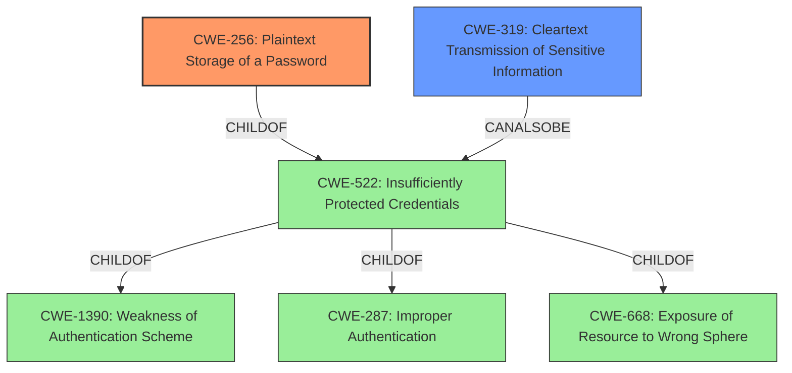

# Analysis for CVE-2021-37401

# Summary
| CWE ID | CWE Name | Confidence | CWE Abstraction Level | CWE Vulnerability Mapping Label | CWE-Vulnerability Mapping Notes |
|---|---|---|---|---|---|
| CWE-256 | Plaintext Storage of a Password | 1.0 | Base | Primary | Allowed |
| CWE-319 | Cleartext Transmission of Sensitive Information | 0.7 | Base | Secondary | Allowed |

## Evidence and Confidence

*   **Confidence Score:** 0.9
*   **Evidence Strength:** HIGH

## Relationship Analysis
The primary relationship is that CWE-256 [Plaintext Storage of a Password] is a child of CWE-522 [Insufficiently Protected Credentials], indicating a more specific case of the broader issue of credential protection. The vulnerability description clearly states that passwords are stored in plaintext, making CWE-256 the more appropriate and specific choice. CWE-319 [Cleartext Transmission of Sensitive Information] is related to CWE-522 [Insufficiently Protected Credentials] through a CANALSOBE relationship, suggesting it as a potential secondary weakness if credentials are also transmitted without encryption.

## Vulnerability Chain
The vulnerability chain starts with the **root cause** of passwords being stored in plaintext (CWE-256). This leads to the possibility of credential theft, which could then be used to **impact** the system by unauthorized uploading, altering, and downloading of PLC user programs.

## Summary of Analysis
The initial analysis focused on identifying the **root cause** of the vulnerability based on the provided evidence. The "CVE Reference Links Content Summary" clearly states that the vulnerability stems from the **Plaintext Storage of a Password**. This aligns directly with the description of CWE-256. The retriever results also listed CWE-256 as the top candidate based on sparse matching.

The graph relationships influenced the selection by providing context on how CWE-256 relates to other CWEs, particularly its parent, CWE-522 [Insufficiently Protected Credentials]. While CWE-522 is a broader category, the specific nature of the vulnerability being the **plaintext storage** makes CWE-256 the more appropriate choice.

The selected CWEs are at the optimal level of specificity because they directly address the identified **weakness** (**plaintext storage**) rather than a more general security principle. This is supported by the evidence and the mapping guidance for CWE-256, which recommends its use when the vulnerability involves storing passwords in plaintext.

The following is the relevant evidence:

*   "**Plaintext Storage of a Password:** The vulnerability stems from the storage of user credentials in plaintext within files. Specifically, credentials can be found in file servers, backup repositories, or ZLD files saved in SD cards."
*   "**CWE-256 (Plaintext Storage of a Password):** The primary **weakness** is the lack of encryption or hashing for stored passwords, making them easily readable."

Other CWEs Considered:

*   CWE-522 [Insufficiently Protected Credentials]: Considered but deemed too general, as the specific issue is the **plaintext storage** rather than a general lack of protection.
*   CWE-319 [Cleartext Transmission of Sensitive Information]: Considered as a secondary weakness because if the plaintext passwords are also transmitted without encryption, this would be another issue.
*   CWE-798 [Use of Hard-coded Credentials]: Ruled out because the passwords are not hard-coded; they are stored in files.
*   CWE-257 [Storing Passwords in a Recoverable Format]: While related, the vulnerability description explicitly mentions **plaintext**, which is a more direct and severe issue than storing passwords in a recoverable format.
*   CWE-321 [Use of Hard-coded Cryptographic Key]: Not applicable as the vulnerability doesn't involve cryptographic keys.
*   CWE-306 [Missing Authentication for Critical Function]: Not directly related, as the core issue is how credentials are stored, not the absence of authentication.