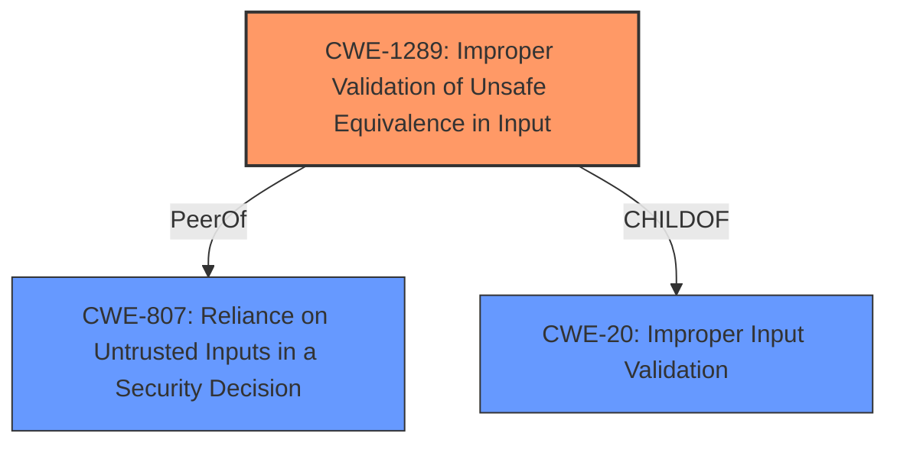

# Analysis for CVE-2021-37417

# Summary
| CWE ID | CWE Name | Confidence | CWE Abstraction Level | CWE Vulnerability Mapping Label | CWE-Vulnerability Mapping Notes |
|---|---|---|---|---|---|
| CWE-1289 | Improper Validation of Unsafe Equivalence in Input | 0.9 | Base | Primary | Allowed |
| CWE-807 | Reliance on Untrusted Inputs in a Security Decision | 0.7 | Base | Secondary | Allowed |
| CWE-20 | Improper Input Validation | 0.5 | Class | Secondary | Discouraged |

## Evidence and Confidence

*   **Confidence Score:** 0.8
*   **Evidence Strength:** HIGH

## Relationship Analysis
The primary CWE selected, CWE-1289, focuses on the **improper validation** of input equivalence. CWE-807 highlights the reliance on untrusted inputs for security decisions, and CWE-20 represents a broader class of input validation issues.

## Vulnerability Chain
The vulnerability chain involves the following sequence:
1.  **Root Cause:** **Improper parameter validation** (`EXCLUDE_CAPTCHA` parameter) - CWE-1289.
2.  **Weakness:** Reliance on the presence of an untrusted parameter for a security decision - CWE-807.
3.  **Impact:** CAPTCHA bypass, leading to potential brute-force attacks.

## Summary of Analysis
Initially, the vulnerability was analyzed based on the provided description and supporting evidence. The key phrase "**improper parameter validation**" strongly suggested CWE-20, but the details about the `EXCLUDE_CAPTCHA` parameter indicated a more specific weakness. The CVE Reference Links Content Summary clearly states that the application "fails to properly validate or sanitize the presence of this parameter, allowing it to be used to bypass the CAPTCHA check."

CWE-1289, "Improper Validation of Unsafe Equivalence in Input," was chosen as the primary CWE because it best describes the root cause: the application **improperly validates** the `EXCLUDE_CAPTCHA` parameter, treating its presence as equivalent to disabling the CAPTCHA, without proper validation. This is further supported by the high similarity score (0.81) in the Retriever Results.

CWE-807, "Reliance on Untrusted Inputs in a Security Decision," was considered a secondary CWE because the application relies on the untrusted `EXCLUDE_CAPTCHA` parameter to make a security decision (whether to enable or disable CAPTCHA).

CWE-20, "Improper Input Validation," was considered but ultimately classified as a secondary CWE with lower confidence because it is a more general class of weakness. While the vulnerability does involve **improper input validation**, CWE-1289 and CWE-807 provide more specific and accurate descriptions of the root cause. The MITRE mapping guidance discourages the use of CWE-20 when lower-level CWEs are applicable.

The final decision was based on the evidence provided, relationship analysis, and MITRE mapping guidance. CWE-1289 offers the most specific and accurate representation of the vulnerability's root cause, while CWE-807 and CWE-20 provide additional context.

Relevant CWE Information:

# Enhanced Context (25 CWEs)
The following CWEs were identified as potentially relevant to this vulnerability:

## CWE-1289: Improper Validation of Unsafe Equivalence in Input
**Abstraction Level**: Base
**Similarity Score**: 0.81
**Source**: dense

**Description**:
The product receives an input value that is used as a resource identifier or other type of reference, but it does not validate or incorrectly validates that the input is equivalent to a potentially-unsafe value.

**Mapping Guidance**:
- Usage: Allowed
- Rationale: This CWE entry is at the Base level of abstraction, which is a preferred level of abstraction for mapping to the root causes of vulnerabilities.

**Technical Explanation:**
The Zoho ManageEngine ADSelfService Plus software **incorrectly validates** the equivalence of the `EXCLUDE_CAPTCHA` parameter, treating its presence as a valid instruction to disable CAPTCHA, without properly checking the source or legitimacy of the parameter.

**Security Implications:**
This vulnerability allows attackers to bypass CAPTCHA, enabling brute-force attacks and potentially unauthorized access to user accounts.

**Relationships:**
This CWE is a Base level weakness.

**Mapping Influence:**
The MITRE mapping guidance allows the usage of this CWE.

## CWE-807: Reliance on Untrusted Inputs in a Security Decision
**Abstraction Level**: Base
**Similarity Score**: 0.80
**Source**: dense

**Description**:
The product uses a protection mechanism that relies on the existence or values of an input, but the input can be modified by an untrusted actor in a way that bypasses the protection mechanism.

**Mapping Guidance**:
- Usage: Allowed
- Rationale: This CWE entry is at the Base level of abstraction, which is a preferred level of abstraction for mapping to the root causes of vulnerabilities.

**Technical Explanation:**
The application **relies** on the presence of the `EXCLUDE_CAPTCHA` parameter, which is an **untrusted input**, to determine whether to enable or disable CAPTCHA. This allows attackers to manipulate the parameter and bypass the CAPTCHA mechanism.

**Security Implications:**
Bypassing the CAPTCHA allows attackers to launch automated brute-force attacks against user accounts.

**Relationships:**
This CWE is a Base level weakness.

**Mapping Influence:**
The MITRE mapping guidance allows the usage of this CWE.

## CWE-20: Improper Input Validation
**Abstraction Level**: Class
**Similarity Score**: 0.080
**Source**: sparse

**Description**:
The product receives input or data, but it does
        not validate or incorrectly validates that the input has the
        properties that are required to process the data safely and
        correctly.

**Mapping Guidance**:
- Usage: Discouraged
- Rationale: CWE-20 is commonly misused in low-information vulnerability reports when lower-level CWEs could be used instead, or when more details about the vulnerability are available [REF-1287]. It is not useful for trend analysis. It is also a level-1 Class (i.e., a child of a Pillar).

**Technical Explanation:**
The application **does not properly validate** the `EXCLUDE_CAPTCHA` parameter, allowing an attacker to bypass the CAPTCHA check.

**Security Implications:**
This vulnerability allows attackers to bypass CAPTCHA, enabling brute-force attacks and potentially unauthorized access to user accounts.

**Relationships:**
This CWE is a Class level weakness.

**Mapping Influence:**
The MITRE mapping guidance discourages the usage of this CWE when lower-level CWEs are available.