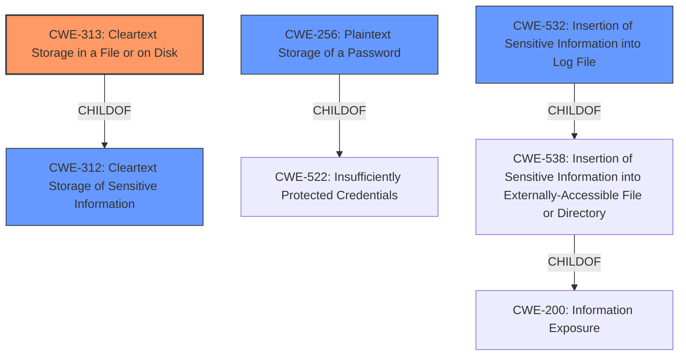

# Analysis Report for CVE-2021-37452

# Vulnerability Analysis Report: CVE-2021-37452

## Description


## Analysis (with Relationship Data)

# Summary
| CWE ID | CWE Name | Confidence | CWE Abstraction Level | CWE Vulnerability Mapping Label | CWE-Vulnerability Mapping Notes |
|---|---|---|---|---|---|
| CWE-313 | Cleartext Storage in a File or on Disk | 1 | Variant | Allowed | Primary CWE |
| CWE-256 | Plaintext Storage of a Password | 0.9 | Base | Allowed | Secondary Candidate |
| CWE-532 | Insertion of Sensitive Information into Log File | 0.7 | Base | Allowed | Secondary Candidate |
| CWE-312 | Cleartext Storage of Sensitive Information | 0.6 | Base | Allowed | Secondary Candidate |

## Evidence and Confidence

*   **Confidence Score:** 0.9
*   **Evidence Strength:** HIGH

## Relationship Analysis
The primary CWE, CWE-313 [CWE-313: Cleartext Storage in a File or on Disk], is a variant of CWE-312 [CWE-312: Cleartext Storage of Sensitive Information], which represents the more general case of storing sensitive information in cleartext. CWE-256 [CWE-256: Plaintext Storage of a Password] is a child of CWE-522 [CWE-522: Insufficiently Protected Credentials], indicating a more specific case of storing passwords without protection. CWE-532 [CWE-532: Insertion of Sensitive Information into Log File] is related to the vulnerability by potentially being another location where sensitive information might be stored in cleartext. The relationships guide the selection of the most specific CWE that accurately captures the vulnerability.



## Vulnerability Chain
The vulnerability chain starts with the **incorrect storage of sensitive information** in cleartext within `.dat` files. This leads to **information disclosure** as local users can read these files and discover login information.

## Summary of Analysis
The analysis is based on the provided evidence, specifically the "CVE Reference Links Content Summary" and "Vulnerability Description Key Phrases". The vulnerability involves the **storage of cleartext login information** in `.dat` configuration files, which can be accessed by local users.

The selection of CWE-313 [CWE-313: Cleartext Storage in a File or on Disk] as the primary CWE is due to its specificity in describing the vulnerability: sensitive data is stored in cleartext within files on disk. This aligns directly with the vulnerability description and the information from the CVE reference link.

The graph relationships influenced the decision by providing context on the hierarchy of CWEs related to cleartext storage. CWE-313 [CWE-313: Cleartext Storage in a File or on Disk] being a variant of CWE-312 [CWE-312: Cleartext Storage of Sensitive Information] indicates that it is a more specific classification for this particular vulnerability.

The selected CWEs are at the optimal level of specificity because they accurately reflect the technical details of the vulnerability while adhering to the recommended abstraction levels. CWE-313 [CWE-313: Cleartext Storage in a File or on Disk] is a Variant, which is a preferred level of abstraction.

Relevant CWE Information:

# Enhanced Context (25 CWEs)

## CWE-313: Cleartext Storage in a File or on Disk
**Abstraction Level**: Variant
**Similarity Score**: 0.099
**Source**: sparse

**Description**:
The product stores sensitive information in cleartext in a file, or on disk.

**Mapping Guidance**:
- Usage: Allowed
- Rationale: This CWE entry is at the Variant level of abstraction, which is a preferred level of abstraction for mapping to the root causes of vulnerabilities.

**Observed Examples**:
- **CVE-2001-1481:** Cleartext credentials in world-readable file.
- **CVE-2005-1828:** Password in cleartext in config file.
- **CVE-2005-2209:** Password in cleartext in config file.

*Explanation*: The description perfectly matches the vulnerability where sensitive information (login credentials) are stored in cleartext within `.dat` files on the disk. This allows local users to discover the login information by reading these files. The "Usage: Allowed" mapping guidance confirms that this CWE is appropriate.

## CWE-256: Plaintext Storage of a Password
**Abstraction Level**: Base
**Similarity Score**: 0.047
**Source**: sparse

**Description**:
Storing a password in plaintext may result in a system compromise.

**Mapping Guidance**:
- Usage: Allowed
- Rationale: This CWE entry is at the Base level of abstraction, which is a preferred level of abstraction for mapping to the root causes of vulnerabilities.

**Observed Examples**:
- **CVE-2022-30275:** Remote Terminal Unit (RTU) uses a driver that relies on a password stored in plaintext.

*Explanation*: While CWE-313 [CWE-313: Cleartext Storage in a File or on Disk] covers the general case, CWE-256 [CWE-256: Plaintext Storage of a Password] is more specific to passwords. Since the vulnerability involves **cleartext passwords**, this CWE is relevant. However, since the vulnerability also includes usernames and other sensitive information, CWE-313 [CWE-313: Cleartext Storage in a File or on Disk] is the better primary choice.

## CWE-532: Insertion of Sensitive Information into Log File
**Abstraction Level**: Base
**Similarity Score**: 0.044
**Source**: sparse

**Description**:
The product writes sensitive information to a log file.

**Mapping Guidance**:
- Usage: Allowed
- Rationale: This CWE entry is at the Base level of abstraction, which is a preferred level of abstraction for mapping to the root causes of vulnerabilities.

**Observed Examples**:
- **CVE-2017-9615:** verbose logging stores admin credentials in a world-readable log file
- **CVE-2018-1999036:** SSH password for private key stored in build log

*Explanation*: This CWE is considered because the `.dat` files can be viewed as a type of "log" or configuration file where sensitive information is stored. However, it's not a traditional log file, so it's a less accurate fit than CWE-313 [CWE-313: Cleartext Storage in a File or on Disk] or CWE-256 [CWE-256: Plaintext Storage of a Password].

## CWE-312: Cleartext Storage of Sensitive Information
**Abstraction Level**: Base
**Similarity Score**: 0.002
**Source**: graph

**Description**:
The product stores sensitive information in cleartext within a resource that might be accessible to another control sphere.

**Mapping Guidance**:
- Usage: Allowed
- Rationale: This CWE entry is at the Base level of abstraction, which is a preferred level of abstraction for mapping to the root causes of vulnerabilities.

**Observed Examples**:
- **CVE-2022-30275:** Remote Terminal Unit (RTU) uses a driver that relies on a password stored in plaintext.
- **CVE-2009-2272:** password and username stored in cleartext in a cookie
- **CVE-2009-1466:** password stored in cleartext in a file with insecure permissions

*Explanation*: This is a more general CWE. Since CWE-313 [CWE-313: Cleartext Storage in a File or on Disk] is more specific about the storage location (file or disk), it's a better fit.

## Other CWEs Considered and Rejected:

*   CWE-522 [CWE-522: Insufficiently Protected Credentials]: This is a class-level CWE, and the vulnerability


## CWE Relationship Analysis

Current CWEs represent these abstraction levels: .


### Vulnerability Chain Analysis

**Chain starting from CWE-312:**
- 312 (Cleartext Storage of Sensitive Information) - ROOT


**Chain starting from CWE-538:**
- 538 (Insertion of Sensitive Information into Externally-Accessible File or Directory) - ROOT


### CWE Relationship Diagram

```mermaid
graph TD
    classDef primary fill:#f96,stroke:#333,stroke-width:2px
    classDef secondary fill:#69f,stroke:#333
    classDef tertiary fill:#9e9,stroke:#333
```


*Report generated on 2025-04-01 18:26:34*
