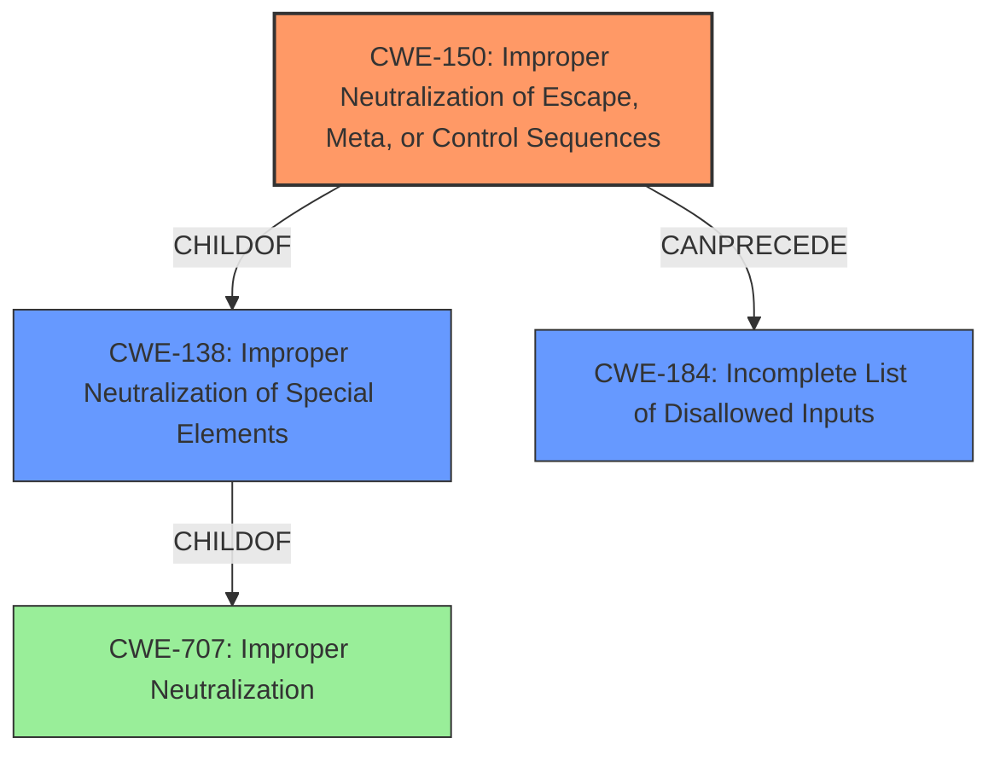

# Analysis for CVE-2021-37471

# Summary
| CWE ID | CWE Name | Confidence | CWE Abstraction Level | CWE Vulnerability Mapping Label | CWE-Vulnerability Mapping Notes |
|---|---|---|---|---|---|
| CWE-150 | Improper Neutralization of Escape, Meta, or Control Sequences | 0.9 | Variant | Allowed | Primary CWE |
| CWE-184 | Incomplete List of Disallowed Inputs | 0.7 | Base | Allowed | Secondary CWE |

## Evidence and Confidence

*   **Confidence Score:** 0.8
*   **Evidence Strength:** HIGH

## Relationship Analysis
The primary CWE selected is CWE-150, which is a variant of CWE-138 (Improper Neutralization of Special Elements). CWE-138 itself is a child of CWE-707. CWE-150 focuses specifically on escape, meta, or control sequences, which aligns directly with the vulnerability description involving a "restricted shell escape sequence." CWE-184 (Incomplete List of Disallowed Inputs) is considered as a contributing factor because the root cause analysis from CVE Reference Links Content Summary specifies the NetCloud OS (**fails to properly validate or sanitize user-provided input when setting the shell prompt, allowing the injection of special characters that disrupts shell functionality**). This could be seen as an incomplete list of disallowed inputs.

## Vulnerability Chain
The vulnerability chain starts with the **improper handling of input** specifically a **restricted shell escape sequence**. This leads to a denial of service (DoS) by making the device's NetCloud Manager console, local console, and SSH command-line unavailable.

## Summary of Analysis
The primary assessment is based on the vulnerability description and the CVE Reference Links Content Summary. The description highlights the "restricted shell escape sequence" and the summary confirms that the root cause is "**insufficient restrictions on shell escape sequences**". CWE-150 directly addresses this type of weakness.

The retriever results show CWE-78 (Improper Neutralization of Special Elements used in an OS Command ('OS Command Injection')) as the top match. While command injection is a potential outcome of improper neutralization, the vulnerability description focuses on the **escape sequence** itself, which makes CWE-150 a more precise fit. CWE-150 also has a direct parent relationship with CWE-138 which is "**Improper Neutralization of Special Elements**" which is also a strong contender. However, CWE-150 is more specific and therefore a better selection.

CWE-22 (Improper Limitation of a Pathname to a Restricted Directory ('Path Traversal')) and related path traversal CWEs were considered, but they are not applicable because the vulnerability does not involve file paths. CWE-269 (Improper Privilege Management) was also considered but discarded, as the vulnerability's root cause is input validation related, not privilege management.

The final decision is to assign CWE-150 as the primary CWE because it directly addresses the **improper handling of escape sequences**, which is the core of the vulnerability. CWE-184 is added as a contributing factor due to the input validation **fails to properly validate or sanitize user-provided input when setting the shell prompt**. These CWEs are at the optimal level of specificity (Variant and Base) for this vulnerability.