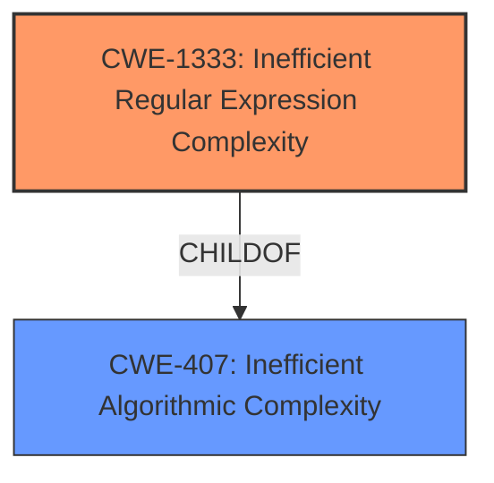

# Analysis for CVE-2021-3749

# Summary
| CWE ID | CWE Name | Confidence | CWE Abstraction Level | CWE Vulnerability Mapping Label | CWE-Vulnerability Mapping Notes |
|---|---|---|---|---|---|
| CWE-1333 | Inefficient Regular Expression Complexity | 1.0 | Base | Allowed | Primary CWE |

## Evidence and Confidence

*   **Confidence Score:** 1.0
*   **Evidence Strength:** HIGH

## Relationship Analysis
The primary relationship that influenced the CWE selection is the ChildOf relationship between CWE-1333 and CWE-407. While CWE-407 (Inefficient Algorithmic Complexity) is a broader class, the specific issue here is related to regular expression complexity, making CWE-1333 a more precise and appropriate choice. There is no evidence to suggest any chain relationships in this vulnerability.

## Vulnerability Chain
The vulnerability chain is straightforward:
1.  **Root Cause:** **Inefficient Regular Expression Complexity** (CWE-1333)
2.  **Impact:** Denial of Service (DoS) due to excessive CPU consumption.

## Summary of Analysis
The vulnerability is clearly described as having an **inefficient regular expression complexity**, which directly maps to CWE-1333. The evidence is strong, with the "Vulnerability Description Key Phrases" explicitly mentioning the **weakness** and the CVE reference links content summary confirming the root cause. The retriever results also list CWE-1333 as the top candidate.

The selection of CWE-1333 is based on the following evidence:

*   "**weakness:** **inefficient regular expression complexity**" (Vulnerability Description Key Phrases)
*   "**Inefficient Regular Expression Complexity:** The vulnerability stems from a regular expression within the axios library that is too complex, leading to potential denial-of-service." (CVE Reference Links Content Summary)
*   "ReDoS (Regular Expression Denial of Service): The excessively complex regular expression can be exploited to cause a denial of service by making the application consume excessive resources (CPU) while processing a specially crafted input." (CVE Reference Links Content Summary)
*   "The github content shows a commit that addresses the ReDoS vulnerability by replacing the original regex based trim function with native `trim()`." (CVE Reference Links Content Summary)

The graph relationships influenced the selection by showing that while CWE-407 is a parent, CWE-1333 is a more specific and accurate representation of the **weakness**.

CWE-1333 is at the optimal level of specificity (Base) as it directly addresses the root cause of the vulnerability which is an inefficient regular expression.

Relevant CWE Information:

# Enhanced Context (25 CWEs)
The following CWEs were identified as potentially relevant to this vulnerability:

## CWE-407: Inefficient Algorithmic Complexity
**Abstraction Level**: Class
**Similarity Score**: 0.77
**Source**: dense

**Description**:
An algorithm in a product has an inefficient worst-case computational complexity that may be detrimental to system performance and can be triggered by an attacker, typically using crafted manipulations that ensure that the worst case is being reached.

**Mapping Guidance**:
- Usage: Allowed-with-Review
- Rationale: This CWE entry is a Class and might have Base-level children that would be more appropriate

## CWE-1333: Inefficient Regular Expression Complexity
**Abstraction Level**: Base
**Similarity Score**: 5352.79
**Source**: sparse

**Description**:
The product uses a regular expression with an inefficient, possibly exponential worst-case computational complexity that consumes excessive CPU cycles.

### Summary of Analysis of other CWEs Considered but Not Used:

*   CWE-407 (Inefficient Algorithmic Complexity): This was considered but not used because, while the vulnerability does involve inefficient complexity, it is specifically related to regular expressions. CWE-1333 is a more specific child of CWE-407 and is therefore a better fit.
*   CWE-186 (Overly Restrictive Regular Expression): This was considered but not used because the issue is not about the regular expression being overly restrictive, but rather about its inefficient complexity.
*   CWE-185 (Incorrect Regular Expression): This was considered but not used because the issue is not about the regular expression being incorrect in terms of its matching logic, but rather about its inefficient complexity.
*   CWE-777 (Regular Expression without Anchors): This was considered but not used because there is no indication that the **weakness** lies in missing anchors in the regular expression.
*   CWE-626 (Null Byte Interaction Error (Poison Null Byte)): This was considered but not used because there is no indication that the vulnerability involves null byte handling.
*   CWE-1176 (Inefficient CPU Computation): This was considered but not used because the root cause is the regular expression, not just inefficient CPU computation in general.

# Enhanced Query for CVE-2021-3749

## Vulnerability Description
axios is vulnerable to Inefficient Regular Expression Complexity

### Vulnerability Description Key Phrases
- **weakness:** **inefficient regular expression complexity**
- **product:** axios

## CVE Reference Links Content Summary
Based on the provided content, here's a breakdown of the relevant information regarding CVE-2021-3749:

**1. Verification:**

The content from `www.oracle.com_2ed21adf_20250114_192117.html` specifically mentions CVE-2021-3749, and the content from `github.com_8c7fcaf5_20250114_192101.html` is related to axios which is the component that contains the vulnerability. The content from `cert-portal.siemens.com_0c4c0762_20250114_192059.html` also references this CVE in the context of SINEC INS.

**2. Root Cause of Vulnerability:**

*   **Inefficient Regular Expression Complexity:** The vulnerability stems from a regular expression within the axios library that is too complex, leading to potential denial-of-service.

**3. Weaknesses/Vulnerabilities Present:**

*   **ReDoS (Regular Expression Denial of Service):** The excessively complex regular expression can be exploited to cause a denial of service by making the application consume excessive resources (CPU) while processing a specially crafted input.

**4. Impact of Exploitation:**

*   **Denial of Service (DoS):** A successful attack can lead to a denial-of-service condition, making the affected application unavailable. The Siemens advisory notes that a successful exploitation of this vulnerability could lead to an uncontrolled resource consumption.
*   The Oracle advisory notes a high impact to availability.

**5. Attack Vectors:**

*   **Network:** The vulnerability is remotely exploitable via network, meaning an attacker can trigger the vulnerability by sending malicious input over the network.

**6. Required Attacker Capabilities/Position:**

*   **No Authentication Required:** An attacker doesn't need to be authenticated to exploit the vulnerability. They can trigger it with malicious requests without needing user credentials.

**Additional Details:**

*   **Affected Component:** The vulnerability resides within the `axios` library, specifically in how it handles certain inputs that are processed by regular expressions.
*   **Patch:** The vulnerability is resolved in later versions of axios, where the problematic regex was modified to avoid ReDoS attacks.
*   **Context:**
    * The github content shows a commit that addresses the ReDoS vulnerability by replacing the original regex based trim function with native `trim()`.
    * The Oracle advisory lists Oracle GoldenGate as one of the products impacted by CVE-2021-3749.
    * The Siemens advisory mentions the vulnerability exists in their product SINEC INS.

**Summary**

CVE-2021-3749 is a ReDoS vulnerability in the `axios` library that can lead to denial of service. It's remotely exploitable without authentication and is triggered by a complex regular expression. Patches and upgrades are necessary to mitigate this vulnerability.

## Retriever Results

### Top Combined Results

| Rank | CWE ID | Name | Abstraction | Usage  | Retrievers | Individual Scores |
|------|--------|------|-------------|-------|------------|-------------------|
| 1 | 1333 | Inefficient Regular Expression Complexity | Base | Allowed | sparse | 0.201 |
| 2 | 186 | Overly Restrictive Regular Expression | Base | Allowed | sparse | 0.126 |
| 3 | 407 | Inefficient Algorithmic Complexity | Class | Allowed-with-Review | sparse | 0.123 |
| 4 | 185 | Incorrect Regular Expression | Class | Allowed-with-Review | sparse | 0.096 |
| 5 | 777 | Regular Expression without Anchors | Variant | Allowed | sparse | 0.094 |
| 6 | 637 | Unnecessary Complexity in Protection Mechanism (Not Using 'Economy of Mechanism') | Class | Allowed-with-Review | dense | 0.463 |
| 7 | 182 | Collapse of Data into Unsafe Value | Base | Allowed | graph | 0.002 |
| 8 | 624 | Executable Regular Expression Error | Base | Allowed | sparse | 0.089 |
| 9 | 1176 | Inefficient CPU Computation | Class | Allowed-with-Review | sparse | 0.082 |
| 10 | 626 | Null Byte Interaction Error (Poison Null Byte) | Variant | Allowed | sparse | 0.079 |

# Complete CWE Specifications

## CWE-1333: Inefficient Regular Expression Complexity
**Abstraction:** Base
**Status:** Draft

### Description
The product uses a regular expression with an inefficient, possibly exponential worst-case computational complexity that consumes excessive CPU cycles.

### Extended Description
Some regular expression engines have a feature called "backtracking". If the token cannot match, the engine "backtracks" to a position that may result in a different token that can match.
 Backtracking becomes a weakness if all of these conditions are met:

  - The number of possible backtracking attempts are exponential relative to the length of the input.

  - The input can fail to match the regular expression.

  - The input can be long enough.

 Attackers can create crafted inputs that intentionally cause the regular expression to use excessive backtracking in a way that causes the CPU consumption to spike. 

### Alternative Terms
ReDoS: ReDoS is an abbreviation of "Regular expression Denial of Service".
Regular Expression Denial of Service: While this term is attack-focused, this is commonly used to describe the weakness.
Catastrophic backtracking: This term is used to describe the behavior of the regular expression as a negative technical impact.

### Relationships
ChildOf -> CWE-407
ChildOf -> CWE-407

### Mapping Guidance
**Usage:** Allowed
**Rationale:** This CWE entry is at the Base level of abstraction, which is a preferred level of abstraction for mapping to the root causes of vulnerabilities.
**Comments:** Carefully read both the name and description to ensure that this mapping is an appropriate fit. Do not try to 'force' a mapping to a lower-level Base/Variant simply to comply with this preferred level of abstraction.
**Reasons:**
- Acceptable-Use

### Observed Examples
- **CVE-2020-5243:** server allows ReDOS with crafted User-Agent strings, due to overlapping capture groups that cause excessive backtracking.
- **CVE-2021-21317:** npm package for user-agent parser prone to ReDoS due to overlapping capture groups
- **CVE-2019-16215:** Markdown parser uses inefficient regex when processing a message, allowing users to cause CPU consumption and delay preventing processing of other messages.

## CWE-186: Overly Restrictive Regular Expression
**Abstraction:** Base
**Status:** Draft

### Description
A regular expression is overly restrictive, which prevents dangerous values from being detected.

### Extended Description
This weakness is not about regular expression complexity. Rather, it is about a regular expression that does not match all values that are intended. Consider the use of a regexp to identify acceptable values or to spot unwanted terms. An overly restrictive regexp misses some potentially security-relevant values leading to either false positives *or* false negatives, depending on how the regexp is being used within the code. Consider the expression /[0-8]/ where the intention was /[0-9]/. This expression is not "complex" but the value "9" is not matched when maybe the programmer planned to check for it.

### Alternative Terms
None

### Relationships
ChildOf -> CWE-185
CanAlsoBe -> CWE-184
CanAlsoBe -> CWE-183

### Mapping Guidance
**Usage:** Allowed
**Rationale:** This CWE entry is at the Base level of abstraction, which is a preferred level of abstraction for mapping to the root causes of vulnerabilities.
**Comments:** Carefully read both the name and description to ensure that this mapping is an appropriate fit. Do not try to 'force' a mapping to a lower-level Base/Variant simply to comply with this preferred level of abstraction.
**Reasons:**
- Acceptable-Use

### Additional Notes
**[Relationship]** Can overlap allowlist/denylist errors (CWE-183/CWE-184)

### Observed Examples
- **CVE-2005-1604:** MIE. ".php.ns" bypasses ".php$" regexp but is still parsed as PHP by Apache. (manipulates an equivalence property under Apache)

## CWE-407: Inefficient Algorithmic Complexity
**Abstraction:** Class
**Status:** Incomplete

### Description
An algorithm in a product has an inefficient worst-case computational complexity that may be detrimental to system performance and can be triggered by an attacker, typically using crafted manipulations that ensure that the worst case is being reached.

### Extended Description
Not provided

### Alternative Terms
Quadratic Complexity: Used when the algorithmic complexity is related to the square of the number of inputs (N^2)

### Relationships
ChildOf -> CWE-405

### Mapping Guidance
**Usage:** Allowed-with-Review
**Rationale:** This CWE entry is a Class and might have Base-level children that would be more appropriate
**Comments:** Examine children of this entry to see if there is a better fit
**Reasons:**
- Abstraction

### Observed Examples
- **CVE-2021-32617:** C++ library for image metadata has "quadratic complexity" issue with unnecessarily repetitive parsing each time an invalid character is encountered
- **CVE-2020-10735:** Python has "quadratic complexity" issue when converting string to int with many digits in unexpected bases
- **CVE-2020-5243:** server allows ReDOS with crafted User-Agent strings, due to overlapping capture groups that cause excessive backtracking.

## CWE-185: Incorrect Regular Expression
**Abstraction:** Class
**Status:** Draft

### Description
The product specifies a regular expression in a way that causes data to be improperly matched or compared.

### Extended Description
When the regular expression is used in protection mechanisms such as filtering or validation, this may allow an attacker to bypass the intended restrictions on the incoming data.

### Alternative Terms
None

### Relationships
ChildOf -> CWE-697
CanPrecede -> CWE-187
CanPrecede -> CWE-182

### Mapping Guidance
**Usage:** Allowed-with-Review
**Rationale:** This CWE entry is a Class and might have Base-level children that would be more appropriate
**Comments:** Examine children of this entry to see if there is a better fit
**Reasons:**
- Abstraction

### Additional Notes
**[Relationship]** While there is some overlap with allowlist/denylist problems, this entry is intended to deal with incorrectly written regular expressions, regardless of their intended use. Not every regular expression is intended for use as an allowlist or denylist. In addition, allowlists and denylists can be implemented using other mechanisms besides regular expressions.

**[Research Gap]** Regexp errors are likely a primary factor in many MFVs, especially those that require multiple manipulations to exploit. However, they are rarely diagnosed at this level of detail.

### Observed Examples
- **CVE-2002-2109:** Regexp isn't "anchored" to the beginning or end, which allows spoofed values that have trusted values as substrings.
- **CVE-2005-1949:** Regexp for IP address isn't anchored at the end, allowing appending of shell metacharacters.
- **CVE-2001-1072:** Bypass access restrictions via multiple leading slash, which causes a regular expression to fail.

## CWE-777: Regular Expression without Anchors
**Abstraction:** Variant
**Status:** Incomplete

### Description
The product uses a regular expression to perform neutralization, but the regular expression is not anchored and may allow malicious or malformed data to slip through.

### Extended Description
When performing tasks such as validating against a set of allowed inputs (allowlist), data is examined and possibly modified to ensure that it is well-formed and adheres to a list of safe values. If the regular expression is not anchored, malicious or malformed data may be included before or after any string matching the regular expression. The type of malicious data that is allowed will depend on the context of the application and which anchors are omitted from the regular expression.

### Alternative Terms
None

### Relationships
ChildOf -> CWE-625

### Mapping Guidance
**Usage:** Allowed
**Rationale:** This CWE entry is at the Variant level of abstraction, which is a preferred level of abstraction for mapping to the root causes of vulnerabilities.
**Comments:** Carefully read both the name and description to ensure that this mapping is an appropriate fit. Do not try to 'force' a mapping to a lower-level Base/Variant simply to comply with this preferred level of abstraction.
**Reasons:**
- Acceptable-Use

### Observed Examples
- **CVE-2022-30034:** Chain: Web UI for a Python RPC framework does not use regex anchors to validate user login emails (CWE-777), potentially allowing bypass of OAuth (CWE-1390).

## CWE-637: Unnecessary Complexity in Protection Mechanism (Not Using 'Economy of Mechanism')
**Abstraction:** Class
**Status:** Draft

### Description
The product uses a more complex mechanism than necessary, which could lead to resultant weaknesses when the mechanism is not correctly understood, modeled, configured, implemented, or used.

### Extended Description
Security mechanisms should be as simple as possible. Complex security mechanisms may engender partial implementations and compatibility problems, with resulting mismatches in assumptions and implemented security. A corollary of this principle is that data specifications should be as simple as possible, because complex data specifications result in complex validation code. Complex tasks and systems may also need to be guarded by complex security checks, so simple systems should be preferred.

### Alternative Terms
Unnecessary Complexity

### Relationships
ChildOf -> CWE-657

### Mapping Guidance
**Usage:** Allowed-with-Review
**Rationale:** This CWE entry is a Class and might have Base-level children that would be more appropriate
**Comments:** Examine children of this entry to see if there is a better fit
**Reasons:**
- Abstraction

### Observed Examples
- **CVE-2007-6067:** Support for complex regular expressions leads to a resultant algorithmic complexity weakness (CWE-407).
- **CVE-2007-1552:** Either a filename extension and a Content-Type header could be used to infer the file type, but the developer only checks the Content-Type, enabling unrestricted file upload (CWE-434).
- **CVE-2007-6479:** In Apache environments, a "filename.php.gif" can be redirected to the PHP interpreter instead of being sent as an image/gif directly to the user. Not knowing this, the developer only checks the last extension of a submitted filename, enabling arbitrary code execution.

## CWE-182: Collapse of Data into Unsafe Value
**Abstraction:** Base
**Status:** Draft

### Description
The product filters data in a way that causes it to be reduced or "collapsed" into an unsafe value that violates an expected security property.

### Extended Description
Not provided

### Alternative Terms
None

### Relationships
ChildOf -> CWE-693
CanPrecede -> CWE-33
CanPrecede -> CWE-34
CanPrecede -> CWE-35

### Mapping Guidance
**Usage:** Allowed
**Rationale:** This CWE entry is at the Base level of abstraction, which is a preferred level of abstraction for mapping to the root causes of vulnerabilities.
**Comments:** Carefully read both the name and description to ensure that this mapping is an appropriate fit. Do not try to 'force' a mapping to a lower-level Base/Variant simply to comply with this preferred level of abstraction.
**Reasons:**
- Acceptable-Use

### Additional Notes
**[Relationship]** Overlaps regular expressions, although an implementation might not necessarily use regexp's.

### Observed Examples
- **CVE-2004-0815:** "/.////" in pathname collapses to absolute path.
- **CVE-2005-3123:** "/.//..//////././" is collapsed into "/.././" after ".." and "//" sequences are removed.
- **CVE-2002-0325:** ".../...//" collapsed to "..." due to removal of "./" in web server.

## CWE-624: Executable Regular Expression Error
**Abstraction:** Base
**Status:** Incomplete

### Description
The product uses a regular expression that either (1) contains an executable component with user-controlled inputs, or (2) allows a user to enable execution by inserting pattern modifiers.

### Extended Description
Case (2) is possible in the PHP preg_replace() function, and possibly in other languages when a user-controlled input is inserted into a string that is later parsed as a regular expression.

### Alternative Terms
None

### Relationships
ChildOf -> CWE-77
ChildOf -> CWE-77
ChildOf -> CWE-77

### Mapping Guidance
**Usage:** Allowed
**Rationale:** This CWE entry is at the Base level of abstraction, which is a preferred level of abstraction for mapping to the root causes of vulnerabilities.
**Comments:** Carefully read both the name and description to ensure that this mapping is an appropriate fit. Do not try to 'force' a mapping to a lower-level Base/Variant simply to comply with this preferred level of abstraction.
**Reasons:**
- Acceptable-Use

### Additional Notes
**[Research Gap]** Under-studied. The existing PHP reports are limited to highly skilled researchers, but there are few examples for other languages. It is suspected that this is under-reported for all languages. Usability factors might make it more prevalent in PHP, but this theory has not been investigated.

### Observed Examples
- **CVE-2006-2059:** Executable regexp in PHP by inserting "e" modifier into first argument to preg_replace
- **CVE-2005-3420:** Executable regexp in PHP by inserting "e" modifier into first argument to preg_replace
- **CVE-2006-2878:** Complex curly syntax inserted into the replacement argument to PHP preg_replace(), which uses the "/e" modifier

## CWE-1176: Inefficient CPU Computation
**Abstraction:** Class
**Status:** Incomplete

### Description
The product performs CPU computations using
         algorithms that are not as efficient as they could be for the
         needs of the developer, i.e., the computations can be
         optimized further.

### Extended Description

This issue can make the product perform more slowly, possibly in ways that are noticeable to the users. If an attacker can influence the amount of computation that must be performed, e.g. by triggering worst-case complexity, then this performance problem might introduce a vulnerability.

### Alternative Terms
None

### Relationships
ChildOf -> CWE-405

### Mapping Guidance
**Usage:** Allowed-with-Review
**Rationale:** This CWE entry is a Class and might have Base-level children that would be more appropriate
**Comments:** Examine children of this entry to see if there is a better fit
**Reasons:**
- Abstraction

### Observed Examples
- **CVE-2022-37734:** Chain: lexer in Java-based GraphQL server does not enforce maximum of tokens early enough (CWE-696), allowing excessive CPU consumption (CWE-1176)

## CWE-626: Null Byte Interaction Error (Poison Null Byte)
**Abstraction:** Variant
**Status:** Draft

### Description
The product does not properly handle null bytes or NUL characters when passing data between different representations or components.

### Extended Description

A null byte (NUL character) can have different meanings across representations or languages. For example, it is a string terminator in standard C libraries, but Perl and PHP strings do not treat it as a terminator. When two representations are crossed - such as when Perl or PHP invokes underlying C functionality - this can produce an interaction error with unexpected results. Similar issues have been reported for ASP. Other interpreters written in C might also be affected.

The poison null byte is frequently useful in path traversal attacks by terminating hard-coded extensions that are added to a filename. It can play a role in regular expression processing in PHP.

### Alternative Terms
None

### Relationships
ChildOf -> CWE-147
ChildOf -> CWE-436

### Mapping Guidance
**Usage:** Allowed
**Rationale:** This CWE entry is at the Variant level of abstraction, which is a preferred level of abstraction for mapping to the root causes of vulnerabilities.
**Comments:** Carefully read both the name and description to ensure that this mapping is an appropriate fit. Do not try to 'force' a mapping to a lower-level Base/Variant simply to comply with this preferred level of abstraction.
**Reasons:**
- Acceptable-Use

### Additional Notes
**[Terminology]** Current usage of "poison null byte" is typically related to this C/Perl/PHP interaction error, but the original term in 1998 was applied to an off-by-one buffer overflow involving a null byte.

**[Research Gap]** There are not many CVE examples, because the poison NULL byte is a design limitation, which typically is not included in CVE by itself. It is typically used as a facilitator manipulation to widen the scope of potential attacks against other vulnerabilities.

### Observed Examples
- **CVE-2005-4155:** NUL byte bypasses PHP regular expression check
- **CVE-2005-3153:** inserting SQL after a NUL byte bypasses allowlist regexp, enabling SQL injection

