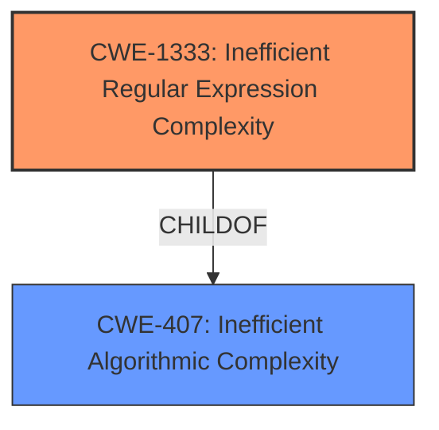

# Analysis Report for CVE-2021-3749

# Vulnerability Analysis Report: CVE-2021-3749

## Description


## Analysis (with Relationship Data)

# Summary
| CWE ID | CWE Name | Confidence | CWE Abstraction Level | CWE Vulnerability Mapping Label | CWE-Vulnerability Mapping Notes |
|---|---|---|---|---|---|
| CWE-1333 | Inefficient Regular Expression Complexity | 1.0 | Base | Allowed | Primary CWE |

## Evidence and Confidence

*   **Confidence Score:** 1.0
*   **Evidence Strength:** HIGH

## Relationship Analysis
The primary relationship that influenced the CWE selection is the ChildOf relationship between CWE-1333 and CWE-407. While CWE-407 (Inefficient Algorithmic Complexity) is a broader class, the specific issue here is related to regular expression complexity, making CWE-1333 a more precise and appropriate choice. There is no evidence to suggest any chain relationships in this vulnerability.



## Vulnerability Chain
The vulnerability chain is straightforward:
1.  **Root Cause:** **Inefficient Regular Expression Complexity** (CWE-1333)
2.  **Impact:** Denial of Service (DoS) due to excessive CPU consumption.

## Summary of Analysis
The vulnerability is clearly described as having an **inefficient regular expression complexity**, which directly maps to CWE-1333. The evidence is strong, with the "Vulnerability Description Key Phrases" explicitly mentioning the **weakness** and the CVE reference links content summary confirming the root cause. The retriever results also list CWE-1333 as the top candidate.

The selection of CWE-1333 is based on the following evidence:

*   "**weakness:** **inefficient regular expression complexity**" (Vulnerability Description Key Phrases)
*   "**Inefficient Regular Expression Complexity:** The vulnerability stems from a regular expression within the axios library that is too complex, leading to potential denial-of-service." (CVE Reference Links Content Summary)
*   "ReDoS (Regular Expression Denial of Service): The excessively complex regular expression can be exploited to cause a denial of service by making the application consume excessive resources (CPU) while processing a specially crafted input." (CVE Reference Links Content Summary)
*   "The github content shows a commit that addresses the ReDoS vulnerability by replacing the original regex based trim function with native `trim()`." (CVE Reference Links Content Summary)

The graph relationships influenced the selection by showing that while CWE-407 is a parent, CWE-1333 is a more specific and accurate representation of the **weakness**.

CWE-1333 is at the optimal level of specificity (Base) as it directly addresses the root cause of the vulnerability which is an inefficient regular expression.

Relevant CWE Information:

# Enhanced Context (25 CWEs)
The following CWEs were identified as potentially relevant to this vulnerability:

## CWE-407: Inefficient Algorithmic Complexity
**Abstraction Level**: Class
**Similarity Score**: 0.77
**Source**: dense

**Description**:
An algorithm in a product has an inefficient worst-case computational complexity that may be detrimental to system performance and can be triggered by an attacker, typically using crafted manipulations that ensure that the worst case is being reached.

**Mapping Guidance**:
- Usage: Allowed-with-Review
- Rationale: This CWE entry is a Class and might have Base-level children that would be more appropriate

## CWE-1333: Inefficient Regular Expression Complexity
**Abstraction Level**: Base
**Similarity Score**: 5352.79
**Source**: sparse

**Description**:
The product uses a regular expression with an inefficient, possibly exponential worst-case computational complexity that consumes excessive CPU cycles.

### Summary of Analysis of other CWEs Considered but Not Used:

*   CWE-407 (Inefficient Algorithmic Complexity): This was considered but not used because, while the vulnerability does involve inefficient complexity, it is specifically related to regular expressions. CWE-1333 is a more specific child of CWE-407 and is therefore a better fit.
*   CWE-186 (Overly Restrictive Regular Expression): This was considered but not used because the issue is not about the regular expression being overly restrictive, but rather about its inefficient complexity.
*   CWE-185 (Incorrect Regular Expression): This was considered but not used because the issue is not about the regular expression being incorrect in terms of its matching logic, but rather about its inefficient complexity.
*   CWE-777 (Regular Expression without Anchors): This was considered but not used because there is no indication that the **weakness** lies in missing anchors in the regular expression.
*   CWE-626 (Null Byte Interaction Error (Poison Null Byte)): This was considered but not used because there is no indication that the vulnerability involves null byte handling.
*   CWE-1176 (Inefficient CPU Computation): This was considered but not used because the root cause is the regular expression, not just inefficient CPU computation in general.


## CWE Relationship Analysis

Current CWEs represent these abstraction levels: .


### Vulnerability Chain Analysis

**Chain starting from CWE-186:**
- 186 (Overly Restrictive Regular Expression) - ROOT


**Chain starting from CWE-185:**
- 185 (Incorrect Regular Expression) - ROOT


### CWE Relationship Diagram

```mermaid
graph TD
    classDef primary fill:#f96,stroke:#333,stroke-width:2px
    classDef secondary fill:#69f,stroke:#333
    classDef tertiary fill:#9e9,stroke:#333
```


*Report generated on 2025-04-01 20:38:33*
