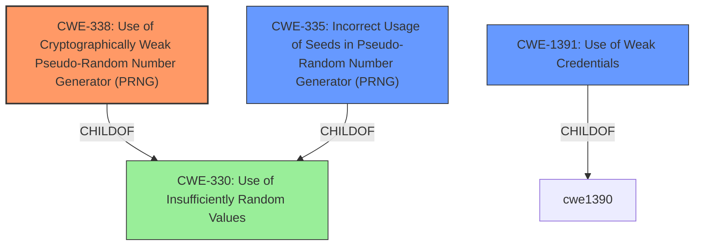

# Analysis for CVE-2021-37546

```markdown
# Summary
| CWE ID | CWE Name | Confidence | CWE Abstraction Level | CWE Vulnerability Mapping Label | CWE-Vulnerability Mapping Notes |
|---|---|---|---|---|---|
| CWE-338 | Use of Cryptographically Weak Pseudo-Random Number Generator (PRNG) | 0.8 | Base | Allowed | Primary CWE: The root cause is an **insecure key generation mechanism**. Using a weak PRNG directly relates to this issue. |
| CWE-335 | Incorrect Usage of Seeds in Pseudo-Random Number Generator (PRNG) | 0.7 | Base | Allowed | Secondary Candidate: If the **insecure key generation** resulted from improper seeding, this CWE is relevant. |
| CWE-1391 | Use of Weak Credentials | 0.6 | Class | Allowed-with-Review | Secondary Candidate: The **insecure key generation mechanism** could lead to weak credentials being generated. |

## Evidence and Confidence

*   **Confidence Score:** 0.7
*   **Evidence Strength:** MEDIUM

## Relationship Analysis
The analysis focuses on the hierarchical relationships stemming from CWE-330 (Use of Insufficiently Random Values), which is a Class-level CWE encompassing issues related to weak randomness. CWE-338 (Use of Cryptographically Weak Pseudo-Random Number Generator (PRNG)) and CWE-335 (Incorrect Usage of Seeds in Pseudo-Random Number Generator (PRNG)) are both children of CWE-330, providing more specific classifications. CWE-1391 (Use of Weak Credentials) is also considered due to the potential outcome of the weak key generation, but it's a Class-level CWE and less directly related to the root cause than CWE-338. The choice of CWE-338 as the primary mapping reflects its Base level of abstraction and direct relevance to the **insecure key generation mechanism**.



## Vulnerability Chain
The vulnerability chain starts with the **insecure key generation mechanism**. This leads to the use of weak keys for encrypting properties. The impact is the potential exposure of sensitive data due to the compromised encryption.

*   **Root Cause:** **Insecure key generation mechanism**
*   **Weakness:** Use of weak cryptographic keys (CWE-338)
*   **Impact:** Potential exposure of sensitive data

## Summary of Analysis
The initial analysis focused on identifying the root cause of the vulnerability, which is the **insecure key generation mechanism**. The evidence from the vulnerability description and CVE reference links points to a problem with how keys are generated for encrypting properties in JetBrains TeamCity. The retriever results suggested several candidate CWEs, including CWE-338, CWE-335 and CWE-1391.

The final decision to map the vulnerability primarily to CWE-338 is based on the direct link between the **insecure key generation mechanism** and the use of a cryptographically weak PRNG. As the description says "*The product uses a Pseudo-Random Number Generator (PRNG) in a security context, but the PRNG's algorithm is not cryptographically strong.*" which is essentially what the vulnerability description states.

CWE-335 is a secondary consideration if the PRNG was not seeded correctly. The evidence is not detailed enough to determine if the seeds were not properly managed.

CWE-1391 is a secondary consideration because it represents the potential outcome of the insecure key generation. However, it is less specific than CWE-338, which focuses on the underlying cause.

The selected CWEs are at the optimal level of specificity, with CWE-338 being a Base-level CWE that directly addresses the **insecure key generation mechanism**.

Relevant CWE Information:

# Enhanced Context (25 CWEs)

## CWE-335: Incorrect Usage of Seeds in Pseudo-Random Number Generator (PRNG)
**Abstraction Level**: Base
**Similarity Score**: 0.79
**Source**: dense

**Description**:
The product uses a Pseudo-Random Number Generator (PRNG) but does not correctly manage seeds.

**Mapping Guidance**:
- Usage: Allowed
- Rationale: This CWE entry is at the Base level of abstraction, which is a preferred level of abstraction for mapping to the root causes of vulnerabilities.

## CWE-331: Insufficient Entropy
**Abstraction Level**: Base
**Similarity Score**: 0.78
**Source**: dense

**Description**:
The product uses an algorithm or scheme that produces insufficient entropy, leaving patterns or clusters of values that are more likely to occur than others.

**Mapping Guidance**:
- Usage: Allowed
- Rationale: This CWE entry is at the Base level of abstraction, which is a preferred level of abstraction for mapping to the root causes of vulnerabilities.

## CWE-1240: Use of a Cryptographic Primitive with a Risky Implementation
**Abstraction Level**: Base
**Similarity Score**: 0.77
**Source**: dense

**Description**:
To fulfill the need for a cryptographic primitive, the product implements a cryptographic algorithm using a non-standard, unproven, or disallowed/non-compliant cryptographic implementation.

**Mapping Guidance**:
- Usage: Allowed
- Rationale: This CWE entry is at the Base level of abstraction, which is a preferred level of abstraction for mapping to the root causes of vulnerabilities.

## CWE-330: Use of Insufficiently Random Values
**Abstraction Level**: Class
**Similarity Score**: 0.77
**Source**: dense

**Description**:
The product uses insufficiently random numbers or values in a security context that depends on unpredictable numbers.

**Mapping Guidance**:
- Usage: Discouraged
- Rationale: This CWE entry is a level-1 Class (i.e., a child of a Pillar). It might have lower-level children that would be more appropriate

## CWE-1391: Use of Weak Credentials
**Abstraction Level**: Class
**Similarity Score**: 0.77
**Source**: dense

**Description**:
The product uses weak credentials (such as a default key or hard-coded password) that can be calculated, derived, reused, or guessed by an attacker.

**Mapping Guidance**:
- Usage: Allowed-with-Review
- Rationale: This CWE entry is a Class and might have Base-level children that would be more appropriate

## CWE-345: Insufficient Verification of Data Authenticity
**Abstraction Level**: Class
**Similarity Score**: 0.76
**Source**: dense

**Description**:
The product does not sufficiently verify the origin or authenticity of data, in a way that causes it to accept invalid data.

**Mapping Guidance**:
- Usage: Discouraged
- Rationale: This CWE entry is a level-1 Class (i.e., a child of a Pillar). It might have lower-level children that would be more appropriate

## CWE-657: Violation of Secure Design Principles
**Abstraction Level**: Class
**Similarity Score**: 0.75
**Source**: dense

**Description**:
The product violates well-established principles for secure design.

**Mapping Guidance**:
- Usage: Discouraged
- Rationale: This CWE entry is a level-1 Class (i.e., a child of a Pillar). It might have lower-level children that would be more appropriate

## CWE-338: Use of Cryptographically Weak Pseudo-Random Number Generator (PRNG)
**Abstraction Level**: Base
**Similarity Score**: 0.75
**Source**: dense

**Description**:
The product uses a Pseudo-Random Number Generator (PRNG) in a security context, but the PRNG's algorithm is not cryptographically strong.

**Mapping Guidance**:
- Usage: Allowed
- Rationale: This CWE entry is at the Base level of abstraction, which is a preferred level of abstraction for mapping to the root causes of vulnerabilities.

## CWE-226: Sensitive Information in Resource Not Removed Before Reuse
**Abstraction Level**: Base
**Similarity Score**: 0.74
**Source**: dense

**Description**:
The product releases a resource such as memory or a file so that it can be made available for reuse, but it does not clear or "zeroize" the information contained in the resource before the product performs a critical state transition or makes the resource available for reuse by other entities.

**Mapping