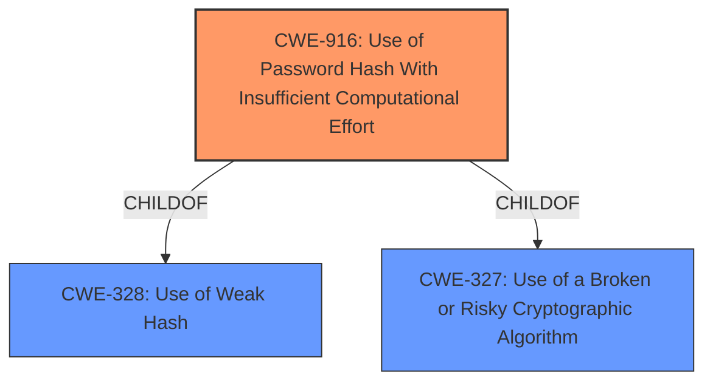

# Raw Analyzer Response for CVE-2021-37551

# Summary
| CWE ID | CWE Name | Confidence | CWE Abstraction Level | CWE Vulnerability Mapping Label | CWE-Vulnerability Mapping Notes |
|---|---|---|---|---|---|
| CWE-916 | Use of Password Hash With Insufficient Computational Effort | 1.0 | Base | Allowed | Primary CWE |
| CWE-328 | Use of Weak Hash | 0.8 | Base | Allowed | Secondary Candidate |
| CWE-1240 | Use of a Cryptographic Primitive with a Risky Implementation | 0.7 | Base | Allowed | Secondary Candidate |

## Evidence and Confidence

*   **Confidence Score:** 0.9
*   **Evidence Strength:** HIGH

## Relationship Analysis
The primary CWE, CWE-916, is a child of both CWE-328 and CWE-327. This indicates that using a password hash with insufficient computational effort is a specific type of using a weak hash, and a more specific case of using a broken or risky cryptographic algorithm. The relationship helped to refine the selection from the broader CWE-328 to the more precise CWE-916.

## Vulnerability Chain
The vulnerability chain starts with the **use of SHA-256 for hashing passwords**, which is a **weakness** that directly leads to **insufficient computational effort** and the potential for password cracking.

## Summary of Analysis
The initial assessment identified the **use of SHA-256 for hashing passwords** as a root cause. The provided evidence, especially the "CVE Reference Links Content Summary," clearly states that "System user passwords were hashed with SHA-256, which is considered weak for password hashing." This directly supports the selection of CWE-916, "Use of Password Hash With Insufficient Computational Effort," as the primary CWE.

The relationship analysis further reinforces this decision. CWE-916 is a child of both CWE-328 ("Use of Weak Hash") and CWE-327 ("Use of a Broken or Risky Cryptographic Algorithm"), indicating that it is a more specific and appropriate classification than either of its parents. While CWE-328 and CWE-327 are also relevant, CWE-916 provides a more precise description of the vulnerability.

The choice of CWE-916 is at the optimal level of specificity, as it directly addresses the root cause (insufficient computational effort for password hashing) and is at the Base level of abstraction, which is preferred according to MITRE mapping guidance.

Relevant CWE Information:

# Enhanced Context (25 CWEs)

## CWE-916: Use of Password Hash With Insufficient Computational Effort
**Technical Explanation:** The vulnerability's details match CWE-916 because the **weak hashing algorithm (SHA-256)** does not provide sufficient computational effort to protect against password cracking attacks.
**Security Implications:** An attacker could compromise system user accounts by cracking the weakly hashed passwords.
**Relationship Analysis:** CWE-916 is a base CWE and a child of CWE-328 and CWE-327.
**Mapping Guidance:** The MITRE mapping guidance allows for this mapping, as CWE-916 is at the Base level of abstraction.

## CWE-328: Use of Weak Hash
**Technical Explanation:** SHA-256 is considered a **weak hash** for password storage due to its speed and susceptibility to attacks like rainbow tables when not properly salted and iterated.
**Security Implications:** An attacker could potentially compromise user accounts.
**Relationship Analysis:** CWE-328 is a parent of CWE-916.
**Mapping Guidance:** The MITRE mapping guidance allows for this mapping, as CWE-328 is at the Base level of abstraction. It is a secondary candidate because CWE-916 is more specific.

## CWE-1240: Use of a Cryptographic Primitive with a Risky Implementation
**Technical Explanation:** Using SHA-256 for password hashing can be considered using a cryptographic primitive with a risky implementation, because while SHA-256 itself is not "broken," its use *without* salting and key stretching is risky.
**Security Implications:** An attacker could potentially compromise user accounts.
**Relationship Analysis:** CWE-1240 is a related cryptographic weakness.
**Mapping Guidance:** The MITRE mapping guidance allows for this mapping, as CWE-1240 is at the Base level of abstraction. It is a tertiary candidate because CWE-916 and CWE-328 are more specific.

## Other CWEs Considered But Not Used:
- CWE-1391 (Use of Weak Credentials), CWE-798 (Use of Hard-coded Credentials), CWE-259 (Use of Hard-coded Password): These CWEs are not applicable because the vulnerability involves a weak hashing algorithm, not weak credentials.
- CWE-312 (Cleartext Storage of Sensitive Information), CWE-319 (Cleartext Transmission of Sensitive Information), CWE-256 (Plaintext Storage of a Password): These CWEs are not applicable because the passwords are not stored or transmitted in cleartext. They are hashed, albeit weakly.
- CWE-759 (Use of a One-Way Hash without a Salt): While salting might be missing, the description focuses on the weakness of the hashing algorithm itself. Therefore, CWE-916 is more appropriate.