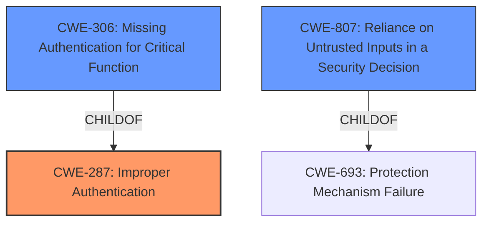

# Raw Analyzer Response for CVE-2021-37580

# Summary
| CWE ID | CWE Name | Confidence | CWE Abstraction Level | CWE Vulnerability Mapping Label | CWE-Vulnerability Mapping Notes |
|---|---|---|---|---|---|
| CWE-287 | Improper Authentication | 0.9 | Class | Primary | Discouraged |
| CWE-306 | Missing Authentication for Critical Function | 0.7 | Base | Secondary | Allowed |
| CWE-807 | Reliance on Untrusted Inputs in a Security Decision | 0.6 | Base | Secondary | Allowed |

## Evidence and Confidence

*   **Confidence Score:** 0.8
*   **Evidence Strength:** HIGH

## Relationship Analysis
The primary relationship considered was the parent-child relationship between CWE-287 (Improper Authentication) and CWE-306 (Missing Authentication for Critical Function). CWE-287 is a class-level CWE, while CWE-306 is a base-level CWE and child of CWE-287. Since the vulnerability involves bypassing authentication due to **incorrect use of JWT**, CWE-287 is the general class, but **CWE-306** is a more specific case of **improper authentication**. CWE-807 is considered since **the JWT is an untrusted input**.

## Vulnerability Chain
The vulnerability chain starts with the **incorrect use of JWT**, leading to the bypass of authentication.
1.  **Incorrect Use of JWT:** The root cause is the flawed implementation of JWT.
2.  **Authentication Bypass:** The vulnerability allows attackers to bypass the authentication process.

## Summary of Analysis
The initial assessment, based on the vulnerability description and CVE reference, points towards an authentication bypass vulnerability. The key phrase "incorrect use of JWT" indicates an issue in the authentication mechanism.

The description states: "A flaw was found in Apache ShenYu Admin. The **incorrect use of JWT** in ShenyuAdminBootstrap allows an attacker to bypass authentication. This issue affected Apache ShenYu 2.3.0 and 2.4.0".

The retriever results suggest CWE-287 (Improper Authentication) as a potential match, but notes this is a discouraged high level class that "might be misused when lower-level CWE entries are likely to be applicable". CWE-306 (Missing Authentication for Critical Function) is also listed and is a child of CWE-287 which is a better match.

Considering the MITRE mapping guidance, CWE-287 is discouraged because it's a high-level class. CWE-306 (Missing Authentication for Critical Function) is considered a more specific Base level CWE. The **incorrect use of JWT** means the system is relying on something that should identify a user, but **fails to do so properly**, which is what is described in CWE-306. CWE-807, Reliance on Untrusted Inputs in a Security Decision, is also applicable because the **JWT is an untrusted input**.

Therefore, CWE-287 serves as the primary, higher-level classification, while CWE-306 and CWE-807 provide more specific details about the nature of the authentication failure and the reliance on untrusted inputs.

# Relevant CWE Information:

## CWE-807: Reliance on Untrusted Inputs in a Security Decision
**Abstraction Level**: Base
**Similarity Score**: 0.81
**Source**: dense

**Description**:
The product uses a protection mechanism that relies on the existence or values of an input, but the input can be modified by an untrusted actor in a way that bypasses the protection mechanism.

**Mapping Guidance**:
- Usage: Allowed
- Rationale: This CWE entry is at the Base level of abstraction, which is a preferred level of abstraction for mapping to the root causes of vulnerabilities.

## CWE-287: Improper Authentication
**Abstraction:** Class
**Status:** Draft

### Description
When an actor claims to have a given identity, the product does not prove or insufficiently proves that the claim is correct.

### Extended Description
Not provided

### Alternative Terms
authentification: An alternate term is "authentification", which appears to be most commonly used by people from non-English-speaking countries.
AuthN: "AuthN" is typically used as an abbreviation of "authentication" within the web application security community. It is also distinct from "AuthZ," which is an abbreviation of "authorization." The use of "Auth" as an abbreviation is discouraged, since it could be used for either authentication or authorization.
AuthC: "AuthC" is used as an abbreviation of "authentication," but it appears to used less frequently than "AuthN."

### Relationships
ChildOf -> CWE-284
ChildOf -> CWE-284

### Mapping Guidance
**Usage:** Discouraged
**Rationale:** This CWE entry might be misused when lower-level CWE entries are likely to be applicable. It is a level-1 Class (i.e., a child of a Pillar).
**Comments:** Consider children or descendants, beginning with CWE-1390: Weak Authentication or CWE-306: Missing Authentication for Critical Function.
**Reasons:**
- Frequent Misuse
**Suggested Alternatives:**
- CWE-1390: Weak Authentication
- CWE-306: Missing Authentication for Critical Function

## CWE-306: Missing Authentication for Critical Function
**Abstraction:** Base
**Status:** Draft

### Description
The product does not perform any authentication for functionality that requires a provable user identity or consumes a significant amount of resources.

### Extended Description
Not provided

### Alternative Terms
None

### Relationships
ChildOf -> CWE-287
ChildOf -> CWE-287

### Mapping Guidance
**Usage:** Allowed
**Rationale:** This CWE entry is at the Base level of abstraction, which is a preferred level of abstraction for mapping to the root causes of vulnerabilities.
**Comments:** Carefully read both the name and description to ensure that this mapping is an appropriate fit. Do not try to 'force' a mapping to a lower-level Base/Variant simply to comply with this preferred level of abstraction.
**Reasons:**
- Acceptable-Use