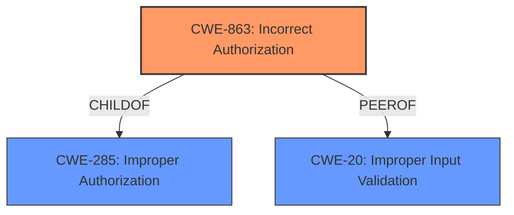

# Analysis Report for CVE-2021-37586

# Vulnerability Analysis Report: CVE-2021-37586

## Description


## Analysis (with Relationship Data)

# Summary

| CWE ID | CWE Name | Confidence | CWE Abstraction Level | CWE Vulnerability Mapping Label | CWE-Vulnerability Mapping Notes |
|---|---|---|---|---|---|
| **CWE-863** | **Incorrect Authorization** | 0.8 | Class | Primary | Allowed-with-Review |
| CWE-285 | Improper Authorization | 0.6 | Class | Secondary | Discouraged |
| CWE-20 | Improper Input Validation | 0.5 | Class | Secondary | Discouraged |

## Evidence and Confidence

*   **Confidence Score:** 0.8
*   **Evidence Strength:** HIGH

## Relationship Analysis

The primary relationship is between CWE-863 **Incorrect Authorization** and its parent CWE-285 **Improper Authorization**. CWE-863 is a more specific case of CWE-285. CWE-20 **Improper Input Validation** is included as a possible contributing factor, although the evidence points more strongly to an authorization problem. The abstraction levels influenced the choice, favoring CWE-863, which is closer to the root cause than the more abstract CWE-284 **Improper Access Control**.



## Vulnerability Chain

The chain of events can be described as follows:
1.  **Root Cause:** **Insufficient validation** in the PowerPlay Web component (as stated in the vulnerability description) leads to **incorrect authorization**.
2.  **Weakness:** An administrator user can access resources (recorded conversations) of other tenants.
3.  **Impact:** Confidentiality breach due to unauthorized access to sensitive data.

## Summary of Analysis

The initial assessment focused on the **insufficient validation** root cause identified in the vulnerability description. The retriever results suggested CWE-20 **Improper Input Validation**, CWE-863 **Incorrect Authorization**, and CWE-285 **Improper Authorization** as potential candidates.

The CVE Reference Links Content Summary provided further evidence, highlighting **inadequate access control** as a core weakness. This supported the selection of an authorization-related CWE.

CWE-863 **Incorrect Authorization** was chosen as the primary CWE because it directly addresses the **incorrect** execution of an authorization check, allowing a user with administrator rights to access recordings of other tenants. The vulnerability description states: "Mitel Interaction Recording Multitenancy systems before 6.7 could allow a user (with Administrator rights) to replay a previously recorded conversation of another tenant due to **insufficient validation**."

CWE-285 **Improper Authorization** was considered but deemed less specific than CWE-863. While CWE-285 describes the general failure to perform authorization correctly, CWE-863 focuses on cases where an authorization check is performed, but the check itself is flawed. Since the system *attempts* authorization but does so incorrectly, CWE-863 is a more accurate fit.

CWE-20 **Improper Input Validation** was also considered, based on the "**insufficient validation**" key phrase. However, the core issue is not so much the input itself, but rather the failure to properly enforce access controls based on the user's role and tenant. Therefore, CWE-20 is a secondary consideration.

The selected CWEs are at the optimal level of specificity because they directly address the root cause and the resulting authorization flaw. The decision is based on the evidence provided in the vulnerability description and CVE reference links, as well as the relationship analysis within the CWE structure.

Relevant CWE Information:

# Enhanced Context (25 CWEs)
The following CWEs were identified as potentially relevant to this vulnerability:

## CWE-274: Improper Handling of Insufficient Privileges
**Abstraction Level**: Base
**Similarity Score**: 0.74
**Source**: dense

**Description**:
The product does not handle or incorrectly handles when it has insufficient privileges to perform an operation, leading to resultant weaknesses.

**Mapping Guidance**:
- Usage: Discouraged
- Rationale: This CWE entry could be deprecated in a future version of CWE.

## CWE-653: Improper Isolation or Compartmentalization
**Abstraction Level**: Class
**Similarity Score**: 0.73
**Source**: dense

**Description**:
The product does not properly compartmentalize or isolate functionality, processes, or resources that require different privilege levels, rights, or permissions.

**Mapping Guidance**:
- Usage: Allowed
- Rationale: This CWE entry is at the Base level of abstraction, which is a preferred level of abstraction for mapping to the root causes of vulnerabilities.

## CWE-266: Incorrect Privilege Assignment
**Abstraction Level**: Base
**Similarity Score**: 0.72
**Source**: dense

**Description**:
A product incorrectly assigns a privilege to a particular actor, creating an unintended sphere of control for that actor.

**Mapping Guidance**:
- Usage: Allowed
- Rationale: This CWE entry is at the Base level of abstraction, which is a preferred level of abstraction for mapping to the root causes of vulnerabilities.

## CWE-1220: Insufficient Granularity of Access Control
**Abstraction Level**: Base
**Similarity Score**: 0.72
**Source**: dense

**Description**:
The product implements access controls via a policy or other feature with the intention to disable or restrict accesses (reads and/or writes) to assets in a system from untrusted agents. However, implemented access controls lack required granularity, which renders the control policy too broad because it allows accesses from unauthorized agents to the security-sensitive assets.

**Mapping Guidance**:
- Usage: Allowed
- Rationale: This CWE entry is at the Base level of abstraction, which is a preferred level of abstraction for mapping to the root causes of vulnerabilities.

## CWE-664: Improper Control of a Resource Through its Lifetime
**Abstraction Level**: Pillar
**Similarity Score**: 0.72
**Source**: dense

**Description**:
The product does not maintain or incorrectly maintains control over a resource throughout its lifetime of creation, use, and release.

**Mapping Guidance**:
- Usage: Discouraged
- Rationale: This CWE entry is high-level when lower-level children are available.

## CWE-267: Privilege Defined With Unsafe Actions
**Abstraction Level**: Base
**Similarity Score**: 0.72
**Source**: dense

**Description**:
A particular privilege, role, capability, or right can be used to perform unsafe actions that were not intended, even when it is assigned to the correct entity.

**Mapping Guidance**:
- Usage: Allowed
- Rationale: This CWE entry is at the Base level of abstraction, which is a preferred level of abstraction for mapping to the root causes of vulnerabilities.

## CWE-280: Improper Handling of Insufficient Permissions or Privileges
**Abstraction Level**: Base
**Similarity Score**: 0.72
**Source**: dense

**Description**:
The product does not handle or incorrectly handles when it has insufficient privileges to access resources or functionality as specified by their permissions. This may cause it to follow unexpected code paths that may leave the product in an invalid state.

**Mapping Guidance**:
- Usage: Allowed
- Rationale: This CWE entry is at the Base level of abstraction, which is a preferred level of abstraction for mapping to the root causes of vulnerabilities.

## CWE-691: Insufficient Control Flow Management
**Abstraction Level**: Pillar
**Similarity Score**: 0.71
**Source**: dense

**Description**:
The code does not sufficiently manage its control flow during execution, creating conditions in which the control flow can be modified in unexpected ways.

**Mapping Guidance**:
- Usage: Discouraged
- Rationale: This CWE entry is extremely high-level, a Pillar. However, classification research is limited for weaknesses of this type, so there can be gaps or organizational difficulties within CWE that force use of this weakness, even at such a high level of abstraction.

## CWE-668: Exposure of Resource to Wrong Sphere
**Abstraction Level**: Class
**Similarity Score**: 0.71
**Source**: dense

**Description**:
The product exposes a resource to the wrong control sphere, providing unintended actors with inappropriate access to the resource.

**Mapping Guidance**:
- Usage: Discouraged
- Rationale: CWE-668 is high-level and is often misused as a catch-all when lower-level CWE IDs might be applicable. It is sometimes used for low-information vulnerability reports [REF-1287]. It is a level-1 Class (i.e., a child of a Pillar). It is not useful for trend analysis.

## CWE-268: Privilege Chaining
**Abstraction Level**: Base
**Similarity Score**: 0.71
**Source**: dense

**


## CWE Relationship Analysis

Current CWEs represent these abstraction levels: .


### Vulnerability Chain Analysis

**Chain starting from CWE-691:**
- 691 (Insufficient Control Flow Management) - ROOT


**Chain starting from CWE-664:**
- 664 (Improper Control of a Resource Through its Lifetime) - ROOT


### CWE Relationship Diagram

```mermaid
graph TD
    classDef primary fill:#f96,stroke:#333,stroke-width:2px
    classDef secondary fill:#69f,stroke:#333
    classDef tertiary fill:#9e9,stroke:#333
```


*Report generated on 2025-04-01 22:30:50*
