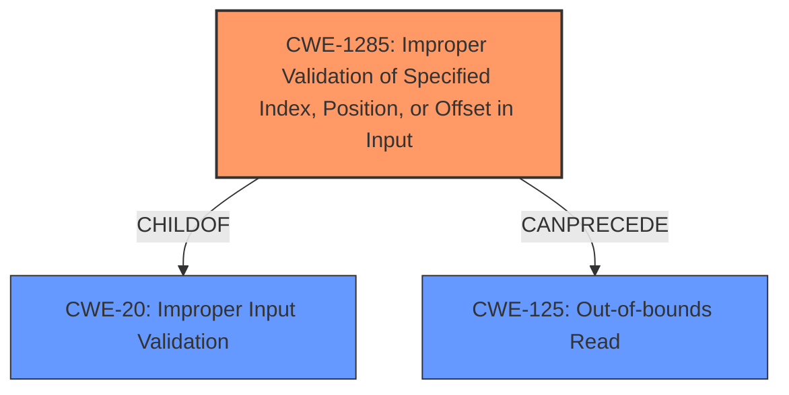

# Analysis for CVE-2021-37594

# Summary
| CWE ID  | CWE Name                                                        | Confidence | CWE Abstraction Level | CWE Vulnerability Mapping Label | CWE-Vulnerability Mapping Notes |
| :-------- | :-------------------------------------------------------------- | :---------- | :---------------------- | :------------------------------ | :------------------------------ |
| CWE-1285 | Improper Validation of Specified Index, Position, or Offset in Input | 0.95      | Base                    | Allowed                         | Primary CWE                     |
| CWE-125  | Out-of-bounds Read                                            | 0.70      | Base                    | Allowed                         | Secondary Candidate             |
| CWE-20   | Improper Input Validation                                       | 0.60      | Class                   | Discouraged                     | Secondary Candidate             |

## Evidence and Confidence

*   **Confidence Score:** 0.90
*   **Evidence Strength:** HIGH

## Relationship Analysis
The primary relationship impacting the decision is the hierarchical structure. CWE-1285 (Improper Validation of Specified Index, Position, or Offset in Input) is a child of CWE-20 (Improper Input Validation). Since the vulnerability specifically involves **missing input checks** related to an index (`fileContentsRequest->listIndex`), CWE-1285 is a more specific and appropriate choice than its parent, CWE-20.

Additionally, CWE-125 (Out-of-bounds Read) can be a consequence of CWE-1285 when an invalid index is used to access an array, leading to reading data outside the array's boundaries.

## Vulnerability Chain
The vulnerability chain starts with the **missing input checks** on `fileContentsRequest->listIndex` (CWE-1285). This leads to an out-of-bounds read (CWE-125) when the index is used to access `clipboard->fileDescriptor` or `clipboard->file_names` arrays.

## Summary of Analysis
The initial assessment considered CWE-20 due to the **missing input checks**, which aligns with the general description of CWE-20. However, after further analysis and consideration of the relationships between CWEs, it became clear that CWE-1285 is a more precise classification. The vulnerability specifically relates to the lack of validation of an index used to access an array.

The "CVE Reference Links Content Summary" section confirms that the code did not properly check if `fileContentsRequest->listIndex` was within the valid bounds of the `clipboard->nFiles` array. This is direct evidence supporting the selection of CWE-1285.

The final selection of CWE-1285 is based on its specificity and the supporting evidence from the vulnerability description. It is the most accurate representation of the **root cause** of the vulnerability.

Relevant CWE Information:

# Enhanced Context (25 CWEs)
The following CWEs were identified as potentially relevant to this vulnerability:

## CWE-1285: Improper Validation of Specified Index, Position, or Offset in Input
**Abstraction Level**: Base
**Similarity Score**: 5991.19
**Source**: sparse

**Description**:
The product receives input that is expected to specify an index, position, or offset into an indexable resource such as a buffer or file, but it does not validate or incorrectly validates that the specified index/position/offset has the required properties.

**Mapping Guidance**:
- Usage: Allowed
- Rationale: This CWE entry is at the Base level of abstraction, which is a preferred level of abstraction for mapping to the root causes of vulnerabilities.

## CWE-125: Out-of-bounds Read
**Abstraction Level**: Base
**Similarity Score**: 6173.10
**Source**: sparse

**Description**:
The product reads data past the end, or before the beginning, of the intended buffer.

**Mapping Guidance**:
- Usage: Allowed
- Rationale: This CWE entry is at the Base level of abstraction, which is a preferred level of abstraction for mapping to the root causes of vulnerabilities.

## CWE-20: Improper Input Validation
**Abstraction Level**: Class
**Similarity Score**: 5921.70
**Source**: sparse

**Description**:
The product receives input or data, but it does
        not validate or incorrectly validates that the input has the
        properties that are required to process the data safely and
        correctly.

**Mapping Guidance**:
- Usage: Discouraged
- Rationale: CWE-20 is commonly misused in low-information vulnerability reports when lower-level CWEs could be used instead, or when more details about the vulnerability are available [REF-1287]. It is not useful for trend analysis. It is also a level-1 Class (i.e., a child of a Pillar).

### CWE Considerations and Rejections:

*   **CWE-1284: Improper Validation of Specified Quantity in Input**: While related to input validation, this CWE focuses on the validation of quantities (size, length, etc.). The vulnerability is specifically about validating an index, making CWE-1285 a more precise fit.
*   **CWE-158: Improper Neutralization of Null Byte or NUL Character**: This CWE is not relevant because the vulnerability does not involve null byte injection.
*   **CWE-862: Missing Authorization**: This CWE is not relevant as the issue is related to input validation, not authorization.
*   **CWE-345: Insufficient Verification of Data Authenticity**: This CWE is not relevant as it focuses on data authenticity, not input validation of indices.
*   **CWE-69: Improper Handling of Windows ::DATA Alternate Data Stream**: This is specific to Windows alternate data streams and is not applicable.
*   **CWE-129: Improper Validation of Array Index**: This CWE is a good match, but CWE-1285 is a more general case of this.
*   **CWE-138: Improper Neutralization of Special Elements**: Not relevant as the issue is not about neutralizing special elements.
*   **CWE-126: Buffer Over-read**: This is a potential impact of the vulnerability, but not the root cause. The root cause is the missing validation of the index.
*   **CWE-130: Improper Handling of Length Parameter Inconsistency**: The weakness is about an index, not a length parameter.
*   **CWE-606: Unchecked Input for Loop Condition**: Not relevant as the issue is not related to loop conditions.
*   **CWE-805: Buffer Access with Incorrect Length Value**: The weakness is about an index, not a length value.
*   **CWE-131: Incorrect Calculation of Buffer Size**: Not relevant as the issue is not about buffer size calculation.
*   **CWE-184: Incomplete List of Disallowed Inputs**: Not relevant as the issue is not about a list of disallowed inputs.
*   **CWE-191: Integer Underflow (Wrap or Wraparound)**: Not relevant as the issue is not about integer underflow.
*    **CWE-41: Improper Resolution of Path Equivalence, CWE-22: Improper Limitation of a Pathname to a Restricted Directory ('Path Traversal'), CWE-770: Allocation of Resources Without Limits or Throttling, CWE-73: External Control of File Name or Path, CWE-190: Integer Overflow or Wraparound, CWE-823: Use of Out-of-range Pointer Offset, CWE-789: Memory Allocation with Excessive Size Value, CWE-170: Improper Null Termination**: These are not relevant to this vulnerability.