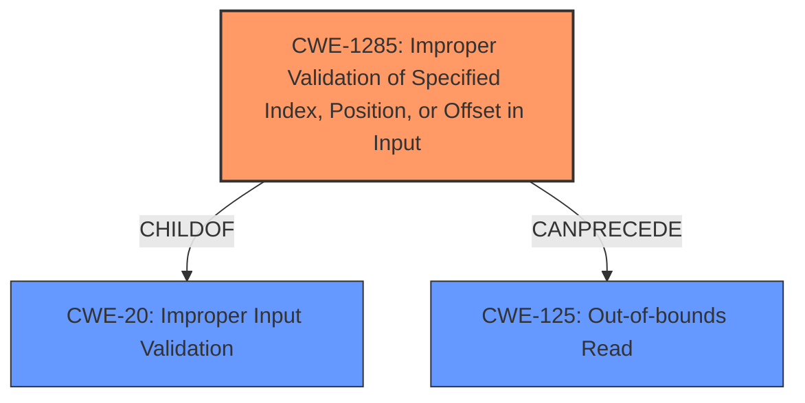

# Analysis for CVE-2021-37595

# Summary
| CWE ID | CWE Name | Confidence | CWE Abstraction Level | CWE Vulnerability Mapping Label | CWE-Vulnerability Mapping Notes |
|---|---|---|---|---|---|
| CWE-1285 | Improper Validation of Specified Index, Position, or Offset in Input | 0.9 | Base | Allowed | Primary CWE. |
| CWE-125 | Out-of-bounds Read | 0.7 | Base | Allowed | Secondary Candidate. |
| CWE-20 | Improper Input Validation | 0.6 | Class | Discouraged | Secondary Candidate. |

## Evidence and Confidence

*   **Confidence Score:** 0.8
*   **Evidence Strength:** HIGH

## Relationship Analysis
The primary CWE is CWE-1285 (**Improper Validation of Specified Index, Position, or Offset in Input**), which is a child of CWE-20 (**Improper Input Validation**). CWE-1285 directly addresses the **missing input checks** for an index, position, or offset, making it more specific than CWE-20. CWE-125 (**Out-of-bounds Read**) can result from CWE-1285 if an invalid index is used to access a buffer.

## Vulnerability Chain
The vulnerability chain starts with the **missing input checks** (CWE-1285), which leads to an out-of-bounds read (CWE-125), resulting in a potential denial of service.

## Summary of Analysis
The initial analysis identified a **missing input check** vulnerability. The retriever results suggested several CWEs, including CWE-1284 (**Improper Validation of Specified Quantity in Input**), CWE-1285 (**Improper Validation of Specified Index, Position, or Offset in Input**), and CWE-20 (**Improper Input Validation**). After reviewing the details and the relationships between CWEs, CWE-1285 was selected as the primary CWE because it directly addresses the **missing input checks** for an index, position, or offset. CWE-125 (**Out-of-bounds Read**) is a potential consequence of this **missing input check**, and CWE-20 is a more general, less specific category.

The evidence from the "CVE Reference Links Content Summary" confirms that the **root cause** is the **missing input checks** for `listIndex` which is then used to access the `clipboard->fileDescriptor` and `clipboard->file_names` arrays. The code **fails to properly validate** the `listIndex` field which can lead to an out-of-bounds read.

The selection of CWE-1285 is at the optimal level of specificity because it describes the exact nature of the **missing input check**, focusing on the index, position, or offset that leads to the vulnerability.

Relevant CWE Information:

# Enhanced Context (25 CWEs)
The following CWEs were identified as potentially relevant to this vulnerability:

## CWE-1285: Improper Validation of Specified Index, Position, or Offset in Input
**Abstraction Level**: Base
**Similarity Score**: 5902.13
**Source**: sparse

**Description**:
The product receives input that is expected to specify an index, position, or offset into an indexable resource such as a buffer or file, but it does not validate or incorrectly validates that the specified index/position/offset has the required properties.

**Mapping Guidance**:
- Usage: Allowed
- Rationale: This CWE entry is at the Base level of abstraction, which is a preferred level of abstraction for mapping to the root causes of vulnerabilities.

### Technical Explanation for CWE-1285
The vulnerability description explicitly mentions **missing input checks** for a `FILECONTENTS_RANGE File Contents Request PDU`. The "CVE Reference Links Content Summary" confirms that the **root cause** is the **missing input checks** for `listIndex` which is then used to access the `clipboard->fileDescriptor` and `clipboard->file_names` arrays. This aligns perfectly with CWE-1285, which describes the scenario where a product receives input specifying an index, position, or offset but **does not validate or incorrectly validates** that the specified index/position/offset has the required properties.

### Security Implications and Potential Impact for CWE-1285
The security implication of **missing input validation** is that an attacker can supply an invalid index, position, or offset, leading to unauthorized access to resources, potentially causing denial of service, information disclosure, or other unintended consequences. In this case, the impact is a denial-of-service (DoS) condition due to the out-of-bounds read.

### Parent-Child Relationships and Chain Patterns for CWE-1285
CWE-1285 is a child of CWE-20 (**Improper Input Validation**). It can precede CWE-125 (**Out-of-bounds Read**) if the invalid index is used to access a memory location outside the bounds of a buffer.

### MITRE Mapping Guidance Influence for CWE-1285
The MITRE mapping guidance for CWE-1285 states that its usage is "Allowed" and that it is at the Base level of abstraction, which is a preferred level for mapping to **root causes** of vulnerabilities. This guidance supports the selection of CWE-1285 as the primary CWE.

### Technical Explanation for CWE-125
The "CVE Reference Links Content Summary" indicates that if the `listIndex` value is greater than or equal to `clipboard->nFiles`, the code attempts to access an element beyond the allocated boundary of `clipboard->fileDescriptor` and `clipboard->file_names` arrays. This leads to an **out-of-bounds read**, which is exactly what CWE-125 describes.

### Security Implications and Potential Impact for CWE-125
The security implication of an **out-of-bounds read** is that sensitive information can be disclosed, or the application can crash, leading to a denial of service.

### Parent-Child Relationships and Chain Patterns for CWE-125
CWE-125 is a child of CWE-119 (**Improper Restriction of Operations within the Bounds of a Memory Buffer**).

### MITRE Mapping Guidance Influence for CWE-125
The MITRE mapping guidance for CWE-125 states that its usage is "Allowed" and that it is at the Base level of abstraction, which is a preferred level for mapping to **root causes** of vulnerabilities.

### Technical Explanation for CWE-20
The vulnerability stems from **missing input checks**. CWE-20 describes a scenario where the product receives input but **does not validate or incorrectly validates** that the input has the properties required to process the data safely and correctly.

### Security Implications and Potential Impact for CWE-20
The security implication of **improper input validation** is that an attacker can craft input in a form not expected by the application, leading to altered control flow, arbitrary control of a resource, or arbitrary code execution.

### Parent-Child Relationships and Chain Patterns for CWE-20
CWE-20 is a class-level CWE and has many child CWEs that describe more specific types of input validation issues.

### MITRE Mapping Guidance Influence for CWE-20
The MITRE mapping guidance for CWE-20 states that its usage is "Discouraged" because it is commonly misused in low-information vulnerability reports when lower-level CWEs could be used instead. This guidance suggests that a more specific CWE should be selected if possible.

### Other CWEs Considered But Not Used

*   CWE-1284 (**Improper Validation of Specified Quantity in Input**): While the `listIndex` can be considered a quantity, CWE-1285 is a better fit because it specifically addresses indexes, positions, or offsets.
*   CWE-158 (**Improper Neutralization of Null Byte or NUL Character**): This is not relevant to the vulnerability description.
*   CWE-862 (**Missing Authorization**): This is not relevant to the vulnerability description, which focuses on **input validation** rather than authorization.
*   CWE-345 (**Insufficient Verification of Data Authenticity**): This is not relevant to the vulnerability description.
*   CWE-69 (**Improper Handling of Windows ::DATA Alternate Data Stream**): This is specific to Windows ADS and not relevant to the general **input validation** issue.
*   CWE-129 (**Improper Validation of Array Index**): This is similar to CWE-1285, but CWE-1285 is a broader category including position and offset.
*   CWE-1