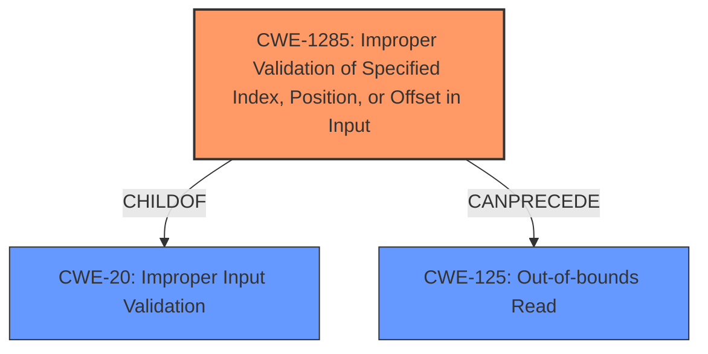

# Analysis for CVE-2021-37595

# Summary
| CWE ID | CWE Name | Confidence | CWE Abstraction Level | CWE Vulnerability Mapping Label | CWE-Vulnerability Mapping Notes |
|---|---|---|---|---|---|
| CWE-1285 | Improper Validation of Specified Index, Position, or Offset in Input | 0.9 | Base | Allowed | Primary CWE. |
| CWE-125 | Out-of-bounds Read | 0.7 | Base | Allowed | Secondary Candidate. |
| CWE-20 | Improper Input Validation | 0.6 | Class | Discouraged | Secondary Candidate. |

## Evidence and Confidence

*   **Confidence Score:** 0.8
*   **Evidence Strength:** HIGH

## Relationship Analysis
The primary CWE is CWE-1285 (**Improper Validation of Specified Index, Position, or Offset in Input**), which is a child of CWE-20 (**Improper Input Validation**). CWE-1285 directly addresses the **missing input checks** for an index, position, or offset, making it more specific than CWE-20. CWE-125 (**Out-of-bounds Read**) can result from CWE-1285 if an invalid index is used to access a buffer.

## Vulnerability Chain
The vulnerability chain starts with the **missing input checks** (CWE-1285), which leads to an out-of-bounds read (CWE-125), resulting in a potential denial of service.

## Summary of Analysis
The initial analysis identified a **missing input check** vulnerability. The retriever results suggested several CWEs, including CWE-1284 (**Improper Validation of Specified Quantity in Input**), CWE-1285 (**Improper Validation of Specified Index, Position, or Offset in Input**), and CWE-20 (**Improper Input Validation**). After reviewing the details and the relationships between CWEs, CWE-1285 was selected as the primary CWE because it directly addresses the **missing input checks** for an index, position, or offset. CWE-125 (**Out-of-bounds Read**) is a potential consequence of this **missing input check**, and CWE-20 is a more general, less specific category.

The evidence from the "CVE Reference Links Content Summary" confirms that the **root cause** is the **missing input checks** for `listIndex` which is then used to access the `clipboard->fileDescriptor` and `clipboard->file_names` arrays. The code **fails to properly validate** the `listIndex` field which can lead to an out-of-bounds read.

The selection of CWE-1285 is at the optimal level of specificity because it describes the exact nature of the **missing input check**, focusing on the index, position, or offset that leads to the vulnerability.

Relevant CWE Information:

# Enhanced Context (25 CWEs)
The following CWEs were identified as potentially relevant to this vulnerability:

## CWE-1285: Improper Validation of Specified Index, Position, or Offset in Input
**Abstraction Level**: Base
**Similarity Score**: 5902.13
**Source**: sparse

**Description**:
The product receives input that is expected to specify an index, position, or offset into an indexable resource such as a buffer or file, but it does not validate or incorrectly validates that the specified index/position/offset has the required properties.

**Mapping Guidance**:
- Usage: Allowed
- Rationale: This CWE entry is at the Base level of abstraction, which is a preferred level of abstraction for mapping to the root causes of vulnerabilities.

### Technical Explanation for CWE-1285
The vulnerability description explicitly mentions **missing input checks** for a `FILECONTENTS_RANGE File Contents Request PDU`. The "CVE Reference Links Content Summary" confirms that the **root cause** is the **missing input checks** for `listIndex` which is then used to access the `clipboard->fileDescriptor` and `clipboard->file_names` arrays. This aligns perfectly with CWE-1285, which describes the scenario where a product receives input specifying an index, position, or offset but **does not validate or incorrectly validates** that the specified index/position/offset has the required properties.

### Security Implications and Potential Impact for CWE-1285
The security implication of **missing input validation** is that an attacker can supply an invalid index, position, or offset, leading to unauthorized access to resources, potentially causing denial of service, information disclosure, or other unintended consequences. In this case, the impact is a denial-of-service (DoS) condition due to the out-of-bounds read.

### Parent-Child Relationships and Chain Patterns for CWE-1285
CWE-1285 is a child of CWE-20 (**Improper Input Validation**). It can precede CWE-125 (**Out-of-bounds Read**) if the invalid index is used to access a memory location outside the bounds of a buffer.

### MITRE Mapping Guidance Influence for CWE-1285
The MITRE mapping guidance for CWE-1285 states that its usage is "Allowed" and that it is at the Base level of abstraction, which is a preferred level for mapping to **root causes** of vulnerabilities. This guidance supports the selection of CWE-1285 as the primary CWE.

### Technical Explanation for CWE-125
The "CVE Reference Links Content Summary" indicates that if the `listIndex` value is greater than or equal to `clipboard->nFiles`, the code attempts to access an element beyond the allocated boundary of `clipboard->fileDescriptor` and `clipboard->file_names` arrays. This leads to an **out-of-bounds read**, which is exactly what CWE-125 describes.

### Security Implications and Potential Impact for CWE-125
The security implication of an **out-of-bounds read** is that sensitive information can be disclosed, or the application can crash, leading to a denial of service.

### Parent-Child Relationships and Chain Patterns for CWE-125
CWE-125 is a child of CWE-119 (**Improper Restriction of Operations within the Bounds of a Memory Buffer**).

### MITRE Mapping Guidance Influence for CWE-125
The MITRE mapping guidance for CWE-125 states that its usage is "Allowed" and that it is at the Base level of abstraction, which is a preferred level for mapping to **root causes** of vulnerabilities.

### Technical Explanation for CWE-20
The vulnerability stems from **missing input checks**. CWE-20 describes a scenario where the product receives input but **does not validate or incorrectly validates** that the input has the properties required to process the data safely and correctly.

### Security Implications and Potential Impact for CWE-20
The security implication of **improper input validation** is that an attacker can craft input in a form not expected by the application, leading to altered control flow, arbitrary control of a resource, or arbitrary code execution.

### Parent-Child Relationships and Chain Patterns for CWE-20
CWE-20 is a class-level CWE and has many child CWEs that describe more specific types of input validation issues.

### MITRE Mapping Guidance Influence for CWE-20
The MITRE mapping guidance for CWE-20 states that its usage is "Discouraged" because it is commonly misused in low-information vulnerability reports when lower-level CWEs could be used instead. This guidance suggests that a more specific CWE should be selected if possible.

### Other CWEs Considered But Not Used

*   CWE-1284 (**Improper Validation of Specified Quantity in Input**): While the `listIndex` can be considered a quantity, CWE-1285 is a better fit because it specifically addresses indexes, positions, or offsets.
*   CWE-158 (**Improper Neutralization of Null Byte or NUL Character**): This is not relevant to the vulnerability description.
*   CWE-862 (**Missing Authorization**): This is not relevant to the vulnerability description, which focuses on **input validation** rather than authorization.
*   CWE-345 (**Insufficient Verification of Data Authenticity**): This is not relevant to the vulnerability description.
*   CWE-69 (**Improper Handling of Windows ::DATA Alternate Data Stream**): This is specific to Windows ADS and not relevant to the general **input validation** issue.
*   CWE-129 (**Improper Validation of Array Index**): This is similar to CWE-1285, but CWE-1285 is a broader category including position and offset.
*   CWE-1

# Enhanced Query for CVE-2021-37595

## Vulnerability Description
In FreeRDP before 2.4.0 on Windows, wf_cliprdr_server_file_contents_request in client/Windows/wf_cliprdr.c has **missing input checks** for a FILECONTENTS_RANGE File Contents Request PDU.

### Vulnerability Description Key Phrases
- **rootcause:** **missing input checks**
- **product:** FreeRDP
- **version:** before 2.4.0
- **component:** wf_cliprdr_server_file_contents_request in client/Windows/wf_cliprdr.c

### CWE for similar CVE Descriptions
### Primary CWE Match
CWE-20

#### Top CWEs
- CWE-20 (Count: 6)

## CVE Reference Links Content Summary
Based on the provided content, here's an analysis of the vulnerability:

**Root Cause:**
- The vulnerability stems from missing input checks in the `wf_cliprdr_server_file_contents_request` function within the FreeRDP client. Specifically, it fails to properly validate the `listIndex` field in the `fileContentsRequest` structure before using it to access the `clipboard->fileDescriptor` and `clipboard->file_names` arrays.

**Weaknesses/Vulnerabilities:**
- **Out-of-bounds read:** If the `listIndex` value is greater than or equal to `clipboard->nFiles`, the code attempts to access an element beyond the allocated boundary of `clipboard->fileDescriptor` and `clipboard->file_names` arrays. This leads to an out-of-bounds read.

**Impact of Exploitation:**
- The primary impact is a denial-of-service (DoS) condition. An attacker can potentially crash the FreeRDP client by sending a crafted file contents request with an invalid `listIndex`.

**Attack Vectors:**
- A malicious RDP server could send a crafted `FILECONTENTS_SIZE` or `FILECONTENTS_RANGE` request, with a `listIndex` that is out of bounds to trigger the vulnerability.

**Required Attacker Capabilities/Position:**
- The attacker needs to control the RDP server and be able to send specially crafted file content request messages to the FreeRDP client.

**Additional Notes:**
- The commit message states "Fixed missing input checks for file contents request" which aligns with the vulnerability description.
- The patch adds checks within the `wf_cliprdr_server_file_contents_request` function to ensure that the `listIndex` is within the bounds of the available files (`clipboard->nFiles`). Specifically, it checks `if (clipboard->nFiles <= fileContentsRequest->listIndex)` and `goto error;` when `listIndex` is invalid.
- This vulnerability affects the Windows client (`client/Windows/wf_cliprdr.c`).

## Retriever Results

### Top Combined Results

| Rank | CWE ID | Name | Abstraction | Usage  | Retrievers | Individual Scores |
|------|--------|------|-------------|-------|------------|-------------------|
| 1 | 1284 | Improper Validation of Specified Quantity in Input | Base | Allowed | sparse | 0.181 |
| 2 | 158 | Improper Neutralization of Null Byte or NUL Character | Variant | Allowed | sparse | 0.132 |
| 3 | 862 | Missing Authorization | Class | Allowed-with-Review | sparse | 0.130 |
| 4 | 345 | Insufficient Verification of Data Authenticity | Class | Discouraged | sparse | 0.129 |
| 5 | 1285 | Improper Validation of Specified Index, Position, or Offset in Input | Base | Allowed | sparse | 0.126 |
| 6 | 69 | Improper Handling of Windows ::DATA Alternate Data Stream | Variant | Allowed | dense | 0.472 |
| 7 | 129 | Improper Validation of Array Index | Variant | Allowed | graph | 0.002 |
| 8 | 138 | Improper Neutralization of Special Elements | Class | Discouraged | sparse | 0.125 |
| 9 | 20 | Improper Input Validation | Class | Discouraged | sparse | 0.121 |
| 10 | 126 | Buffer Over-read | Variant | Allowed | sparse | 0.121 |

# Complete CWE Specifications

## CWE-1284: Improper Validation of Specified Quantity in Input
**Abstraction:** Base
**Status:** Incomplete

### Description
The product receives input that is expected to specify a quantity (such as size or length), but it does not validate or incorrectly validates that the quantity has the required properties.

### Extended Description

Specified quantities include size, length, frequency, price, rate, number of operations, time, and others. Code may rely on specified quantities to allocate resources, perform calculations, control iteration, etc. When the quantity is not properly validated, then attackers can specify malicious quantities to cause excessive resource allocation, trigger unexpected failures, enable buffer overflows, etc.

### Alternative Terms
None

### Relationships
ChildOf -> CWE-20
ChildOf -> CWE-20
CanPrecede -> CWE-789

### Mapping Guidance
**Usage:** Allowed
**Rationale:** This CWE entry is at the Base level of abstraction, which is a preferred level of abstraction for mapping to the root causes of vulnerabilities.
**Comments:** Carefully read both the name and description to ensure that this mapping is an appropriate fit. Do not try to 'force' a mapping to a lower-level Base/Variant simply to comply with this preferred level of abstraction.
**Reasons:**
- Acceptable-Use

### Additional Notes
**[Maintenance]** This entry is still under development and will continue to see updates and content improvements.

### Observed Examples
- **CVE-2022-21668:** Chain: Python library does not limit the resources used to process images that specify a very large number of bands (CWE-1284), leading to excessive memory consumption (CWE-789) or an integer overflow (CWE-190).
- **CVE-2008-1440:** lack of validation of length field leads to infinite loop
- **CVE-2008-2374:** lack of validation of string length fields allows memory consumption or buffer over-read

## CWE-158: Improper Neutralization of Null Byte or NUL Character
**Abstraction:** Variant
**Status:** Incomplete

### Description
The product receives input from an upstream component, but it does not neutralize or incorrectly neutralizes NUL characters or null bytes when they are sent to a downstream component.

### Extended Description
As data is parsed, an injected NUL character or null byte may cause the product to believe the input is terminated earlier than it actually is, or otherwise cause the input to be misinterpreted. This could then be used to inject potentially dangerous input that occurs after the null byte or otherwise bypass validation routines and other protection mechanisms.

### Alternative Terms
None

### Relationships
ChildOf -> CWE-138

### Mapping Guidance
**Usage:** Allowed
**Rationale:** This CWE entry is at the Variant level of abstraction, which is a preferred level of abstraction for mapping to the root causes of vulnerabilities.
**Comments:** Carefully read both the name and description to ensure that this mapping is an appropriate fit. Do not try to 'force' a mapping to a lower-level Base/Variant simply to comply with this preferred level of abstraction.
**Reasons:**
- Acceptable-Use

### Additional Notes
**[Relationship]** This can be a factor in multiple interpretation errors, other interaction errors, filename equivalence, etc.

### Observed Examples
- **CVE-2008-1284:** NUL byte in theme name causes directory traversal impact to be worse
- **CVE-2005-2008:** Source code disclosure using trailing null.
- **CVE-2005-3293:** Source code disclosure using trailing null.

## CWE-862: Missing Authorization
**Abstraction:** Class
**Status:** Incomplete

### Description
The product does not perform an authorization check when an actor attempts to access a resource or perform an action.

### Extended Description
Not provided

### Alternative Terms
AuthZ: "AuthZ" is typically used as an abbreviation of "authorization" within the web application security community. It is distinct from "AuthN" (or, sometimes, "AuthC") which is an abbreviation of "authentication." The use of "Auth" as an abbreviation is discouraged, since it could be used for either authentication or authorization.

### Relationships
ChildOf -> CWE-285
ChildOf -> CWE-284

### Mapping Guidance
**Usage:** Allowed-with-Review
**Rationale:** This CWE entry is a Class and might have Base-level children that would be more appropriate
**Comments:** Examine children of this entry to see if there is a better fit
**Reasons:**
- Abstraction

### Additional Notes
**[Terminology]** Assuming a user with a given identity, authorization is the process of determining whether that user can access a given resource, based on the user's privileges and any permissions or other access-control specifications that apply to the resource.

### Observed Examples
- **CVE-2022-24730:** Go-based continuous deployment product does not check that a user has certain privileges to update or create an app, allowing adversaries to read sensitive repository information
- **CVE-2009-3168:** Web application does not restrict access to admin scripts, allowing authenticated users to reset administrative passwords.
- **CVE-2009-3597:** Web application stores database file under the web root with insufficient access control (CWE-219), allowing direct request.

## CWE-345: Insufficient Verification of Data Authenticity
**Abstraction:** Class
**Status:** Draft

### Description
The product does not sufficiently verify the origin or authenticity of data, in a way that causes it to accept invalid data.

### Extended Description
Not provided

### Alternative Terms
None

### Relationships
ChildOf -> CWE-693

### Mapping Guidance
**Usage:** Discouraged
**Rationale:** This CWE entry is a level-1 Class (i.e., a child of a Pillar). It might have lower-level children that would be more appropriate
**Comments:** Examine children of this entry to see if there is a better fit
**Reasons:**
- Abstraction

### Additional Notes
**[Relationship]** "origin validation" could fall under this.

**[Maintenance]** The specific ways in which the origin is not properly identified should be laid out as separate weaknesses. In some sense, this is more like a category.

### Observed Examples
- **CVE-2022-30260:** Distributed Control System (DCS) does not sign firmware images and only relies on insecure checksums for integrity checks
- **CVE-2022-30267:** Distributed Control System (DCS) does not sign firmware images and only relies on insecure checksums for integrity checks
- **CVE-2022-30272:** Remote Terminal Unit (RTU) does not use signatures for firmware images and relies on insecure checksums

## CWE-1285: Improper Validation of Specified Index, Position, or Offset in Input
**Abstraction:** Base
**Status:** Incomplete

### Description
The product receives input that is expected to specify an index, position, or offset into an indexable resource such as a buffer or file, but it does not validate or incorrectly validates that the specified index/position/offset has the required properties.

### Extended Description

Often, indexable resources such as memory buffers or files can be accessed using a specific position, index, or offset, such as an index for an array or a position for a file. When untrusted input is not properly validated before it is used as an index, attackers could access (or attempt to access) unauthorized portions of these resources. This could be used to cause buffer overflows, excessive resource allocation, or trigger unexpected failures. 

### Alternative Terms
None

### Relationships
ChildOf -> CWE-20

### Mapping Guidance
**Usage:** Allowed
**Rationale:** This CWE entry is at the Base level of abstraction, which is a preferred level of abstraction for mapping to the root causes of vulnerabilities.
**Comments:** Carefully read both the name and description to ensure that this mapping is an appropriate fit. Do not try to 'force' a mapping to a lower-level Base/Variant simply to comply with this preferred level of abstraction.
**Reasons:**
- Acceptable-Use

### Additional Notes
**[Maintenance]** This entry is still under development and will continue to see updates and content improvements.

### Observed Examples
- **CVE-2005-0369:** large ID in packet used as array index
- **CVE-2001-1009:** negative array index as argument to POP LIST command

## CWE-69: Improper Handling of Windows ::DATA Alternate Data Stream
**Abstraction:** Variant
**Status:** Incomplete

### Description
The product does not properly prevent access to, or detect usage of, alternate data streams (ADS).

### Extended Description
An attacker can use an ADS to hide information about a file (e.g. size, the name of the process) from a system or file browser tools such as Windows Explorer and 'dir' at the command line utility. Alternately, the attacker might be able to bypass intended access restrictions for the associated data fork.

### Alternative Terms
None

### Relationships
ChildOf -> CWE-66

### Mapping Guidance
**Usage:** Allowed
**Rationale:** This CWE entry is at the Variant level of abstraction, which is a preferred level of abstraction for mapping to the root causes of vulnerabilities.
**Comments:** Carefully read both the name and description to ensure that this mapping is an appropriate fit. Do not try to 'force' a mapping to a lower-level Base/Variant simply to comply with this preferred level of abstraction.
**Reasons:**
- Acceptable-Use

### Additional Notes
**[Theoretical]** This and similar problems exist because the same resource can have multiple identifiers that dictate which behavior can be performed on the resource.

### Observed Examples
- **CVE-1999-0278:** In IIS, remote attackers can obtain source code for ASP files by appending "::$DATA" to the URL.
- **CVE-2000-0927:** Product does not properly record file sizes if they are stored in alternative data streams, which allows users to bypass quota restrictions.

## CWE-129: Improper Validation of Array Index
**Abstraction:** Variant
**Status:** Draft

### Description
The product uses untrusted input when calculating or using an array index, but the product does not validate or incorrectly validates the index to ensure the index references a valid position within the array.

### Extended Description
Not provided

### Alternative Terms
out-of-bounds array index
index-out-of-range
array index underflow

### Relationships
ChildOf -> CWE-1285
ChildOf -> CWE-20
CanPrecede -> CWE-119
CanPrecede -> CWE-823
CanPrecede -> CWE-789

### Mapping Guidance
**Usage:** Allowed
**Rationale:** This CWE entry is at the Variant level of abstraction, which is a preferred level of abstraction for mapping to the root causes of vulnerabilities.
**Comments:** Carefully read both the name and description to ensure that this mapping is an appropriate fit. Do not try to 'force' a mapping to a lower-level Base/Variant simply to comply with this preferred level of abstraction.
**Reasons:**
- Acceptable-Use

### Additional Notes
**[Relationship]** This weakness can precede uncontrolled memory allocation (CWE-789) in languages that automatically expand an array when an index is used that is larger than the size of the array, such as JavaScript.

**[Theoretical]** An improperly validated array index might lead directly to the always-incorrect behavior of "access of array using out-of-bounds index."

### Observed Examples
- **CVE-2005-0369:** large ID in packet used as array index
- **CVE-2001-1009:** negative array index as argument to POP LIST command
- **CVE-2003-0721:** Integer signedness error leads to negative array index

## CWE-138: Improper Neutralization of Special Elements
**Abstraction:** Class
**Status:** Draft

### Description
The product receives input from an upstream component, but it does not neutralize or incorrectly neutralizes special elements that could be interpreted as control elements or syntactic markers when they are sent to a downstream component.

### Extended Description
Most languages and protocols have their own special elements such as characters and reserved words. These special elements can carry control implications. If product does not prevent external control or influence over the inclusion of such special elements, the control flow of the program may be altered from what was intended. For example, both Unix and Windows interpret the symbol < ("less than") as meaning "read input from a file".

### Alternative Terms
None

### Relationships
ChildOf -> CWE-707

### Mapping Guidance
**Usage:** Discouraged
**Rationale:** This CWE entry is a level-1 Class (i.e., a child of a Pillar). It might have lower-level children that would be more appropriate
**Comments:** Examine children of this entry to see if there is a better fit
**Reasons:**
- Abstraction

### Additional Notes
**[Relationship]** This weakness can be related to interpretation conflicts or interaction errors in intermediaries (such as proxies or application firewalls) when the intermediary's model of an endpoint does not account for protocol-specific special elements.

**[Relationship]** See this entry's children for different types of special elements that have been observed at one point or another. However, it can be difficult to find suitable CVE examples. In an attempt to be complete, CWE includes some types that do not have any associated observed example.

**[Research Gap]** This weakness is probably under-studied for proprietary or custom formats. It is likely that these issues are fairly common in applications that use their own custom format for configuration files, logs, meta-data, messaging, etc. They would only be found by accident or with a focused effort based on an understanding of the format.

### Observed Examples
- **CVE-2001-0677:** Read arbitrary files from mail client by providing a special MIME header that is internally used to store pathnames for attachments.
- **CVE-2000-0703:** Setuid program does not cleanse special escape sequence before sending data to a mail program, causing the mail program to process those sequences.
- **CVE-2003-0020:** Multi-channel issue. Terminal escape sequences not filtered from log files.

## CWE-20: Improper Input Validation
**Abstraction:** Class
**Status:** Stable

### Description
The product receives input or data, but it does
        not validate or incorrectly validates that the input has the
        properties that are required to process the data safely and
        correctly.

### Extended Description

Input validation is a frequently-used technique for checking potentially dangerous inputs in order to ensure that the inputs are safe for processing within the code, or when communicating with other components. When software does not validate input properly, an attacker is able to craft the input in a form that is not expected by the rest of the application. This will lead to parts of the system receiving unintended input, which may result in altered control flow, arbitrary control of a resource, or arbitrary code execution.

Input validation is not the only technique for processing input, however. Other techniques attempt to transform potentially-dangerous input into something safe, such as filtering (CWE-790) - which attempts to remove dangerous inputs - or encoding/escaping (CWE-116), which attempts to ensure that the input is not misinterpreted when it is included in output to another component. Other techniques exist as well (see CWE-138 for more examples.)

Input validation can be applied to:

  - raw data - strings, numbers, parameters, file contents, etc.

  - metadata - information about the raw data, such as headers or size

Data can be simple or structured. Structured data can be composed of many nested layers, composed of combinations of metadata and raw data, with other simple or structured data.

Many properties of raw data or metadata may need to be validated upon entry into the code, such as:

  - specified quantities such as size, length, frequency, price, rate, number of operations, time, etc.

  - implied or derived quantities, such as the actual size of a file instead of a specified size

  - indexes, offsets, or positions into more complex data structures

  - symbolic keys or other elements into hash tables, associative arrays, etc.

  - well-formedness, i.e. syntactic correctness - compliance with expected syntax 

  - lexical token correctness - compliance with rules for what is treated as a token

  - specified or derived type - the actual type of the input (or what the input appears to be)

  - consistency - between individual data elements, between raw data and metadata, between references, etc.

  - conformance to domain-specific rules, e.g. business logic 

  - equivalence - ensuring that equivalent inputs are treated the same

  - authenticity, ownership, or other attestations about the input, e.g. a cryptographic signature to prove the source of the data

Implied or derived properties of data must often be calculated or inferred by the code itself. Errors in deriving properties may be considered a contributing factor to improper input validation. 

Note that "input validation" has very different meanings to different people, or within different classification schemes. Caution must be used when referencing this CWE entry or mapping to it. For example, some weaknesses might involve inadvertently giving control to an attacker over an input when they should not be able to provide an input at all, but sometimes this is referred to as input validation.

Finally, it is important to emphasize that the distinctions between input validation and output escaping are often blurred, and developers must be careful to understand the difference, including how input validation is not always sufficient to prevent vulnerabilities, especially when less stringent data types must be supported, such as free-form text. Consider a SQL injection scenario in which a person's last name is inserted into a query. The name "O'Reilly" would likely pass the validation step since it is a common last name in the English language. However, this valid name cannot be directly inserted into the database because it contains the "'" apostrophe character, which would need to be escaped or otherwise transformed. In this case, removing the apostrophe might reduce the risk of SQL injection, but it would produce incorrect behavior because the wrong name would be recorded.

### Alternative Terms
None

### Relationships
ChildOf -> CWE-707
PeerOf -> CWE-345
CanPrecede -> CWE-22
CanPrecede -> CWE-41
CanPrecede -> CWE-74
CanPrecede -> CWE-119
CanPrecede -> CWE-770

### Mapping Guidance
**Usage:** Discouraged
**Rationale:** CWE-20 is commonly misused in low-information vulnerability reports when lower-level CWEs could be used instead, or when more details about the vulnerability are available [REF-1287]. It is not useful for trend analysis. It is also a level-1 Class (i.e., a child of a Pillar).
**Comments:** Consider lower-level children such as Improper Use of Validation Framework (CWE-1173) or improper validation involving specific types or properties of input such as Specified Quantity (CWE-1284); Specified Index, Position, or Offset (CWE-1285); Syntactic Correctness (CWE-1286); Specified Type (CWE-1287); Consistency within Input (CWE-1288); or Unsafe Equivalence (CWE-1289).
**Reasons:**
- Frequent Misuse
**Suggested Alternatives:**
- CWE-1284: Specified Quantity
- CWE-1285: Specified Index, Position, or Offset
- CWE-1286: Syntactic Correctness
- CWE-1287: Specified Type
- CWE-1288: Consistency within Input
- CWE-1289: Unsafe Equivalence
- CWE-116: Improper Encoding or Escaping of Output

### Additional Notes
**[Relationship]** 

CWE-116 and CWE-20 have a close association because, depending on the nature of the structured message, proper input validation can indirectly prevent special characters from changing the meaning of a structured message. For example, by validating that a numeric ID field should only contain the 0-9 characters, the programmer effectively prevents injection attacks.

**[Maintenance]** As of 2020, this entry is used more often than preferred, and it is a source of frequent confusion. It is being actively modified for CWE 4.1 and subsequent versions.

**[Maintenance]** Concepts such as validation, data transformation, and neutralization are being refined, so relationships between CWE-20 and other entries such as CWE-707 may change in future versions, along with an update to the Vulnerability Theory document.

**[Maintenance]** Input validation - whether missing or incorrect - is such an essential and widespread part of secure development that it is implicit in many different weaknesses. Traditionally, problems such as buffer overflows and XSS have been classified as input validation problems by many security professionals. However, input validation is not necessarily the only protection mechanism available for avoiding such problems, and in some cases it is not even sufficient. The CWE team has begun capturing these subtleties in chains within the Research Concepts view (CWE-1000), but more work is needed.

**[Terminology]** 

The "input validation" term is extremely common, but it is used in many different ways. In some cases its usage can obscure the real underlying weakness or otherwise hide chaining and composite relationships.

Some people use "input validation" as a general term that covers many different neutralization techniques for ensuring that input is appropriate, such as filtering, canonicalization, and escaping. Others use the term in a more narrow context to simply mean "checking if an input conforms to expectations without changing it." CWE uses this more narrow interpretation.

### Observed Examples
- **CVE-2024-37032:** Large language model (LLM) management tool does not validate the format of a digest value (CWE-1287) from a private, untrusted model registry, enabling relative path traversal (CWE-23), a.k.a. Probllama
- **CVE-2022-45918:** Chain: a learning management tool debugger uses external input to locate previous session logs (CWE-73) and does not properly validate the given path (CWE-20), allowing for filesystem path traversal using "../" sequences (CWE-24)
- **CVE-2021-30860:** Chain: improper input validation (CWE-20) leads to integer overflow (CWE-190) in mobile OS, as exploited in the wild per CISA KEV.

## CWE-126: Buffer Over-read
**Abstraction:** Variant
**Status:** Draft

### Description
The product reads from a buffer using buffer access mechanisms such as indexes or pointers that reference memory locations after the targeted buffer.

### Extended Description
This typically occurs when the pointer or its index is incremented to a position beyond the bounds of the buffer or when pointer arithmetic results in a position outside of the valid memory location to name a few. This may result in exposure of sensitive information or possibly a crash.

### Alternative Terms
None

### Relationships
ChildOf -> CWE-125
ChildOf -> CWE-788

### Mapping Guidance
**Usage:** Allowed
**Rationale:** This CWE entry is at the Variant level of abstraction, which is a preferred level of abstraction for mapping to the root causes of vulnerabilities.
**Comments:** Carefully read both the name and description to ensure that this mapping is an appropriate fit. Do not try to 'force' a mapping to a lower-level Base/Variant simply to comply with this preferred level of abstraction.
**Reasons:**
- Acceptable-Use

### Additional Notes
**[Relationship]** These problems may be resultant from missing sentinel values (CWE-463) or trusting a user-influenced input length variable.

### Observed Examples
- **CVE-2022-1733:** Text editor has out-of-bounds read past end of line while indenting C code
- **CVE-2014-0160:** Chain: "Heartbleed" bug receives an inconsistent length parameter (CWE-130) enabling an out-of-bounds read (CWE-126), returning memory that could include private cryptographic keys and other sensitive data.
- **CVE-2009-2523:** Chain: product does not handle when an input string is not NULL terminated, leading to buffer over-read or heap-based buffer overflow.

