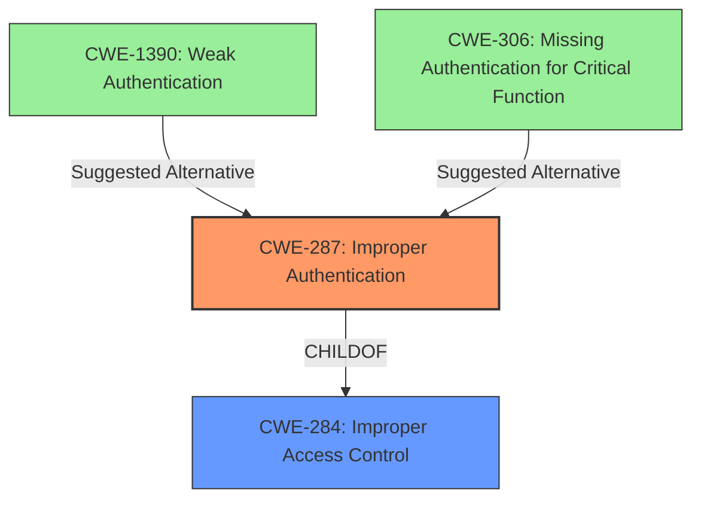

# Analysis Report for CVE-2021-37597

# Vulnerability Analysis Report: CVE-2021-37597

## Description


## Analysis (with Relationship Data)

# Summary
| CWE ID | CWE Name | Confidence | CWE Abstraction Level | CWE Vulnerability Mapping Label | CWE-Vulnerability Mapping Notes |
|---|---|---|---|---|---|
| CWE-287 | Improper Authentication | 0.8 | Class | Allowed | Primary CWE |

## Evidence and Confidence

*   **Confidence Score:** 0.8
*   **Evidence Strength:** MEDIUM

## Relationship Analysis
The primary CWE is CWE-287 Improper Authentication, which is a class-level CWE. While it is a discouraged mapping, there is not enough information provided to determine the root cause to select a more specific base-level CWE.



## Vulnerability Chain
The vulnerability involves an MFA bypass due to manipulation of the `wordpress_logged_in_[hash]` cookie. This indicates a flaw in the authentication process, where the **WEAKNESS** lies in how the application verifies user identity.

## Summary of Analysis
The vulnerability description states that WP Cerber before 8.9.3 allows MFA bypass via `wordpress_logged_in_[hash]` manipulation. The retriever results pointed towards several CWEs, but based on the available information, the most appropriate CWE is CWE-287 Improper Authentication.
*   The vulnerability description states: MFA bypass via `wordpress_logged_in_[hash]` manipulation. This indicates a **ROOTCAUSE** in the authentication mechanism.
*   CWE-287's description states: "When an actor claims to have a given identity, the product does not prove or insufficiently proves that the claim is correct."
*   The manipulation of the `wordpress_logged_in_[hash]` cookie suggests that the application is not adequately validating the user's session or authentication status.
*   CWE-287 is a class-level CWE, and the mapping guidance discourages its use when lower-level CWEs are applicable. However, the current description does not provide sufficient information to pinpoint the specific **ROOTCAUSE** of the **WEAKNESS** to choose between CWE-1390 Weak Authentication, or CWE-306 Missing Authentication for Critical Function.
*   The evidence and confidence is medium because there is no CVE Reference Links Content Summary section.

Relevant CWE Information:


## CWE Relationship Analysis

Current CWEs represent these abstraction levels: .


### Vulnerability Chain Analysis

**Chain starting from CWE-1390:**
- 1390 (Weak Authentication) - ROOT


**Chain starting from CWE-287:**
- 287 (Improper Authentication) - ROOT


### CWE Relationship Diagram

```mermaid
graph TD
    classDef primary fill:#f96,stroke:#333,stroke-width:2px
    classDef secondary fill:#69f,stroke:#333
    classDef tertiary fill:#9e9,stroke:#333
```


*Report generated on 2025-04-02 15:24:34*
