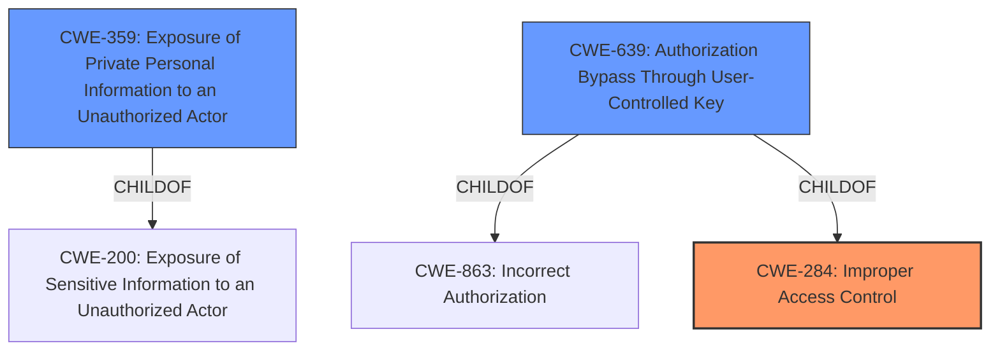

# Enhanced Analysis for CVE-2021-37601

# Summary
| CWE ID | CWE Name | Confidence | CWE Abstraction Level | CWE Vulnerability Mapping Label | CWE-Vulnerability Mapping Notes |
|---|---|---|---|---|---|
| CWE-284 | Improper Access Control | 0.9 | Pillar | Primary | Discouraged |
| CWE-359 | Exposure of Private Personal Information to an Unauthorized Actor | 0.7 | Base | Secondary | Allowed |
| CWE-639 | Authorization Bypass Through User-Controlled Key | 0.6 | Base | Secondary | Allowed |
## Evidence and Confidence

*   **Confidence Score:** 0.8
*   **Evidence Strength:** HIGH

## Relationship Analysis
The primary CWE is CWE-284, "Improper Access Control," which is a high-level Pillar. The vulnerability involves a lack of proper restrictions on who can access affiliation lists. CWE-359, "Exposure of Private Personal Information to an Unauthorized Actor," and CWE-639, "Authorization Bypass Through User-Controlled Key," are considered as secondary CWEs. CWE-359 is a child of CWE-200 "Exposure of Sensitive Information to an Unauthorized Actor" and CWE-639 is a child of CWE-863 "Incorrect Authorization" and CWE-284 "Improper Access Control". The high-level nature of CWE-284 makes it less specific than its potential children, but given the information, it seems to be a reasonable starting point.



## Vulnerability Chain
The chain of events starts with **improper access control** (CWE-284) which leads to the **exposure of sensitive information** (CWE-359) such as the list of admins, members, owners, and banned entities of a Multi-User chat room. An attacker can exploit this to obtain sensitive information.

## Summary of Analysis
The initial assessment considered CWE-284 as the primary weakness due to the **improper access control** within the Multi-User Chat component. The "CVE Reference Links Content Summary" section highlights this, stating: "The vulnerability stems from a lack of proper restrictions on who can access the affiliation lists within MUC." CWE-359, "Exposure of Private Personal Information to an Unauthorized Actor," is a consequence of the **improper access control**, as the attacker is able to obtain sensitive information. However, CWE-200 "Exposure of Sensitive Information to an Unauthorized Actor" is discouraged.

CWE-639 "Authorization Bypass Through User-Controlled Key" was considered because the attacker can potentially manipulate the key value to access another user's data. However, this CWE might be more applicable if there was a direct manipulation of a user-controlled key involved, which is not explicitly stated in the vulnerability description.

CWE-284 is a high-level Pillar, but it accurately represents the fundamental flaw. The evidence supports that the root cause is a lack of access control, which then leads to information disclosure.

Relevant CWE Information:
**CWE-284: Improper Access Control**:
The product does not restrict or incorrectly restricts access to a resource from an unauthorized actor. The vulnerability description clearly states a lack of proper restrictions. The "CVE Reference Links Content Summary" confirms this.
**CWE-359: Exposure of Private Personal Information to an Unauthorized Actor**:
The product does not properly prevent a person's private, personal information from being accessed by actors who are not explicitly authorized. This matches the vulnerability description: "allows remote attackers to obtain sensitive information (list of admins, members, owners, and banned entities of a Multi-User chat room)."
**CWE-639: Authorization Bypass Through User-Controlled Key**:
The system's authorization functionality does not prevent one user from gaining access to another user's data or record by modifying the key value identifying the data. While the attacker does not directly modify the key, the access to the information can be seen as bypassing authorization.

I am overriding the general mapping guidance of using a lower-level CWE because the provided information does not give enough detail to choose a more specific CWE, but the evidence clearly shows improper access control.


## CWE Relationship Analysis

Current CWEs represent these abstraction levels: .


### Vulnerability Chain Analysis

**Chain starting from CWE-284:**
- 284 (Improper Access Control) - ROOT


**Chain starting from CWE-359:**
- 359 (Exposure of Private Personal Information to an Unauthorized Actor) - ROOT


### CWE Relationship Diagram

```mermaid
graph TD
    classDef primary fill:#f96,stroke:#333,stroke-width:2px
    classDef secondary fill:#69f,stroke:#333
    classDef tertiary fill:#9e9,stroke:#333
```