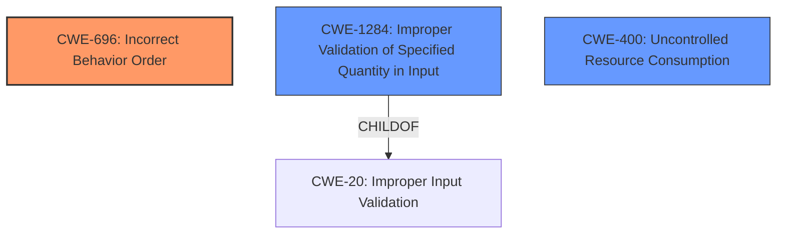

# Analysis for CVE-2021-37604

# Summary
| CWE ID    | CWE Name                                                    | Confidence | CWE Abstraction Level | CWE Vulnerability Mapping Label | CWE-Vulnerability Mapping Notes |
| --------- | ----------------------------------------------------------- | ---------- | --------------------- | ------------------------------- | ----------------------------- |
| CWE-696   | Incorrect Behavior Order                                    | 0.8        | Class                 | Allowed-with-Review             | Primary CWE                   |
| CWE-1284  | Improper Validation of Specified Quantity in Input          | 0.6        | Base                  | Allowed                         | Secondary Candidate           |
| CWE-400   | Uncontrolled Resource Consumption                           | 0.4        | Class                 | Discouraged                     | Secondary Candidate           |

## Evidence and Confidence

*   **Confidence Score:** 0.7
*   **Evidence Strength:** MEDIUM

## Relationship Analysis
The primary CWE selected is CWE-696, Incorrect Behavior Order, which is a class-level CWE. It has a child relationship with CWE-691 (Missing Interlock) and is related to the sequence of operations. The vulnerability involves **improper validation of frame counters** before message authentication, thus fitting the "incorrect behavior order" concept.

CWE-1284, Improper Validation of Specified Quantity in Input, is a base-level CWE and a child of CWE-20. It relates to the validation of quantities, such as size or length, which is relevant to frame counters.

CWE-400, Uncontrolled Resource Consumption, is a class-level CWE and relates to the exhaustion of resources. In this scenario, injecting messages with large frame counter values could lead to denial of service, which can be seen as a form of resource exhaustion.

## Vulnerability Chain
The vulnerability chain starts with the **improper validation of frame counters**. An attacker injects messages with a large frame counter value and invalid payload. Because the frame counters are validated/updated before message authentication, the attacker can increment the frame counter, leading to denial of service and potential replay attacks. The root cause is the incorrect order of operations.

## Summary of Analysis
The initial analysis considered CWE-696 (Incorrect Behavior Order) as the primary weakness, due to the frame counters being validated before message authentication. The vulnerability description key phrases also point to **improper validation** as the root cause. The CVE reference links content summary supports this by stating "Frame counters are validated before the message authentication."

CWE-1284 (Improper Validation of Specified Quantity in Input) was considered because frame counters represent a specified quantity, and their validation is flawed. However, CWE-696 is a better fit as it specifically describes the incorrect order of operations.

CWE-400 (Uncontrolled Resource Consumption) was considered as the impact of the vulnerability is a denial-of-service. However, this is a consequence of the **improper validation** rather than the root cause itself.

The final decision is to assign CWE-696 as the primary CWE with a confidence of 0.8, as it captures the essence of the **incorrect behavior order** that leads to the vulnerability. CWE-1284 is a secondary candidate with a confidence of 0.6, and CWE-400 is a tertiary candidate with a confidence of 0.4.

Relevant CWE Information:

# Enhanced Context (25 CWEs)

## CWE-1289: Improper Validation of Unsafe Equivalence in Input
**Abstraction Level**: Base
**Similarity Score**: 0.80
**Source**: dense

**Description**:
The product receives an input value that is used as a resource identifier or other type of reference, but it does not validate or incorrectly validates that the input is equivalent to a potentially-unsafe value.

**Mapping Guidance**:
- Usage: Allowed
- Rationale: This CWE entry is at the Base level of abstraction, which is a preferred level of abstraction for mapping to the root causes of vulnerabilities.
*This CWE was not selected because the vulnerability is not about validating equivalence but about validating the sequence of operations.*

## CWE-1288: Improper Validation of Consistency within Input
**Abstraction Level**: Base
**Similarity Score**: 0.79
**Source**: dense

**Description**:
The product receives a complex input with multiple elements or fields that must be consistent with each other, but it does not validate or incorrectly validates that the input is actually consistent.

**Mapping Guidance**:
- Usage: Allowed
- Rationale: This CWE entry is at the Base level of abstraction, which is a preferred level of abstraction for mapping to the root causes of vulnerabilities.
*This CWE was not selected because the vulnerability is not about validating consistency but about validating the sequence of operations.*

## CWE-1173: Improper Use of Validation Framework
**Abstraction Level**: Base
**Similarity Score**: 0.75
**Source**: dense

**Description**:
The product does not use, or incorrectly uses, an input validation framework that is provided by the source language or an independent library.

**Mapping Guidance**:
- Usage: Allowed
- Rationale: This CWE entry is at the Base level of abstraction, which is a preferred level of abstraction for mapping to the root causes of vulnerabilities.
*This CWE was not selected because the vulnerability is not explicitly related to the improper use of a validation framework, but rather the order in which validation occurs.*

## CWE-179: Incorrect Behavior Order: Early Validation
**Abstraction Level**: Base
**Similarity Score**: 0.75
**Source**: dense

**Description**:
The product validates input before applying protection mechanisms that modify the input, which could allow an attacker to bypass the validation via dangerous inputs that only arise after the modification.

**Mapping Guidance**:
- Usage: Allowed
- Rationale: This CWE entry is at the Base level of abstraction, which is a preferred level of abstraction for mapping to the root causes of vulnerabilities.
*This CWE is very similar to CWE-696, but focuses on early validation. CWE-696 is broader and thus more appropriate.*

## CWE-1389: Incorrect Parsing of Numbers with Different Radices
**Abstraction Level**: Base
**Similarity Score**: 0.74
**Source**: dense

**Description**:
The product parses numeric input assuming base 10 (decimal) values, but it does not account for inputs that use a different base number (radix).

**Mapping Guidance**:
- Usage: Allowed
- Rationale: This CWE entry is at the Base level of abstraction, which is a preferred level of abstraction for mapping to the root causes of vulnerabilities.
*This CWE was not selected because the vulnerability is not about parsing numbers with different radices.*

## CWE-606: Unchecked Input for Loop Condition
**Abstraction Level**: Base
**Similarity Score**: 0.74
**Source**: dense

**Description**:
The product does not properly check inputs that are used for loop conditions, potentially leading to a denial of service or other consequences because of excessive looping.

**Mapping Guidance**:
- Usage: Allowed
- Rationale: This CWE entry is at the Base level of abstraction, which is a preferred level of abstraction for mapping to the root causes of vulnerabilities.
*This CWE was not selected because the vulnerability is not directly related to unchecked input for loop conditions.*

## CWE-115: Misinterpretation of Input
**Abstraction Level**: Base
**Similarity Score**: 0.74
**Source**: dense

**Description**:
The product misinterprets an input, whether from an attacker or another product, in a security-relevant fashion.

**Mapping Guidance**:
- Usage: Allowed
- Rationale: This CWE entry is at the Base level of abstraction, which is a preferred level of abstraction for mapping to the root causes of vulnerabilities.
*This CWE was not selected because the vulnerability is not about misinterpreting input but about validating the sequence of operations.*

## CWE-807: Reliance on Untrusted Inputs in a Security Decision
**Abstraction Level**: Base
**Similarity Score**: 0.74
**Source**: dense

**Description**:
The product uses a protection mechanism that relies on the existence or values of an input, but the input can be modified by an untrusted actor in a way that bypasses the protection mechanism.

**Mapping Guidance**:
- Usage: Allowed
- Rationale: This CWE entry is at the Base level of abstraction, which is a preferred level of abstraction for mapping to the root causes of vulnerabilities.
*This CWE was not selected because the vulnerability's core issue is not the reliance on untrusted inputs but the order in which validation and authentication occur.*

## CWE-228: Improper Handling of