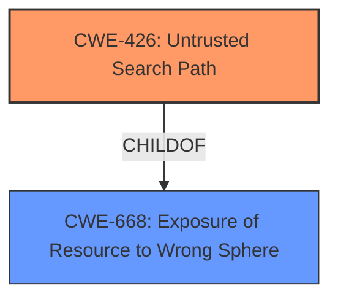

# Analysis Report for CVE-2021-37617

# Vulnerability Analysis Report: CVE-2021-37617

## Description


## Analysis (with Relationship Data)

# Summary
| CWE ID | CWE Name | Confidence | CWE Abstraction Level | CWE Vulnerability Mapping Label | CWE-Vulnerability Mapping Notes |
|---|---|---|---|---|---|
| CWE-426 | Untrusted Search Path | 1.0 | Base | Allowed | Primary CWE |

## Evidence and Confidence

*   **Confidence Score:** 1.0
*   **Evidence Strength:** HIGH

## Relationship Analysis
The primary relationship influencing the decision is the parent-child relationship between CWE-668 (Exposure of Resource to Wrong Sphere) and CWE-426 (Untrusted Search Path). CWE-426 is a more specific Base level weakness that accurately captures the vulnerability where the application searches for an executable in a user-writable directory. No chain relationships apply here.



## Vulnerability Chain
The vulnerability chain starts with the **improper configuration of the search path**, leading to the execution of a malicious executable.
  - **Root Cause:** **Untrusted Search Path** (CWE-426)
  - **Impact:** Execution of arbitrary code with elevated privileges.

## Summary of Analysis
The initial analysis and criticism, along with the retriever results, strongly suggest CWE-426 as the most appropriate mapping. The vulnerability description clearly states that the Nextcloud Desktop Client searches for `Uninstall.exe` in the `C:\` directory, which is writable by regular users. This constitutes an **untrusted search path**.

The evidence from the "CVE Reference Links Content Summary" section explicitly supports this: "The client was searching for the uninstaller executable in a location that was not secured and writeable by regular users. This falls under CWE-426: Untrusted Search Path."

The graph relationships confirm that CWE-426 is a more specific instance of CWE-668, thus making it a better choice.

The selected CWE is at the optimal level of specificity because it directly addresses the root cause: the use of an untrusted search path.

Relevant CWE Information:

# Enhanced Context (25 CWEs)

## CWE-668: Exposure of Resource to Wrong Sphere
**Abstraction Level**: Class
**Similarity Score**: 0.77
**Source**: dense

**Description**:
The product exposes a resource to the wrong control sphere, providing unintended actors with inappropriate access to the resource.

**Mapping Guidance**:
- Usage: Discouraged
- Rationale: CWE-668 is high-level and is often misused as a catch-all when lower-level CWE IDs might be applicable. It is sometimes used for low-information vulnerability reports [REF-1287]. It is a level-1 Class (i.e., a child of a Pillar). It is not useful for trend analysis.

## CWE-426: Untrusted Search Path
**Abstraction Level**: Base
**Similarity Score**: 7464.88
**Source**: sparse

**Description**:
The product uses a fixed or controlled search path to find resources, but one or more locations in that path can be under the control of unintended actors.

**Mapping Guidance:**
- Usage: Allowed
- Rationale: This CWE entry is at the Base level of abstraction, which is a preferred level of abstraction for mapping to the root causes of vulnerabilities.

### Summary of Analysis
The Nextcloud Desktop Client's vulnerability aligns with **CWE-426 [Untrusted Search Path]** because it searches for the `Uninstall.exe` file in a directory (`C:\`) writable by regular users. This allows a malicious user to place a malicious executable that will be executed with administrative privileges.

The security implication is the potential for arbitrary code execution with elevated privileges.

**CWE-426** is a child of **CWE-668 [Exposure of Resource to Wrong Sphere]**, but **CWE-426** is more specific and accurately captures the nature of the vulnerability.

The MITRE mapping guidance allows the use of **CWE-426**, as it is at the Base level of abstraction.

CWE-427 (Uncontrolled Search Path Element) was considered but not selected, because the description notes that CWE-426 inherently involves control over the definition of a control sphere, while CWE-427 involves a fixed control sphere, in which part of the sphere may be under attacker control. In this case, the path `C:\` is fixed, but writable by regular users. Thus CWE-426 is more accurate.


## CWE Relationship Analysis

Current CWEs represent these abstraction levels: .


### Vulnerability Chain Analysis

**Chain starting from CWE-426:**
- 426 (Untrusted Search Path) - ROOT


**Chain starting from CWE-668:**
- 668 (Exposure of Resource to Wrong Sphere) - ROOT


### CWE Relationship Diagram

```mermaid
graph TD
    classDef primary fill:#f96,stroke:#333,stroke-width:2px
    classDef secondary fill:#69f,stroke:#333
    classDef tertiary fill:#9e9,stroke:#333
```


*Report generated on 2025-04-02 12:58:17*
