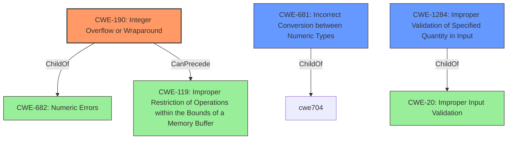

# Raw Analyzer Response for CVE-2021-37645

# Summary
| CWE ID | CWE Name | Confidence | CWE Abstraction Level | CWE Vulnerability Mapping Label | CWE-Vulnerability Mapping Notes |
|---|---|---|---|---|---|
| CWE-190 | Integer Overflow or Wraparound | 0.9 | Base | Allowed | Primary CWE |
| CWE-681 | Incorrect Conversion between Numeric Types | 0.8 | Base | Allowed | Secondary Candidate |
| CWE-1284 | Improper Validation of Specified Quantity in Input | 0.7 | Base | Allowed | Secondary Candidate |

## Evidence and Confidence

*   **Confidence Score:** 0.8
*   **Evidence Strength:** HIGH

## Relationship Analysis
The primary weakness is an **integer overflow** (CWE-190) caused by an **incorrect conversion between numeric types** (CWE-681). Specifically, a signed integer is converted to an unsigned integer, leading to a large value being used for memory allocation. This can be seen as related to **improper validation of specified quantity in input** (CWE-1284), since the axis value is not validated before memory allocation. CWE-190 is a child of CWE-682 (Numeric Errors), while CWE-681 and CWE-1284 are children of CWE-20 (Improper Input Validation). CWE-190 can precede CWE-119 (Improper Restriction of Operations within the Bounds of a Memory Buffer).

## Vulnerability Chain
The vulnerability chain starts with an **incorrect conversion between numeric types** (CWE-681), which leads to an **integer overflow** (CWE-190) due to the conversion of a signed integer to an unsigned integer. This then leads to excessive memory allocation, potentially resulting in a denial-of-service. There is also **improper validation of specified quantity in input** (CWE-1284).

## Summary of Analysis
The primary **root cause** of the vulnerability is an **integer overflow** (CWE-190) resulting from an **incorrect conversion between numeric types** (CWE-681). The `axis` value, a signed integer, is converted to an unsigned integer, and then used as a size argument for an `absl::InlinedVector` constructor. This leads to allocating a very large vector, and potentially a denial of service due to excessive memory allocation. The code **does not properly validate** the axis value before using it for memory allocation.

The vulnerability description clearly states the **integer overflow** issue. "In affected versions the implementation of `tf.raw_ops.QuantizeAndDequantizeV4Grad` is vulnerable to an **integer overflow** issue caused by converting a signed integer value to an unsigned one and then allocating memory based on this value." This provides direct evidence for CWE-190.

The description also indicates the **incorrect conversion between numeric types** "caused by converting a signed integer value to an unsigned one and then allocating memory based on this value".

CWE-1284 is relevant because the size argument is not validated before being used to allocate memory.

I am selecting CWE-190 as the primary CWE because it represents the immediate **root cause** of the vulnerability. CWE-681 and CWE-1284 are contributing factors.

Other CWEs considered:

*   CWE-122 (Heap-based Buffer Overflow): This is a potential impact of the integer overflow, but not the root cause. Therefore, it's not the most appropriate primary CWE.
*   CWE-824 (Access of Uninitialized Pointer): This is not relevant to the vulnerability description.
*   CWE-787 (Out-of-bounds Write): Not directly applicable, as the primary issue is the allocation of excessive memory, not writing beyond buffer bounds.
*   CWE-125 (Out-of-bounds Read): Not relevant.
*   CWE-835 (Loop with Unreachable Exit Condition ('Infinite Loop')): Not relevant.
*   CWE-193 (Off-by-one Error): Not relevant.
Relevant CWE Information: