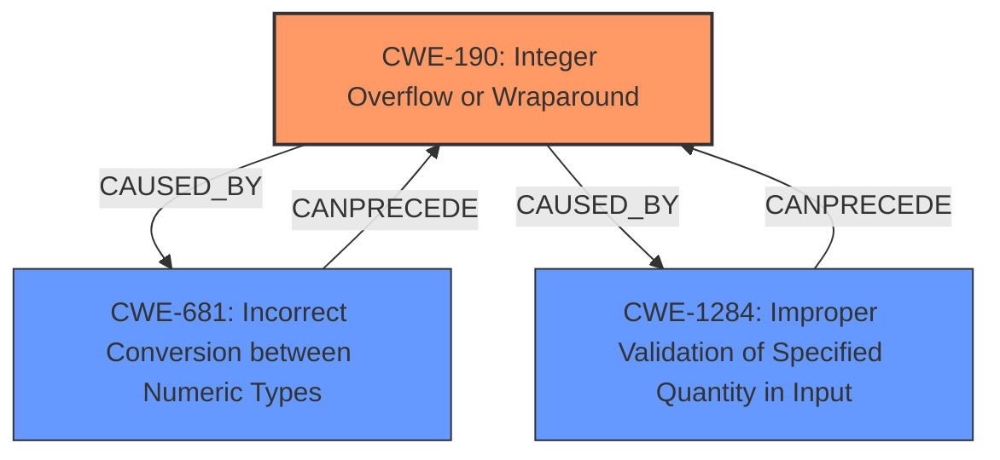

# Enhanced Analysis for CVE-2021-37646

# Summary
| CWE ID  | CWE Name                                       | Confidence | CWE Abstraction Level | CWE Vulnerability Mapping Label | CWE-Vulnerability Mapping Notes |
| :-------- | :--------------------------------------------- | :--------- | :---------------------- | :------------------------------ | :------------------------------ |
| CWE-190   | Integer Overflow or Wraparound                 | 1.0        | Base                    | Primary                         | Allowed                       |
| CWE-1284  | Improper Validation of Specified Quantity in Input | 0.8        | Base                    | Secondary                       | Allowed                       |
| CWE-681   | Incorrect Conversion between Numeric Types       | 0.7        | Base                    | Secondary                       | Allowed                       |

## Evidence and Confidence

*   **Confidence Score:** 0.9
*   **Evidence Strength:** HIGH

## Relationship Analysis
The primary weakness is an **integer overflow** (CWE-190) that occurs because a signed integer is converted to an unsigned integer. This conversion happens because the `reserve` method, which takes an unsigned long, is called with a potentially negative value derived from user-supplied input. This **improper validation** (CWE-1284) of the input quantity leads to an unexpected large memory allocation. The **incorrect conversion** (CWE-681) from a signed to unsigned integer is a contributing factor in triggering the overflow.



## Vulnerability Chain
The vulnerability chain starts with **improper validation** of the `ngram_widths` input (CWE-1284). This allows a negative value to be passed to the `reserve` method. Then, an **incorrect conversion** between numeric types (CWE-681) occurs when the signed integer is implicitly converted to an unsigned long. This results in a very large positive value which is then used to allocate memory, leading to an **integer overflow** (CWE-190) and potential denial of service.

## Summary of Analysis
The primary weakness is CWE-190, **Integer Overflow or Wraparound**. The description states that the vulnerability involves an **integer overflow** due to converting a signed integer value to an unsigned one, which directly matches the CWE's description. The `ngram_widths` parameter is converted from a signed integer to an unsigned long, which can cause the value to become a very large number if a negative value is provided as input. This large number is then used for memory allocation, leading to a potential denial of service. This is strongly supported by the vulnerability description: "the implicit conversion transforms the negative value to a large integer". Confidence is high as the description explicitly mentions the **integer overflow**.

CWE-1284, **Improper Validation of Specified Quantity in Input**, is a secondary weakness. The vulnerability description indicates that the `ngram_widths` parameter is not validated, allowing negative values. This lack of validation allows the **integer overflow** to occur. The "CVE Reference Links Content Summary" section notes the "Unvalidated Input" as a weakness and states that "The code did not properly validate the input `ngram_widths` parameter, allowing negative values to be used." This supports the mapping of CWE-1284 with a high confidence.

CWE-681, **Incorrect Conversion between Numeric Types**, is also a secondary weakness. The implicit conversion from a signed integer to an unsigned long contributes to the **integer overflow**. The "CVE Reference Links Content Summary" section specifically states that "leading to an implicit conversion of the negative integer to a large positive value." This evidence supports the inclusion of CWE-681 as a secondary weakness.

The selected CWEs are at the optimal level of specificity because they accurately describe the root cause and contributing factors of the vulnerability. CWE-190 describes the **integer overflow**, while CWE-1284 and CWE-681 describe the reasons and mechanisms that led to the overflow.


## CWE Relationship Analysis

Current CWEs represent these abstraction levels: .


### Vulnerability Chain Analysis

**Chain starting from CWE-190:**
- 190 (Integer Overflow or Wraparound) - ROOT


**Chain starting from CWE-681:**
- 681 (Incorrect Conversion between Numeric Types) - ROOT


### CWE Relationship Diagram

```mermaid
graph TD
    classDef primary fill:#f96,stroke:#333,stroke-width:2px
    classDef secondary fill:#69f,stroke:#333
    classDef tertiary fill:#9e9,stroke:#333
```