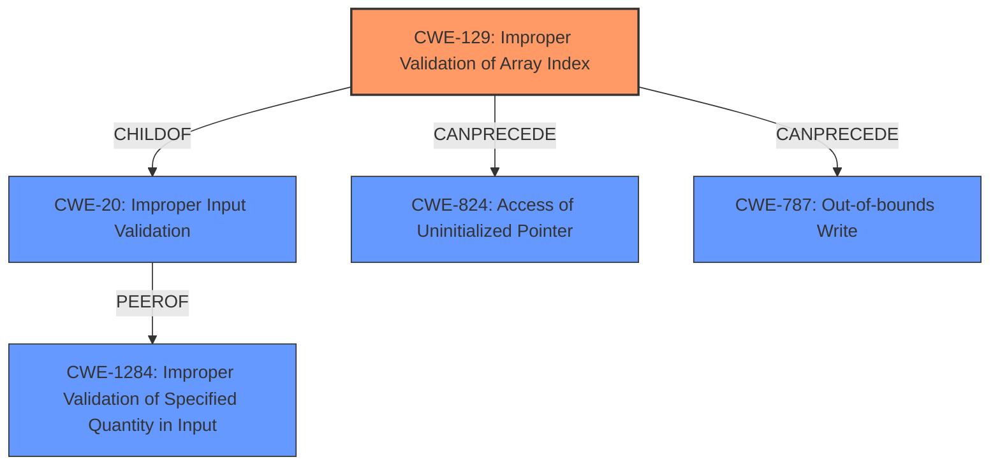

# Analysis for CVE-2021-37656

# Summary
| CWE ID | CWE Name | Confidence | CWE Abstraction Level | CWE Vulnerability Mapping Label | CWE-Vulnerability Mapping Notes |
|---|---|---|---|---|---|
| CWE-129 | Improper Validation of Array Index | 0.8 | Variant | Allowed | Primary CWE |
| CWE-824 | Access of Uninitialized Pointer | 0.6 | Base | Allowed | Secondary Candidate |
| CWE-787 | Out-of-bounds Write | 0.5 | Base | Allowed | Secondary Candidate |
| CWE-1284 | Improper Validation of Specified Quantity in Input | 0.5 | Base | Allowed | Secondary Candidate |

## Evidence and Confidence

*   **Confidence Score:** 0.7
*   **Evidence Strength:** MEDIUM

## Relationship Analysis
The primary CWE is CWE-129, which is a variant of CWE-20 (Improper Input Validation). The vulnerability involves a failure to validate array indices, which can lead to various out-of-bounds access issues.

CWE-824, CWE-787, and CWE-1284 are other potential candidates. CWE-787 (Out-of-bounds Write) and CWE-824 (Access of Uninitialized Pointer) can be the results of failing to properly validate array indices. CWE-1284 (Improper Validation of Specified Quantity in Input) is closely related to CWE-129, but focuses more on the quantity (size, length) rather than the array index itself.

## Vulnerability Chain
The chain of events starts with **incomplete validation of the splits values**. This **weakness** can lead to binding a reference to a null pointer and ultimately cause undefined behavior.

Root Cause: **Incomplete validation of the splits values** (CWE-129)
-> Potential Consequence: **null pointer dereference** (CWE-824) or **out-of-bounds write** (CWE-787)
-> Impact: undefined behavior

## Summary of Analysis
The initial assessment, based on the vulnerability description and the CVE Reference Links Content Summary, points to **incomplete validation of the splits values** as the root cause. Specifically, the vulnerability description key phrases identify **"incomplete validation of the splits values"** as the root cause and a **"null pointer dereference"** as the **weakness**. The CVE Reference Links Content Summary confirms the **"Incomplete Input Validation"** and **"Potential Null Pointer Dereference"**.

The Retriever Results suggest several candidate CWEs, including CWE-824 (Access of Uninitialized Pointer), CWE-681 (Incorrect Conversion between Numeric Types), and CWE-1284 (Improper Validation of Specified Quantity in Input). However, given the context of array indexing and the failure to validate the order of splits, CWE-129 (Improper Validation of Array Index) is the most appropriate primary CWE.

CWE-129 captures the essence of the vulnerability, which is the failure to validate that the array indices (splits values) are in increasing order. This failure can lead to a null pointer dereference or an out-of-bounds write, but the root cause is the improper validation of the array index.

The relationships between CWEs also support this decision. CWE-129 is a variant of CWE-20 (Improper Input Validation), which is a broader category that encompasses many types of input validation errors. The chain of events (improper validation -> null pointer dereference/out-of-bounds write -> undefined behavior) further supports the selection of CWE-129 as the primary CWE.

CWE-824 is a plausible secondary CWE, as the **weakness** can result in a null pointer dereference if the invalid index leads to accessing an uninitialized memory location. CWE-787 is also a possible consequence, if the invalid index results in writing outside the bounds of the intended buffer. CWE-1284 is related but less specific than CWE-129, as it focuses on the quantity (size, length) rather than the array index itself.

The selected CWEs are at the optimal level of specificity, as they accurately represent the root cause and potential consequences of the vulnerability. CWE-129 is a variant-level CWE that specifically addresses the improper validation of array indices, while CWE-824 and CWE-787 capture the potential consequences of this improper validation.