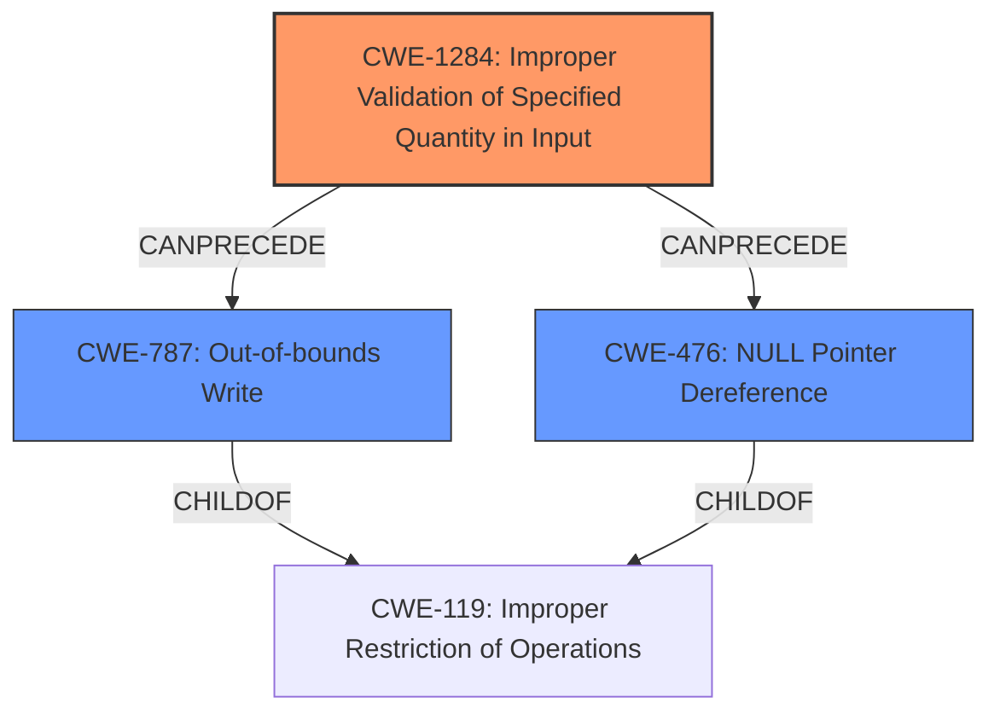

# Analysis for CVE-2021-37663

# Summary
| CWE ID | CWE Name | Confidence | CWE Abstraction Level | CWE Vulnerability Mapping Label | CWE-Vulnerability Mapping Notes |
|---|---|---|---|---|---|
| CWE-1284 | Improper Validation of Specified Quantity in Input | 0.9 | Base | Allowed | Primary CWE |
| CWE-787 | Out-of-bounds Write | 0.7 | Base | Allowed | Secondary Candidate |
| CWE-476 | NULL Pointer Dereference | 0.7 | Base | Allowed | Secondary Candidate |

## Evidence and Confidence

*   **Confidence Score:** 0.8
*   **Evidence Strength:** HIGH

## Relationship Analysis
The primary CWE is CWE-1284 (**Improper Validation of Specified Quantity in Input**), which highlights the **incomplete validation** of the `min_range` and `max_range` inputs. CWE-787 (**Out-of-bounds Write**) and CWE-476 (**NULL Pointer Dereference**) are potential consequences of this **incomplete validation**, forming a chain. These are child of CWE-119 (**Improper Restriction of Operations within the Bounds of a Memory Buffer**), which represents a more general class of memory safety issues.

## Vulnerability Chain
The vulnerability chain starts with **incomplete validation** of input quantities (CWE-1284). This leads to either out-of-bounds write (CWE-787) or a null pointer dereference (CWE-476), both resulting in undefined behavior, crashes, or potential arbitrary code execution.

## Summary of Analysis
The initial analysis focused on the lack of validation, which pointed towards CWE-1284 (**Improper Validation of Specified Quantity in Input**) as the primary weakness. The vulnerability description and CVE reference summary both highlighted the **incomplete validation** of the `min_range` and `max_range` input tensors. The description states the implementation "does not check that `min_range` and `max_range` both have the same non-zero number of elements." This **incomplete validation** is the root cause that can lead to out-of-bounds access or null pointer dereferences.

The graph relationships show that CWE-1284 can precede CWE-787 (**Out-of-bounds Write**) and CWE-476 (**NULL Pointer Dereference**), which are potential consequences of the **incomplete validation**.

The selected CWEs are at the optimal level of specificity. CWE-1284 accurately captures the root cause, while CWE-787 and CWE-476 represent the potential impacts.

Relevant CWE Information:

# Enhanced Context (25 CWEs)
The following CWEs were identified as potentially relevant to this vulnerability:

## CWE-824: Access of Uninitialized Pointer
**Abstraction Level**: Base
**Similarity Score**: 0.81
**Source**: dense
**Description**: The product accesses or uses a pointer that has not been initialized.

## CWE-125: Out-of-bounds Read
**Abstraction Level**: Base
**Similarity Score**: 0.79
**Source**: dense
**Description**: The product reads data past the end, or before the beginning, of the intended buffer.

## CWE-191: Integer Underflow (Wrap or Wraparound)
**Abstraction Level**: Base
**Similarity Score**: 0.79
**Source**: dense
**Description**: The product subtracts one value from another, such that the result is less than the minimum allowable integer value, which produces a value that is not equal to the correct result.

## CWE-131: Incorrect Calculation of Buffer Size
**Abstraction Level**: Base
**Similarity Score**: 0.79
**Source**: dense
**Description**: The product does not correctly calculate the size to be used when allocating a buffer, which could lead to a buffer overflow.

## CWE-476: NULL Pointer Dereference
**Abstraction Level**: Base
**Similarity Score**: 0.79
**Source**: dense
**Description**: The product dereferences a pointer that it expects to be valid but is NULL.

## CWE-681: Incorrect Conversion between Numeric Types
**Abstraction Level**: Base
**Similarity Score**: 0.78
**Source**: dense
**Description**: When converting from one data type to another, such as long to integer, data can be omitted or translated in a way that produces unexpected values. If the resulting values are used in a sensitive context, then dangerous behaviors may occur.

## CWE-805: Buffer Access with Incorrect Length Value
**Abstraction Level**: Base
**Similarity Score**: 0.78
**Source**: dense
**Description**: The product uses a sequential operation to read or write a buffer, but it uses an incorrect length value that causes it to access memory that is outside of the bounds of the buffer.

## CWE-823: Use of Out-of-range Pointer Offset
**Abstraction Level**: Base
**Similarity Score**: 0.78
**Source**: dense
**Description**: The product performs pointer arithmetic on a valid pointer, but it uses an offset that can point outside of the intended range of valid memory locations for the resulting pointer.

## CWE-193: Off-by-one Error
**Abstraction Level**: Base
**Similarity Score**: 0.78
**Source**: dense
**Description**: A product calculates or uses an incorrect maximum or minimum value that is 1 more, or 1 less, than the correct value.

## CWE-126: Buffer Over-read
**Abstraction Level**: Variant
**Similarity Score**: 0.78
**Source**: dense
**Description**: The product reads from a buffer using buffer access mechanisms such as indexes or pointers that reference memory locations after the targeted buffer.

## CWE-824: Access of Uninitialized Pointer
**Abstraction Level**: Base
**Similarity Score**: 5880.66
**Source**: sparse
**Description**: The product accesses or uses a pointer that has not been initialized.

## CWE-1284: Improper Validation of Specified Quantity in Input
**Abstraction Level**: Base
**Similarity Score**: 5798.99
**Source**: sparse
**Description**: The product receives input that is expected to specify a quantity (such as size or length), but it does not validate or incorrectly validates that the quantity has the required properties.

## CWE-125: Out-of-bounds Read
**Abstraction Level**: Base
**Similarity Score**: 5761.68
**Source**: sparse
**Description**: The product reads data past the end, or before the beginning, of the intended buffer.

## CWE-193: Off-by-one Error
**Abstraction Level**: Base
**Similarity Score**: 5761.63
**Source**: sparse
**Description**: A product calculates or uses an incorrect maximum or minimum value that is 1 more, or 1 less, than the correct value.

## CWE-476: NULL Pointer Dereference
**Abstraction Level**: Base
**Similarity Score**: 5626.79
**Source**: sparse
**Description**: The product dereferences a pointer that it expects to be valid but is NULL.

## CWE-195: Signed to Unsigned Conversion Error
**Abstraction Level**: variant
**Similarity Score**: 4.33
**Source**: graph
**Description**: CWE-195: Signed to Unsigned Conversion Error

## CWE-787: Out-of-bounds Write
**Abstraction Level**: base
**Similarity Score**: 4.33
**Source**: graph
**Description**: CWE-787: Out-of-bounds Write

## CWE-190: Integer Overflow or Wraparound
**Abstraction Level**: base
**Similarity Score**: 4.33
**Source**: graph
**Description**: CWE-190: Integer Overflow or Wraparound

## CWE-170: Improper Null Termination
**Abstraction Level**: base
**Similarity Score**: 4.33
**Source**: graph
**Description**: CWE-170: Improper Null Termination

## CWE-1287: Improper Validation of Specified Type of Input
**Abstraction Level**: base
**Similarity Score**: 3.64
**Source**: graph
**Description**: CWE-1287: Improper Validation of Specified Type of Input

##