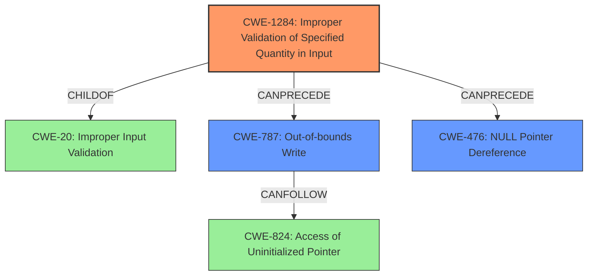

# Analysis for CVE-2021-37665

# Summary
| CWE ID | CWE Name | Confidence | CWE Abstraction Level | CWE Vulnerability Mapping Label | CWE-Vulnerability Mapping Notes |
|---|---|---|---|---|---|
| CWE-1284 | Improper Validation of Specified Quantity in Input | 0.9 | Base | Allowed | Primary CWE |
| CWE-787 | Out-of-bounds Write | 0.6 | Base | Allowed | Secondary CWE |
| CWE-476 | NULL Pointer Dereference | 0.5 | Base | Allowed | Secondary CWE |

## Evidence and Confidence

*   **Confidence Score:** 0.8
*   **Evidence Strength:** HIGH

## Relationship Analysis
The primary weakness is **improper validation of input** (CWE-1284). This can lead to other weaknesses such as out-of-bounds write (CWE-787) and null pointer dereference (CWE-476). CWE-1284 is a child of CWE-20 (Improper Input Validation), indicating a general category of input validation issues. CWE-787 can lead to further issues such as access of uninitialized pointer (CWE-824).

## Vulnerability Chain
The vulnerability chain starts with **incomplete validation** (CWE-1284) of the input tensors' dimensions. This **lack of validation** can then lead to an out-of-bounds write (CWE-787) or a null pointer dereference (CWE-476), ultimately resulting in undefined behavior.

## Summary of Analysis
The primary **root cause** of the vulnerability is the **incomplete validation** of input tensors, specifically their dimensions, in the MKL implementation of requantization within TensorFlow. This aligns well with CWE-1284 (Improper Validation of Specified Quantity in Input), as the dimensions of the tensors represent a quantity that is not being properly validated. The vulnerability description states "**incomplete validation in MKL implementation of requantization**". The CVE Reference Links Content Summary explicitly states "Lack of dimension validation for the `input` tensor in `RequantizationRangePerChannel`" and "**Incomplete validation** of input arguments in `MklRequantizePerChannelOp`."

The consequences of this **lack of validation** include undefined behavior, which can manifest as either an out-of-bounds write (CWE-787) or a null pointer dereference (CWE-476), as indicated by the vulnerability description and the CVE reference summary.

The retriever results also support this assessment. CWE-1284 is ranked 2nd. CWE-787 and CWE-476 are also listed.

CWE-824 (Access of Uninitialized Pointer) was considered but not chosen as the primary CWE. While the vulnerability can lead to undefined behavior, including potentially accessing uninitialized memory, the **root cause** is the **lack of input validation** rather than the direct access of an uninitialized pointer. Therefore, CWE-1284 is a more accurate representation of the core weakness.

CWE-122 (Heap-based Buffer Overflow) was considered but not chosen. While out-of-bounds write could cause a heap overflow, the description doesn't provide enough evidence to conclude this is a buffer overflow.

CWE-1287 (Improper Validation of Specified Type of Input) was considered. The vulnerability description focuses on the dimensions of the input tensor, which falls under quantity rather than type.

Therefore, CWE-1284 is the most specific and accurate representation of the **root cause**, while CWE-787 and CWE-476 represent potential consequences of the **lack of validation**.