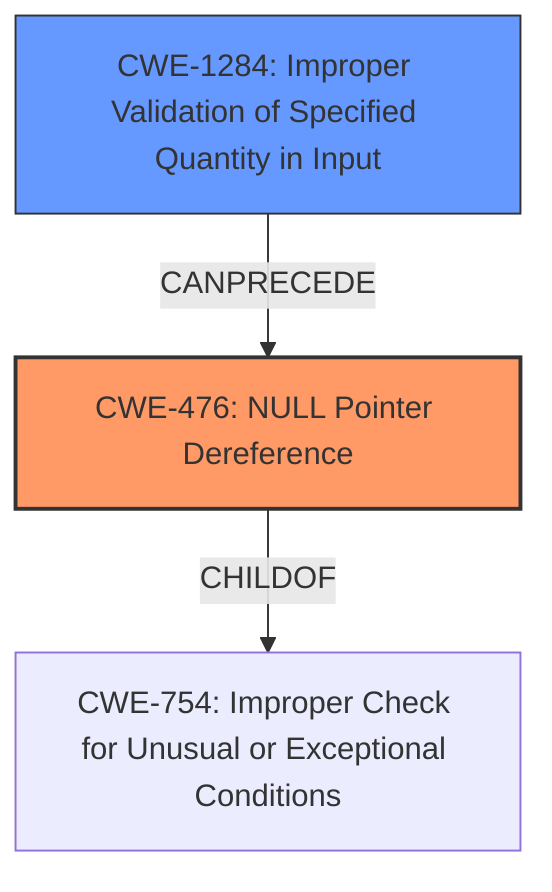

# Enhanced Analysis for CVE-2021-37676

# Summary
| CWE ID | CWE Name | Confidence | CWE Abstraction Level | CWE Vulnerability Mapping Label | CWE-Vulnerability Mapping Notes |
|---|---|---|---|---|---|
| CWE-476 | NULL Pointer Dereference | 0.9 | Base | Allowed | Primary CWE |
| CWE-1284 | Improper Validation of Specified Quantity in Input | 0.7 | Base | Allowed | Secondary Candidate |

## Evidence and Confidence

*   **Confidence Score:** 0.8
*   **Evidence Strength:** HIGH

## Relationship Analysis
The primary weakness is a **NULL Pointer Dereference (CWE-476)**, which occurs because the code **fails to validate the input** `dense_shape` tensor. This leads to **Improper Validation of Specified Quantity in Input (CWE-1284)**. Thus, CWE-1284 can precede CWE-476. CWE-476 is a child of CWE-754 (Improper Check for Unusual or Exceptional Conditions).



## Vulnerability Chain
The vulnerability chain starts with **Improper Validation of Specified Quantity in Input (CWE-1284)**, specifically the `dense_shape` tensor in the `tf.raw_ops.SparseFillEmptyRows` operation. Because of the **lack of validation**, a **NULL Pointer Dereference (CWE-476)** occurs when the code attempts to dereference the potentially invalid dimension, leading to **undefined behavior**.

## Summary of Analysis
The vulnerability is primarily due to a **NULL pointer dereference** caused by **missing input validation**.
The vulnerability description states that the **rootcause** is "**binding a reference to null pointer**".
The CVE Reference Links Content Summary mentions the "**lack of input validation**" and "**Null Pointer Dereference**" as weaknesses.

CWE Selection Justification:
*   **CWE-476: NULL Pointer Dereference**
    *   The vulnerability description clearly states that the issue is caused by **binding a reference to a null pointer**.
    *   The CVE Reference Links Content Summary confirms a "potential null pointer dereference caused by accessing a potentially invalid dimension".
    *   This is a Base-level CWE, providing an appropriate level of detail.
    *   The mapping guidance allows for this CWE to be used.
*   **CWE-1284: Improper Validation of Specified Quantity in Input**
    *   The CVE Reference Links Content Summary identifies a "**Lack of Input Validation**" as a contributing factor.
    *   The shape inference implementation **fails to properly validate input arguments**, specifically not checking for empty tensors.
    *   This is a Base-level CWE, providing an appropriate level of detail.
    *   The mapping guidance allows for this CWE to be used.

Other CWEs Considered:
*   CWE-824 (Access of Uninitialized Pointer): Considered but not selected, as the pointer is not necessarily uninitialized but rather becomes NULL due to the lack of validation.
*   CWE-787 (Out-of-bounds Write): Considered but not selected, as the primary issue is not writing out of bounds but rather dereferencing a NULL pointer.

Therefore, the selected CWEs are at the optimal level of specificity, accurately representing both the root cause (CWE-1284) and the direct consequence (CWE-476) of the vulnerability.


## CWE Relationship Analysis

Current CWEs represent these abstraction levels: .


### Vulnerability Chain Analysis

**Chain starting from CWE-476:**
- 476 (NULL Pointer Dereference) - ROOT


**Chain starting from CWE-754:**
- 754 (Improper Check for Unusual or Exceptional Conditions) - ROOT


### CWE Relationship Diagram

```mermaid
graph TD
    classDef primary fill:#f96,stroke:#333,stroke-width:2px
    classDef secondary fill:#69f,stroke:#333
    classDef tertiary fill:#9e9,stroke:#333
```