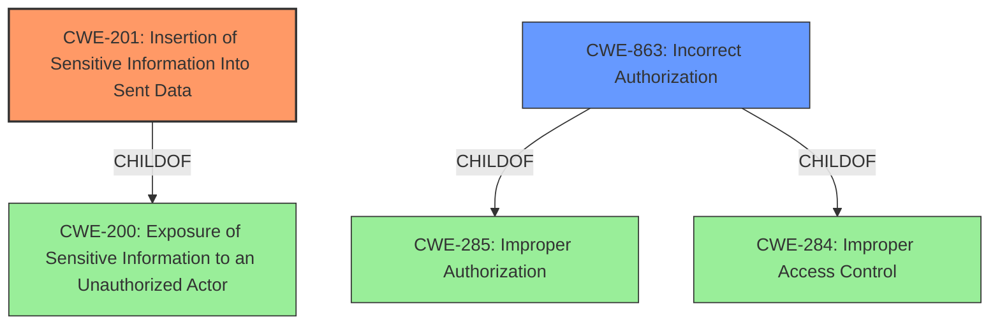

# Raw Analyzer Response for CVE-2021-37703

# Summary
| CWE ID | CWE Name | Confidence | CWE Abstraction Level | CWE Vulnerability Mapping Label | CWE-Vulnerability Mapping Notes |
|---|---|---|---|---|---|
| CWE-201 | Insertion of Sensitive Information Into Sent Data | 0.9 | Base | Primary | Allowed |
| CWE-863 | Incorrect Authorization | 0.6 | Class | Secondary | Allowed-with-Review |

## Evidence and Confidence

*   **Confidence Score:** 0.75
*   **Evidence Strength:** MEDIUM

## Relationship Analysis
The primary relationship influencing the decision is the ChildOf relationship. CWE-201 is a ChildOf CWE-200. CWE-863 is a child of CWE-285 and CWE-284. The selection favors the Base level CWE-201 over the Class level CWE-200 due to increased specificity.

## Vulnerability Chain
The vulnerability chain starts with the **incorrect handling of access control**, which leads to the **insertion of sensitive information into sent data**, and finally results in **exposure of user read state**.

## Summary of Analysis
The initial assessment considered several CWEs, including those related to information exposure and authorization. The primary CWE, CWE-201, was selected because it accurately describes the **insertion of sensitive user read state data into messages sent to unauthorized users**. While other CWEs like CWE-863 (Incorrect Authorization) are relevant, they represent a broader class of vulnerabilities.

The vulnerability description states: "In Discourse before versions 2.7.8 and 2.8.0.beta5, a users read state for a topic such as the last read post number and the notification level is exposed." The CVE Reference Links Content Summary confirms: "The issue was that this information was being broadcast to all users who had access to a topic even when the user was not supposed to have it."

CWE-201 is at the Base level of abstraction, making it more specific than its parent, CWE-200. The retriever results also suggest CWE-201 as a potential candidate. The decision is primarily based on the evidence that the vulnerability involves the **intentional sending of sensitive information (read state) to unauthorized users**, which aligns perfectly with the description of CWE-201. CWE-863 is considered a secondary issue because the authorization check was not correctly performed which resulted in sensitive information being sent to the wrong users.

Relevant CWE Information:

# Enhanced Context (25 CWEs)

## CWE-538: Insertion of Sensitive Information into Externally-Accessible File or Directory
**Abstraction Level**: Base
**Similarity Score**: 0.82
**Source**: dense

**Description**:
The product places sensitive information into files or directories that are accessible to actors who are allowed to have access to the files, but not to the sensitive information.
**Rationale for Not Selecting**: While this CWE involves insertion of sensitive information, it focuses on files/directories, not data sent during communication. Therefore, it is not the best fit for this vulnerability.

## CWE-497: Exposure of Sensitive System Information to an Unauthorized Control Sphere
**Abstraction Level**: Base
**Similarity Score**: 0.79
**Source**: dense
**Rationale for Not Selecting**: This CWE is too broad and focuses on "system-level" information rather than specific user data being transmitted.

## CWE-226: Sensitive Information in Resource Not Removed Before Reuse
**Abstraction Level**: Base
**Similarity Score**: 0.78
**Source**: dense
**Rationale for Not Selecting**: The key aspect of this CWE is the reuse of resources without clearing sensitive data, which is not the case in this vulnerability.

## CWE-212: Improper Removal of Sensitive Information Before Storage or Transfer
**Abstraction Level**: Base
**Similarity Score**: 0.78
**Source**: dense
**Rationale for Not Selecting**: The vulnerability is not about failing to remove sensitive information before storage or transfer, but rather about sending sensitive information to unauthorized users in the first place.

## CWE-359: Exposure of Private Personal Information to an Unauthorized Actor
**Abstraction Level**: Base
**Similarity Score**: 0.78
**Source**: dense
**Rationale for Not Selecting**: This CWE is similar to CWE-201, but CWE-201 more accurately describes the technical mechanism of the vulnerability (data being sent).

## CWE-213: Exposure of Sensitive Information Due to Incompatible Policies
**Abstraction Level**: Base
**Similarity Score**: 0.78
**Source**: dense
**Rationale for Not Selecting**: This CWE focuses on policy conflicts, which are not explicitly mentioned in the vulnerability description.

## CWE-552: Files or Directories Accessible to External Parties
**Abstraction Level**: Base
**Similarity Score**: 0.78
**Source**: dense
**Rationale for Not Selecting**: This CWE focuses on file/directory access, while the vulnerability involves data being sent through the message bus.

## CWE-200: Exposure of Sensitive Information to an Unauthorized Actor
**Abstraction Level**: Class
**Similarity Score**: 0.77
**Source**: dense
**Rationale for Not Selecting**: CWE-200 is too general, and CWE-201 provides a more specific description of the vulnerability.

## CWE-668: Exposure of Resource to Wrong Sphere
**Abstraction Level**: Class
**Similarity Score**: 0.76
**Source**: dense
**Rationale for Not Selecting**: This CWE is too general and doesn't accurately capture the specific mechanism of the vulnerability.

## CWE-202: Exposure of Sensitive Information Through Data Queries
**Abstraction Level**: Base
**Similarity Score**: 0.76
**Source**: dense
**Rationale for Not Selecting**: This CWE focuses on inferring information through statistical queries, which is not applicable here.

## CWE-79: Improper Neutralization of Input During Web Page Generation ('Cross-site Scripting')
**Abstraction Level**: Base
**Similarity Score**: 7511.40
**Source**: sparse
**Rationale for Not Selecting**: This CWE is about XSS, which is unrelated to the information disclosure vulnerability described.

## CWE-863: Incorrect Authorization
**Abstraction Level**: Class
**Similarity Score**: 7444.57
**Source**: sparse
**Rationale for Selecting**: The vulnerability stems from how Discourse publishes unread topic notifications to clients. When a new post is made, the server publishes a message to all clients who are tracking the topic. This message includes the user's read state for the topic, such as the last read post number and the notification level. The issue was that this information was being broadcast to all users who had access to a topic even when the user was not supposed to have it.

## CWE-201: Insertion of Sensitive Information Into Sent Data
**Abstraction Level**: Base
**Similarity Score**: 7378.86
**Source**: sparse
**Rationale for Selecting**: This CWE accurately describes the technical mechanism of the vulnerability: sensitive user read state data is being inserted into messages sent to unauthorized users.

## CWE-285: Improper Authorization
**Abstraction Level**: Class
**Similarity Score**: 7236.85
**Source**: sparse
**Rationale for Not Selecting**: This CWE is a more general form of authorization issues, and CWE-863 describes a more accurate description.

## CWE-79: Improper Neutralization of Input During Web Page Generation ('Cross-site Scripting')
**Abstraction Level**: base
**Similarity Score**: 5.03
**Source**: graph
**Rationale for Not Selecting**: The vulnerability is not about XSS, so this CWE is not applicable.

## CWE-494: Download of Code Without Integrity Check
**Abstraction Level**: base
**Similarity Score**: 4.33
**Source**: graph
**Rationale for Not Selecting**: This CWE is related to downloading code without proper verification, which is not relevant to this vulnerability.

## CWE-178: Improper Handling of Case Sensitivity
**Abstraction Level**: base
**Similarity Score**: 3.64
**Source**: graph
**Rationale for Not Selecting**: Case sensitivity is not a factor in this vulnerability.

## CWE-1289: Improper Validation of Unsafe Equivalence in Input
**Abstraction Level**: