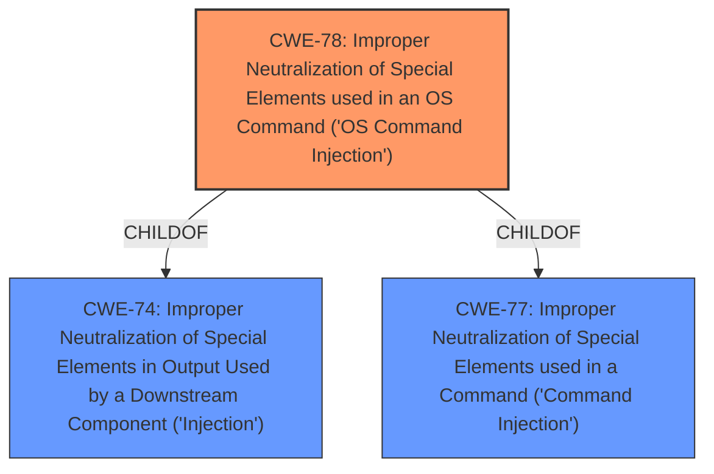

# Analysis Report for CVE-2021-37722

# Vulnerability Analysis Report: CVE-2021-37722

## Description


## Analysis (with Relationship Data)

# Summary
| CWE ID | CWE Name | Confidence | CWE Abstraction Level | CWE Vulnerability Mapping Label | CWE-Vulnerability Mapping Notes |
|---|---|---|---|---|---|
| CWE-78 | Improper Neutralization of Special Elements used in an OS Command ('OS Command Injection') | 1.0 | Base | Allowed | Primary CWE |

## Evidence and Confidence

*   **Confidence Score:** 1.0
*   **Evidence Strength:** HIGH

## Relationship Analysis
The primary relationship influencing my decision is the ChildOf relationship between CWE-78 and CWE-77 (now deprecated) and CWE-74, indicating that OS Command Injection is a specific type of injection. The Retriever Results also show a strong match for CWE-78.



## Vulnerability Chain
The vulnerability chain starts with the **improper neutralization** of special elements in a command, leading to **remote command execution**. This means an attacker can inject malicious commands that the system executes.

## Summary of Analysis
The initial analysis strongly pointed towards CWE-78, given the **remote command execution** vulnerability and the **improper neutralization** weakness highlighted in the description and CVE reference. The "CVE Reference Links Content Summary" explicitly states the "**Root cause of vulnerability**: Authenticated command injection vulnerabilities exist in the ArubaOS command line interface," which directly aligns with the CWE-78 description.

The selection of CWE-78 is at the optimal level of specificity because it clearly defines the **root cause** as an OS command injection vulnerability. The evidence is strong, and the relationship analysis supports this classification.

Relevant CWE Information:

# Enhanced Context (25 CWEs)

## CWE-78: Improper Neutralization of Special Elements used in an OS Command ('OS Command Injection')
**Abstraction:** Base
**Similarity Score**: 5.03
**Source**: graph

**Description**:
CWE-78: Improper Neutralization of Special Elements used in an OS Command ('OS Command Injection')

**Mapping Guidance**:
- Usage: Allowed
- Rationale: This CWE entry is at the Base level of abstraction, which is a preferred level of abstraction for mapping to the root causes of vulnerabilities.

**Relationships**:
- CANFOLLOW -> CWE-184
- CANALSOBE -> CWE-88
- CHILDOF -> CWE-77
- CHILDOF -> CWE-77
- CHILDOF -> CWE-74


## CWE Relationship Analysis

Current CWEs represent these abstraction levels: .


### Vulnerability Chain Analysis

**Chain starting from CWE-88:**
- 88 (Improper Neutralization of Argument Delimiters in a Command ('Argument Injection')) - ROOT


**Chain starting from CWE-78:**
- 78 (Improper Neutralization of Special Elements used in an OS Command ('OS Command Injection')) - ROOT


### CWE Relationship Diagram

```mermaid
graph TD
    classDef primary fill:#f96,stroke:#333,stroke-width:2px
    classDef secondary fill:#69f,stroke:#333
    classDef tertiary fill:#9e9,stroke:#333
```


*Report generated on 2025-04-02 14:09:40*
