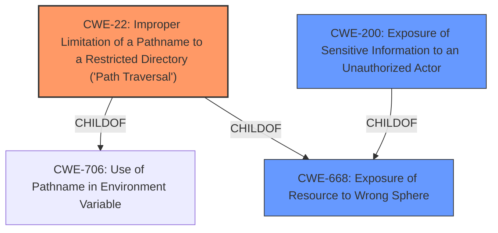

# Analysis for CVE-2021-37734

# Summary
| CWE ID | CWE Name | Confidence | CWE Abstraction Level | CWE Vulnerability Mapping Label | CWE-Vulnerability Mapping Notes |
|---|---|---|---|---|---|
| CWE-22 | Improper Limitation of a Pathname to a Restricted Directory ('Path Traversal') | 1.0 | Base | Primary | Allowed |
| CWE-200 | Exposure of Sensitive Information to an Unauthorized Actor | 0.6 | Class | Secondary | Discouraged |

## Evidence and Confidence

*   **Confidence Score:** 0.8
*   **Evidence Strength:** HIGH

## Relationship Analysis
The primary CWE, CWE-22, is a base-level CWE that describes the root cause of the vulnerability: improper limitation of a pathname to a restricted directory. This is a specific type of input validation issue that leads to path traversal. CWE-200, a class-level CWE, describes the resulting exposure of sensitive information, which is a consequence of the path traversal vulnerability. CWE-22 is a child of CWE-706 (Use of Pathname in Environment Variable) and CWE-668 (Exposure of Resource to Wrong Sphere).

## Vulnerability Chain
The vulnerability chain begins with the **improper limitation of a pathname to a restricted directory** (CWE-22), which allows an attacker to traverse the file system and ultimately leads to **remote unauthorized read access to files** (CWE-200).

## Summary of Analysis
The analysis concludes that the primary CWE for this vulnerability is CWE-22 because the root cause is the **improper limitation of a pathname to a restricted directory**. The "CVE Reference Links Content Summary" explicitly states this as the root cause: "The vulnerability is due to improper limitation of a pathname to a restricted directory, leading to a path traversal vulnerability." This aligns perfectly with the description of CWE-22. The vulnerability enables attackers to read arbitrary files, which can include sensitive information.

CWE-200 is considered a secondary CWE because it describes the impact of the vulnerability (exposure of sensitive information) rather than the root cause. While the vulnerability ultimately leads to information exposure, the primary issue is the path traversal that allows unauthorized access to those files. The "Vulnerability Description Key Phrases" also support this by mentioning "**remote unauthorized read access to files**".

The selection of CWE-22 is at the optimal level of specificity because it directly addresses the **root cause** of the vulnerability as described in the provided information.

Relevant CWE Information:
# Enhanced Context (25 CWEs)
The following CWEs were identified as potentially relevant to this vulnerability:

## CWE-274: Improper Handling of Insufficient Privileges
**Abstraction Level**: Base
**Similarity Score**: 0.77
**Source**: dense

**Description**:
The product does not handle or incorrectly handles when it has insufficient privileges to perform an operation, leading to resultant weaknesses.

**Mapping Guidance**:
- Usage: Discouraged
- Rationale: This CWE entry could be deprecated in a future version of CWE.

*   **Reason for not selecting:** The vulnerability is not about insufficient privileges, but rather about path traversal.

## CWE-653: Improper Isolation or Compartmentalization
**Abstraction Level**: Class
**Similarity Score**: 0.76
**Source**: dense

**Description**:
The product does not properly compartmentalize or isolate functionality, processes, or resources that require different privilege levels, rights, or permissions.

**Mapping Guidance**:
- Usage: Allowed
- Rationale: This CWE entry is at the Base level of abstraction, which is a preferred level of abstraction for mapping to the root causes of vulnerabilities.

*   **Reason for not selecting:** This vulnerability isn't due to improper isolation, it's due to path traversal.

## CWE-668: Exposure of Resource to Wrong Sphere
**Abstraction Level**: Class
**Similarity Score**: 0.76
**Source**: dense

**Description**:
The product exposes a resource to the wrong control sphere, providing unintended actors with inappropriate access to the resource.

**Mapping Guidance**:
- Usage: Discouraged
- Rationale: CWE-668 is high-level and is often misused as a catch-all when lower-level CWE IDs might be applicable. It is sometimes used for low-information vulnerability reports [REF-1287]. It is a level-1 Class (i.e., a child of a Pillar). It is not useful for trend analysis.

*   **Reason for not selecting:** CWE-668 is too high-level. The vulnerability is due to path traversal (CWE-22).

## CWE-280: Improper Handling of Insufficient Permissions or Privileges
**Abstraction Level**: Base
**Similarity Score**: 0.75
**Source**: dense

**Description**:
The product does not handle or incorrectly handles when it has insufficient privileges to access resources or functionality as specified by their permissions. This may cause it to follow unexpected code paths that may leave the product in an invalid state.

**Mapping Guidance**:
- Usage: Allowed
- Rationale: This CWE entry is at the Base level of abstraction, which is a preferred level of abstraction for mapping to the root causes of vulnerabilities.

*   **Reason for not selecting:** The vulnerability is not about insufficient privileges but rather about path traversal.

## CWE-266: Incorrect Privilege Assignment
**Abstraction Level**: Base
**Similarity Score**: 0.75
**Source**: dense

**Description**:
A product incorrectly assigns a privilege to a particular actor, creating an unintended sphere of control for that actor.

**Mapping Guidance**:
- Usage: Allowed
- Rationale: This CWE entry is at the Base level of abstraction, which is a preferred level of abstraction for mapping to the root causes of vulnerabilities.

*   **Reason for not selecting:** The vulnerability is not about incorrect privilege assignment, but rather about path traversal.

## CWE-267: Privilege Defined With Unsafe Actions
**Abstraction Level**: Base
**Similarity Score**: 0.75
**Source**: dense

**Description**:
A particular privilege, role, capability, or right can be used to perform unsafe actions that were not intended, even when it is assigned to the correct entity.

**Mapping Guidance**:
- Usage: Allowed
- Rationale: This CWE entry is at the Base level of abstraction, which is a preferred level of abstraction for mapping to the root causes of vulnerabilities.

*   **Reason for not selecting:** The vulnerability is not about privileges defined with unsafe actions, but rather about path traversal.

## CWE-212: Improper Removal of Sensitive Information Before Storage or Transfer
**Abstraction Level**: Base
**Similarity Score**: 0.75
**Source**: dense

**Description**:
The product stores, transfers, or shares a resource that contains sensitive information, but it does not properly remove that information before the product makes the resource available to unauthorized actors.

**Mapping Guidance**:
- Usage: Allowed
- Rationale: This CWE entry is at the Base level of abstraction, which is a preferred level of abstraction for mapping to the root causes of vulnerabilities.

*   **Reason for not selecting:** The vulnerability is not about the improper removal of sensitive information before storage or transfer, but rather about path traversal.

## CWE-41: Improper Resolution of Path Equivalence
**Abstraction Level**: Base
**Similarity Score**: 0.75
**Source**: dense

**Description**:
The product is vulnerable to file system contents disclosure through path equivalence. Path equivalence involves the use of special characters in file and directory names. The associated manipulations are intended to generate multiple names for the same object.

**Mapping Guidance**:
- Usage: Allowed
- Rationale: This CWE entry is at the Base level of abstraction, which is a preferred level of abstraction for mapping to the root causes of vulnerabilities.

*   **Reason for not selecting:** While path equivalence could be related, the description of the vulnerability specifically mentions the **improper limitation of a pathname to a restricted directory** which aligns more closely with CWE-22.

## CWE-404: Improper Resource Shutdown or Release
**Abstraction Level**: Class
**Similarity Score**: 0.74
**Source**: dense

**Description**:
The product does not release or incorrectly releases a resource before it is made available for re-use.

**Mapping Guidance**:
- Usage: Allowed-with-Review
- Rationale: This CWE entry is a Class and might have Base-level children that would be more appropriate

*   **Reason for not selecting:** The vulnerability is