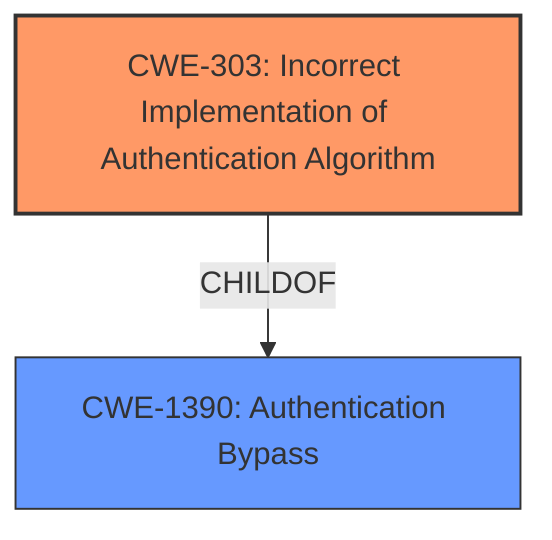

# Analysis for CVE-2021-37741

# Summary
| CWE ID | CWE Name | Confidence | CWE Abstraction Level | CWE Vulnerability Mapping Label | CWE-Vulnerability Mapping Notes |
|---|---|---|---|---|---|
| CWE-303 | Incorrect Implementation of Authentication Algorithm | 0.6 | Base | Allowed | Primary CWE |

## Evidence and Confidence

*   **Confidence Score:** 0.6
*   **Evidence Strength:** LOW

## Relationship Analysis
The primary CWE is CWE-303, which is a base level CWE. The relationships for this CWE include it being a child of CWE-1390, Authentication Bypass. I considered CWE-1390 as well, but it is a class level CWE and I prefer a base level CWE where possible.

## Vulnerability Chain
The vulnerability chain starts with the **incorrect implementation of an authentication algorithm**, leading to pre-authentication remote code execution.

## Summary of Analysis
The vulnerability description indicates a pre-authentication Remote Code Execution (RCE) vulnerability in ManageEngine ADManager Plus. While the provided information is limited, the Retriever Results suggest several potential CWEs. Based on the available evidence and the retriever results, the most suitable CWE is **CWE-303 (Incorrect Implementation of Authentication Algorithm)**.

The evidence supporting this choice is weak. The "Vulnerability Description Key Phrases" mention "pre-authentication RCE," which suggests that the vulnerability exists before authentication takes place. The absence of authentication or a flaw in its implementation would allow an attacker to execute code remotely. CWE-306 (Missing Authentication for Critical Function) could also be a candidate.

CWE-303 is at the Base level of abstraction, which is preferred. It describes a situation where an authentication algorithm is implemented incorrectly, potentially leading to authentication bypass. Given that the vulnerability occurs pre-authentication, an **incorrect authentication implementation** could be the root cause, enabling RCE.

Other CWEs considered include:

*   CWE-434 (Unrestricted Upload of File with Dangerous Type): Less likely, as it involves file uploads, which isn't explicitly mentioned in the description.
*   CWE-502 (Deserialization of Untrusted Data): Also less likely, as it involves deserialization, which isn't mentioned.
*   CWE-425 (Direct Request ('Forced Browsing')): Possible, but less specific than CWE-303.
*   CWE-306 (Missing Authentication for Critical Function): Possible, but I favored CWE-303 because it hints at an attempt at authentication that went wrong as opposed to no authentication at all.

The confidence in this assessment is relatively low (0.6) due to the limited information provided in the vulnerability description and the lack of detail in the CVE Reference Links Content Summary. More information about the specific flaw in the authentication process would increase the confidence in this mapping.