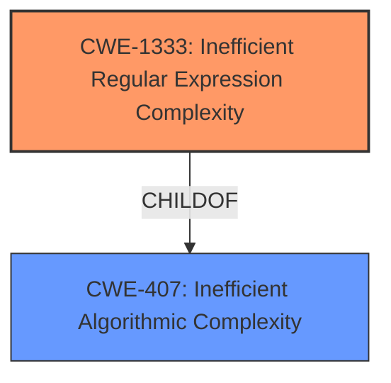

# Raw Analyzer Response for CVE-2021-3777

# Summary
| CWE ID  | CWE Name                                                                                                           | Confidence | CWE Abstraction Level | CWE Vulnerability Mapping Label | CWE-Vulnerability Mapping Notes |
| :-------- | :------------------------------------------------------------------------------------------------------------------- | :---------- | :---------------------- | :------------------------------ | :-------------------------------- |
| CWE-1333 | Inefficient Regular Expression Complexity                                                                            | 1          | Base                    | Primary                          | Allowed                           |

## Evidence and Confidence

*   **Confidence Score:** 1
*   **Evidence Strength:** HIGH

## Relationship Analysis
The primary relationship that influenced my decision was the ChildOf relationship between CWE-1333 and CWE-407. While CWE-407 represents a broader class of "Inefficient Algorithmic Complexity," CWE-1333 is a more specific Base weakness that directly addresses the inefficiency stemming from regular expression complexity.

## Vulnerability Chain
The vulnerability chain starts with the **inefficient regular expression**. This inefficiency leads to excessive CPU consumption and, ultimately, a denial-of-service condition.

## Summary of Analysis
The initial assessment, based on the vulnerability description and the CVE Reference Links Content Summary, strongly points to **CWE-1333** (**Inefficient Regular Expression Complexity**). The vulnerability description explicitly mentions "Inefficient Regular Expression Complexity." The CVE Reference Links Content Summary provides detailed evidence of the **root cause** being the regex `/{([\s\S]+?)}/g` susceptible to a denial-of-service (DoS) attack due to catastrophic backtracking. The fix involves changing the regex to `/{([^{]+?)}/g`. This evidence directly supports the classification of **CWE-1333** (**Inefficient Regular Expression Complexity**).

The Retriever Results also identify **CWE-1333** (**Inefficient Regular Expression Complexity**) as the top candidate with a score of 0.209. Other CWEs considered included **CWE-407** (**Inefficient Algorithmic Complexity**) and **CWE-625** (**Permissive Regular Expression**).

**CWE-407** (**Inefficient Algorithmic Complexity**) was considered but deemed too general. While the inefficient regular expression does lead to inefficient algorithmic complexity, **CWE-1333** (**Inefficient Regular Expression Complexity**) provides a more specific and accurate description of the **root cause**.

**CWE-625** (**Permissive Regular Expression**) was also considered, but it focuses on regular expressions that do not sufficiently restrict allowed values, which is not the primary issue here. The problem is not that the regex allows unintended characters, but that its complexity leads to excessive backtracking.

The final decision to assign **CWE-1333** (**Inefficient Regular Expression Complexity**) is based on the explicit mention of "Inefficient Regular Expression Complexity" in the vulnerability description, the detailed explanation of the catastrophic backtracking issue in the CVE Reference Links Content Summary, and the Retriever Results identifying **CWE-1333** (**Inefficient Regular Expression Complexity**) as the top candidate. **CWE-1333** (**Inefficient Regular Expression Complexity**) is the optimal level of specificity for this vulnerability.

Relevant CWE Information:

# Enhanced Context (25 CWEs)
The following CWEs were identified as potentially relevant to this vulnerability:

## CWE-637: Unnecessary Complexity in Protection Mechanism (Not Using 'Economy of Mechanism')
**Abstraction Level**: Class
**Similarity Score**: 0.74
**Source**: dense

**Description**:
The product uses a more complex mechanism than necessary, which could lead to resultant weaknesses when the mechanism is not correctly understood, modeled, configured, implemented, or used.

**Mapping Guidance**:
- Usage: Allowed-with-Review
- Rationale: This CWE entry is a Class and might have Base-level children that would be more appropriate

## CWE-625: Permissive Regular Expression
**Abstraction Level**: Base
**Similarity Score**: 0.74
**Source**: dense

**Description**:
The product uses a regular expression that does not sufficiently restrict the set of allowed values.

**Mapping Guidance**:
- Usage: Allowed
- Rationale: This CWE entry is at the Base level of abstraction, which is a preferred level of abstraction for mapping to the root causes of vulnerabilities.

## CWE-1176: Inefficient CPU Computation
**Abstraction Level**: Class
**Similarity Score**: 0.74
**Source**: dense

**Description**:
The product performs CPU computations using
         algorithms that are not as efficient as they could be for the
         needs of the developer, i.e., the computations can be
         optimized further.

**Mapping Guidance**:
- Usage: Allowed-with-Review
- Rationale: This CWE entry is a Class and might have Base-level children that would be more appropriate

## CWE-407: Inefficient Algorithmic Complexity
**Abstraction Level**: Class
**Similarity Score**: 0.73
**Source**: dense

**Description**:
An algorithm in a product has an inefficient worst-case computational complexity that may be detrimental to system performance and can be triggered by an attacker, typically using crafted manipulations that ensure that the worst case is being reached.

**Mapping Guidance**:
- Usage: Allowed-with-Review
- Rationale: This CWE entry is a Class and might have Base-level children that would be more appropriate

## CWE-185: Incorrect Regular Expression
**Abstraction Level**: Class
**Similarity Score**: 0.73
**Source**: dense

**Description**:
The product specifies a regular expression in a way that causes data to be improperly matched or compared.

**Mapping Guidance**:
- Usage: Allowed-with-Review
- Rationale: This CWE entry is a Class and might have Base-level children that would be more appropriate

## CWE-186: Overly Restrictive Regular Expression
**Abstraction Level**: Base
**Similarity Score**: 0.73
**Source**: dense

**Description**:
A regular expression is overly restrictive, which prevents dangerous values from being detected.

**Mapping Guidance**:
- Usage: Allowed
- Rationale: This CWE entry is at the Base level of abstraction, which is a preferred level of abstraction for mapping to the root causes of vulnerabilities.

## CWE-799: Improper Control of Interaction Frequency
**Abstraction Level**: Class
**Similarity Score**: 0.70
**Source**: dense

**Description**:
The product does not properly limit the number or frequency of interactions that it has with an actor, such as the number of incoming requests.

**Mapping Guidance**:
- Usage: Allowed-with-Review
- Rationale: This CWE entry is a Class and might have Base-level children that would be more appropriate

## CWE-41: Improper Resolution of Path Equivalence
**Abstraction Level**: Base
**Similarity Score**: 0.70
**Source**: dense

**Description**:
The product is vulnerable to file system contents disclosure through path equivalence. Path equivalence involves the use of special characters in file and directory names. The associated manipulations are intended to generate multiple names for the same object.

**Mapping Guidance**:
- Usage: Allowed
- Rationale: This CWE entry is at the Base level of abstraction, which is a preferred level of abstraction for mapping to the root causes of vulnerabilities.

## CWE-405: Asymmetric Resource Consumption (Amplification)
**Abstraction Level**: Class
**Similarity Score**: 0.70
**Source**: dense

**Description**:
The product does not properly control situations in which an adversary can cause the product to consume or produce excessive resources without requiring the adversary to invest equivalent work or otherwise prove authorization, i.e., the adversary's influence is "asymmetric."

**Mapping Guidance**:
- Usage: Allowed-with-Review
- Rationale: This CWE entry is a Class and might have Base-level children that would be more appropriate

## CWE-1289: Improper Validation of Unsafe Equivalence in Input
**Abstraction Level**: Base
**Similarity Score**: 0.70
**Source**: dense

**Description**:
The product receives an input value that is used as a resource identifier or other type of reference, but it does not validate or incorrectly validates that the input is equivalent to a potentially-unsafe value.

**Mapping Guidance**:
- Usage: Allowed
- Rationale: This CWE entry is at the Base level of abstraction, which is a preferred level of abstraction for mapping to the root causes of vulnerabilities.

## CWE-1333: Inefficient Regular Expression Complexity
**Abstraction Level**: Base
**Similarity Score**: 5175.08
**Source**: sparse

**Description**:
The product uses a regular expression with an inefficient, possibly exponential worst-case computational complexity that consumes excessive CPU cycles.

**Mapping Guidance**:
- Usage: Allowed
- Rationale: This CWE entry is