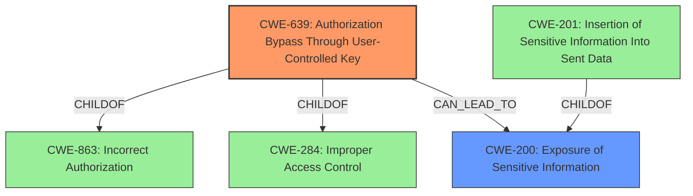

# Raw Analyzer Response for CVE-2021-37777

# Summary
| CWE ID | CWE Name | Confidence | CWE Abstraction Level | CWE Vulnerability Mapping Label | CWE-Vulnerability Mapping Notes |
|---|---|---|---|---|---|
| CWE-639 | Authorization Bypass Through User-Controlled Key | 1.0 | Base | Allowed | Primary CWE. The application's authorization mechanism **fails to prevent** a user from accessing another user's data by manipulating the key identifying the data. |
| CWE-200 | Exposure of Sensitive Information | 0.75 | Class | Allowed | Secondary CWE. Thumbnails uploaded by one site owner are visible to another, leading to sensitive information disclosure. |

## Evidence and Confidence

*   **Confidence Score:** 0.9
*   **Evidence Strength:** HIGH

## Relationship Analysis
The primary CWE is CWE-639, which is a Base level weakness describing authorization bypass via user-controlled keys. It is related to CWE-863 (Incorrect Authorization) and CWE-284 (Improper Access Control) via ChildOf relationships, indicating that it's a specific type of authorization or access control issue. CWE-200 (Exposure of Sensitive Information) is a Class level weakness, representing the impact of the authorization bypass. It is related to its children like CWE-201 (Insertion of Sensitive Information Into Sent Data), which could have been a more specific fit if the specific mechanism of information exposure was detailed.

## Vulnerability Chain
The vulnerability chain starts with the **insecure direct object reference** (IDOR), represented by CWE-639. Because of this **failed** or **incorrect authorization**, one user can access another user's thumbnails. The impact of this is the sensitive information disclosure, which is represented by CWE-200.

## Summary of Analysis
The initial assessment identified the **insecure direct object reference** as the root cause, leading to sensitive information disclosure. The "Vulnerability Description Key Phrases" section calls out "**insecure direct object reference**" as the rootcause and "sensitive information disclosure" as the impact, aligning well with the descriptions and relationships of the chosen CWEs. The "CVE Reference Links Content Summary" further supports this by stating that the root cause is IDOR and the impact is sensitive information disclosure.

CWE-639 is the most specific CWE that fits the description of the **authorization bypass** due to the **user-controlled key**. The description clearly states that "The system's authorization functionality does not prevent one user from gaining access to another user's data or record by modifying the key value identifying the data." This aligns perfectly with the IDOR vulnerability described.

CWE-200 is chosen to represent the impact of the vulnerability - sensitive information disclosure. While CWE-201 (Insertion of Sensitive Information Into Sent Data) was considered, the provided information does not have sufficient detail to determine if data is being "inserted" into sent data, or simply being exposed.

CWE-79 (Improper Neutralization of Input During Web Page Generation ('Cross-site Scripting')) and CWE-352 (Cross-Site Request Forgery (CSRF)) were also considered but deemed less relevant. There's no indication of input being improperly neutralized leading to script execution or that the application is vulnerable to CSRF attacks.