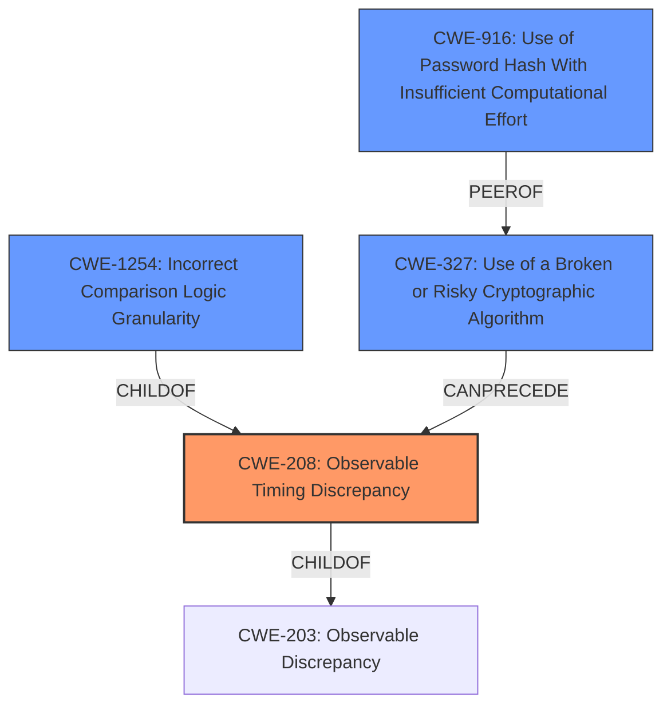

# Raw Analyzer Response for CVE-2021-37848

# Summary
| CWE ID | CWE Name | Confidence | CWE Abstraction Level | CWE Vulnerability Mapping Label | CWE-Vulnerability Mapping Notes |
|---|---|---|---|---|---|
| CWE-208 | Observable Timing Discrepancy | 1 | Base | Allowed | Primary CWE |
| CWE-1254 | Incorrect Comparison Logic Granularity | 0.7 | Base | Allowed | Secondary Candidate |
| CWE-916 | Use of Password Hash With Insufficient Computational Effort | 0.5 | Base | Allowed | Secondary Candidate |

## Evidence and Confidence

*   **Confidence Score:** 0.8
*   **Evidence Strength:** HIGH

## Relationship Analysis
The primary CWE is CWE-208, which is a Base level CWE. CWE-208 is related to CWE-203 (Observable Discrepancy) as a child. CWE-1254 (Incorrect Comparison Logic Granularity) is also a child of CWE-208, representing a more specific case where the timing discrepancy arises from the granularity of comparison logic. Therefore, CWE-1254 is a more specific version of CWE-208. CWE-327 (Use of a Broken or Risky Cryptographic Algorithm) is connected via CANPRECEDE to CWE-208, indicating it can lead to timing discrepancies. CWE-916 (Use of Password Hash With Insufficient Computational Effort) is related to cryptographic weaknesses.

## Vulnerability Chain
The vulnerability chain starts with the **use of strncmp**, which leads to **observable timing discrepancies** during password hash comparison. This timing discrepancy can then be exploited to **recover the password hash**, potentially leading to **unauthorized access**.

## Summary of Analysis
The initial assessment identified CWE-208 as the primary candidate due to the **timing leak** caused by **using strncmp** for hash comparison. The "CVE Reference Links Content Summary" section explicitly mentions "Timing Side-Channel: Using `strncmp()` and `memcmp()` creates a timing side-channel vulnerability." This confirms the relevance of CWE-208.

CWE-1254 was considered because it represents a more specific scenario where the timing discrepancy comes from incorrect comparison logic granularity, in this case, a byte-by-byte comparison. While applicable, the description of the vulnerability doesn't explicitly focus on the granularity, making CWE-208 the more direct and appropriate choice.

CWE-916 was also considered because the advisory suggests using strong salted hashing algorithms. However, the vulnerability is primarily about the timing leak due to the use of `strncmp`, not the weakness of the hash itself. Therefore, CWE-916 is a secondary concern and less directly related to the root cause.

The final decision favors CWE-208 due to its direct alignment with the **root cause** (**timing leak** from **using strncmp**) and supporting evidence from the CVE description. The evidence provided is "The vulnerability stems from the **use of `strncmp()`** and `memcmp()` for comparing password hashes... These functions perform comparisons in a non-constant time manner." CWE-208 is at the optimal level of specificity because it accurately captures the core issue.

Relevant CWE Information:

# Enhanced Context (25 CWEs)

## CWE-208: Observable Timing Discrepancy
**Abstraction Level**: Base
**Similarity Score**: 0.78
**Source**: dense

**Description**:
Two separate operations in a product require different amounts of time to complete, in a way that is observable to an actor and reveals security-relevant information about the state of the product, such as whether a particular operation was successful or not.

**Mapping Guidance**:
- Usage: Allowed
- Rationale: This CWE entry is at the Base level of abstraction, which is a preferred level of abstraction for mapping to the root causes of vulnerabilities.

**Technical Explanation**:
CWE-208 (Observable Timing Discrepancy) is the primary CWE because the core vulnerability is a timing side-channel. The **use of strncmp** for password hash comparison causes the comparison to take different amounts of time depending on how many characters match. This timing difference can be observed by an attacker and used to infer information about the password hash.
**Security Implications**: An attacker can recover the password hash by observing timing differences.
**Relationship**: ChildOf -> CWE-203.
**MITRE Mapping Guidance**: The usage is "Allowed" and the rationale states that it is at the Base level of abstraction, which is preferred.

## CWE-1254: Incorrect Comparison Logic Granularity
**Abstraction Level**: Base
**Similarity Score**: 6521.54
**Source**: sparse

**Description**:
The product's comparison logic is performed over a series of steps rather than across the entire string in one operation. If there is a comparison logic failure on one of these steps, the operation may be vulnerable to a timing attack that can result in the interception of the process for nefarious purposes.

**Mapping Guidance**:
- Usage: Allowed
- Rationale: This CWE entry is at the Base level of abstraction, which is a preferred level of abstraction for mapping to the root causes of vulnerabilities.

**Technical Explanation**:
CWE-1254 (Incorrect Comparison Logic Granularity) is a secondary candidate because `strncmp` performs a byte-by-byte comparison. The timing differences arise because the comparison stops as soon as a mismatch is found.
**Security Implications**: An attacker can recover parts of the password hash by observing the timing differences in each byte comparison.
**Relationship**: ChildOf -> CWE-208, ChildOf -> CWE-697
**MITRE Mapping Guidance**: The usage is "Allowed" and the rationale states that it is at the Base level of abstraction, which is preferred.

## CWE-916: Use of Password Hash With Insufficient Computational Effort
**Abstraction Level**: Base
**Similarity Score**: 6995.57
**Source**: sparse

**Description**:
The product generates a hash for a password, but it uses a scheme that does not provide a sufficient level of computational effort that would make password cracking attacks infeasible or expensive.

**Mapping Guidance**:
- Usage: Allowed
- Rationale: This CWE entry is at the Base level of abstraction, which is a preferred level of abstraction for mapping to the root causes of vulnerabilities.

**Technical Explanation**:
CWE-916 (Use of Password Hash With Insufficient Computational Effort) is a secondary candidate because the advisory mentions that "the default unsalted MD5 hash is easily cracked offline". The fact that an easily cracked hash is being used contributes to the weakness. However, the root cause is still the timing leak due to **using strncmp**.
**Security Implications**: It can make it easier to crack passwords.
**Relationship**: ChildOf -> CWE-327, ChildOf -> CWE-328
**MITRE Mapping Guidance**: The usage is "Allowed" and the rationale states that it is at the Base level of abstraction, which is preferred.

## CWE-328: Use of Weak Hash
**Abstraction Level**: Base
**Similarity Score**: 6782.01
**Source**: sparse

**Description**:
The product uses an algorithm that produces a digest (output value) that does not meet security expectations for a hash function that allows an adversary to reasonably determine the original input (preimage attack), find another input that can produce the same hash (2nd preimage attack), or find multiple inputs that evaluate to the same hash (birthday attack).

**Mapping Guidance**:
- Usage: Allowed
- Rationale: This CWE entry is at the Base level of abstraction, which is a preferred level of abstraction for mapping to the root causes of vulnerabilities.

**Technical Explanation**:
CWE-328 is closely related to CWE-916, and could be a better fit if the primary issue was a weak hashing algorithm. However, the primary weakness is the timing side channel, not the hash itself, even though it is mentioned that an unsalted MD5 hash is used by default.
**Security Implications**: Using a weak hash makes it easier to crack passwords.
**Relationship**: ChildOf -> CWE-326, Child