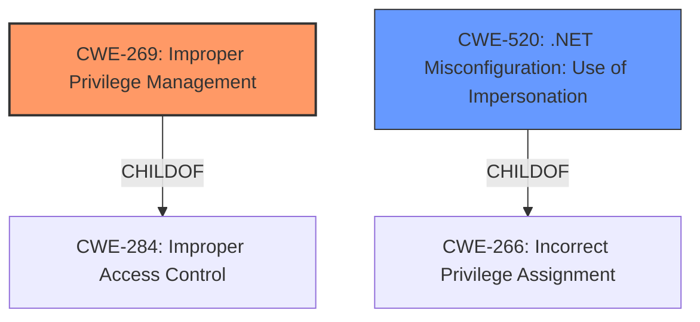

# Raw Analyzer Response for CVE-2021-37852

# Summary
| CWE ID | CWE Name | Confidence | CWE Abstraction Level | CWE Vulnerability Mapping Label | CWE-Vulnerability Mapping Notes |
|---|---|---|---|---|---|
| CWE-269 | Improper Privilege Management | 0.7 | Class | Primary | Allowed-with-Review |
| CWE-520 | .NET Misconfiguration: Use of Impersonation | 0.6 | Variant | Secondary | Allowed |

## Evidence and Confidence

*   **Confidence Score:** 0.7
*   **Evidence Strength:** MEDIUM

## Relationship Analysis
The primary relationship influencing the selection is that CWE-269 (Improper Privilege Management) is a high-level classification that needs further refinement. While it broadly captures the essence of the vulnerability (privilege escalation), the retriever results also suggest considering CWE-520 (.NET Misconfiguration: Use of Impersonation), which is a Variant of CWE-266 (Incorrect Privilege Assignment). This suggests a potential path of refinement from a general Class (CWE-269) to a more specific Variant (CWE-520). The description mentions impersonation which is the key aspect of CWE-520. The relationship helps in choosing a more specific CWE based on the vulnerability details.

## Vulnerability Chain
The vulnerability chain involves the following steps:
1.  **Root Cause:** **Improper privilege management** in ESET products allows an untrusted process to impersonate the client of a pipe.
2.  **Weakness:** The system **fails to properly validate** or sanitize the client of the named pipe.
3.  **Impact:** This leads to **privilege escalation**, allowing a low-privileged process to elevate its privileges to SYSTEM.

## Summary of Analysis
The initial assessment pointed to CWE-269 (Improper Privilege Management) as the primary weakness due to the observed privilege escalation. However, based on the description and the retriever results, CWE-520 (.NET Misconfiguration: Use of Impersonation) was also considered.

The vulnerability description states: "ESET products for Windows allows untrusted process to impersonate the client of a pipe, which can be leveraged by attacker to escalate privileges in the context of NT AUTHORITY\SYSTEM." This clearly indicates an impersonation issue.

The "CVE Reference Links Content Summary" section further supports this by stating: "The vulnerability stems from the improper use of named pipes within ESET Endpoint Antivirus. Specifically, the issue arises from allowing an untrusted process to impersonate the client of a named pipe."

The decision to include CWE-520 as a secondary CWE is based on the explicit mention of "impersonation" and the fact that the vulnerability affects ".NET applications," which aligns with the description of CWE-520. While CWE-269 broadly captures the privilege management issue, CWE-520 provides a more specific classification related to impersonation within the .NET framework.

The selection of CWE-269 and CWE-520 is at the appropriate level of specificity. CWE-269 is a Class-level CWE that broadly describes the improper privilege management issue, while CWE-520 is a Variant-level CWE that provides a more specific classification related to impersonation within the .NET framework.
I am overriding the general mapping guidance to be more specific. I believe CWE-520 should also be included here even though the confidence is lower because the vulnerability description explicitly mentions impersonation.

Relevant CWE Information:

# Enhanced Context (25 CWEs)
The following CWEs were identified as potentially relevant to this vulnerability:

## CWE-269: Improper Privilege Management
**Abstraction:** Class
**Status:** Draft

### Description
The product does not properly assign, modify, track, or check privileges for an actor, creating an unintended sphere of control for that actor.

### Extended Description
Not provided

### Alternative Terms
None

### Relationships
ChildOf -> CWE-284

### Mapping Guidance
**Usage:** Discouraged
**Rationale:** CWE-269 is commonly misused. It can be conflated with "privilege escalation," which is a technical impact that is listed in many low-information vulnerability reports [REF-1287]. It is not useful for trend analysis.
**Comments:** If an error or mistake allows privilege escalation, then use the CWE ID for that mistake. Avoid using CWE-269 when only phrases such as "privilege escalation" or "gain privileges" are available, as these indicate technical impact of the vulnerability - not the root cause weakness. If the root cause seems to be directly related to privileges, then examine the children of CWE-269 for additional hints, such as Execution with Unnecessary Privileges (CWE-250) or Incorrect Privilege Assignment (CWE-266).
**Reasons:**
- Frequent Misuse

### Additional Notes
**[Maintenance]** The relationships between privileges, permissions, and actors (e.g. users and groups) need further refinement within the Research view. One complication is that these concepts apply to two different pillars, related to control of resources (CWE-664) and protection mechanism failures (CWE-693).

## CWE-520: .NET Misconfiguration: Use of Impersonation
**Abstraction:** Variant
**Status:** Incomplete

### Description
Allowing a .NET application to run at potentially escalated levels of access to the underlying operating and file systems can be dangerous and result in various forms of attacks.

### Extended Description
.NET server applications can optionally execute using the identity of the user authenticated to the client. The intention of this functionality is to bypass authentication and access control checks within the .NET application code. Authentication is done by the underlying web server (Microsoft Internet Information Service IIS), which passes the authenticated token, or unauthenticated anonymous token, to the .NET application. Using the token to impersonate the client, the application then relies on the settings within the NTFS directories and files to control access. Impersonation enables the application, on the server running the .NET application, to both execute code and access resources in the context of the authenticated and authorized user.

### Alternative Terms
None

### Relationships
ChildOf -> CWE-266

### Mapping Guidance
**Usage:** Allowed
**Rationale:** This CWE entry is at the Variant level of abstraction, which is a preferred level of abstraction for mapping to the root causes of vulnerabilities.
**Comments:** Carefully read both the name and description to ensure that this mapping is an appropriate fit. Do not try to 'force' a mapping to a lower-level Base/Variant simply to comply with this preferred level of abstraction.
**Reasons:**
- Acceptable-Use