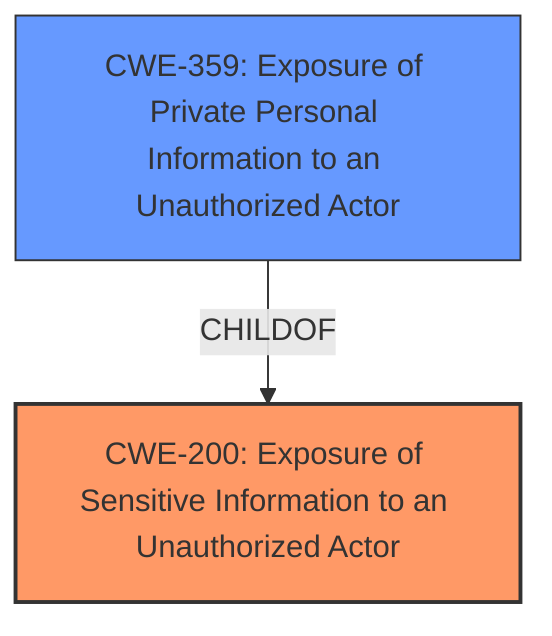

# Enhanced Analysis for CVE-2021-37867

# Summary
| CWE ID    | CWE Name                                                   | Confidence | CWE Abstraction Level | CWE Vulnerability Mapping Label | CWE-Vulnerability Mapping Notes |
| :-------- | :--------------------------------------------------------- | :--------- | :---------------------- | :------------------------------ | :---------------------------- |
| CWE-200   | Exposure of Sensitive Information to an Unauthorized Actor | 0.8        | Class                   | Primary                         | Discouraged                   |
| CWE-359   | Exposure of Private Personal Information to an Unauthorized Actor | 0.6        | Base                    | Secondary                       | Allowed                      |

## Evidence and Confidence

*   **Confidence Score:** 0.7
*   **Evidence Strength:** MEDIUM

## Relationship Analysis
The primary relationship impacting the decision is that CWE-359 is a ChildOf CWE-200, indicating a more specific case of information exposure. However, as the provided description focuses on the exposure of email addresses, which falls under private personal information, CWE-359 is a good candidate. Despite this, the description of the vulnerability is generic, so it's more appropriate to assign CWE-200.



## Vulnerability Chain
The chain of events is relatively straightforward: the Mattermost Boards plugin **fails to protect email addresses**, leading to the **exposure of sensitive information** to unauthorized users.

## Summary of Analysis
The initial analysis identified that the Mattermost Boards plugin **fails to protect email addresses**, which allows both authenticated and unauthorized users to access this data. This is a clear case of sensitive information being exposed. The primary concern is **the root cause of the failure to protect**.

The retriever results suggest CWE-200 (Exposure of Sensitive Information to an Unauthorized Actor), CWE-359 (Exposure of Private Personal Information to an Unauthorized Actor), and CWE-285 (Improper Authorization) as potential candidates.

CWE-200 is a high-level class, but it accurately describes the general issue. The MITRE mapping guidance discourages its use, recommending more specific CWEs. The vulnerability description states "Mattermost Boards plugin v0.10.0 and earlier **fails to protect email addresses** of all users via one of the Boards APIs, which allows authenticated and unauthorized users to access this information resulting in sensitive & private information disclosure."

CWE-359 is a more specific Base level CWE that directly addresses the exposure of private personal information, which is applicable given that email addresses are considered private personal information.

I am selecting CWE-200 as the primary weakness because the description does not provide the specific mechanism that failed to protect the email addresses.
I am selecting CWE-359 as a secondary weakness because email addresses are private personal information.

Relevant CWE Information:

# Enhanced Context (25 CWEs)

## CWE-226: Sensitive Information in Resource Not Removed Before Reuse
**Abstraction Level**: Base
**Similarity Score**: 0.76
**Source**: dense

**Description**:
The product releases a resource such as memory or a file so that it can be made available for reuse, but it does not clear or "zeroize" the information contained in the resource before the product performs a critical state transition or makes the resource available for reuse by other entities.

**Mapping Guidance**:
- Usage: Allowed
- Rationale: This CWE entry is at the Base level of abstraction, which is a preferred level of abstraction for mapping to the root causes of vulnerabilities.

**Vulnerability Mapping Notes:** The description doesn't involve resource reuse, so this CWE is not applicable.

## CWE-1220: Insufficient Granularity of Access Control
**Abstraction Level**: Base
**Similarity Score**: 0.75
**Source**: dense

**Description**:
The product implements access controls via a policy or other feature with the intention to disable or restrict accesses (reads and/or writes) to assets in a system from untrusted agents. However, implemented access controls lack required granularity, which renders the control policy too broad because it allows accesses from unauthorized agents to the security-sensitive assets.

**Mapping Guidance**:
- Usage: Allowed
- Rationale: This CWE entry is at the Base level of abstraction, which is a preferred level of abstraction for mapping to the root causes of vulnerabilities.

**Vulnerability Mapping Notes:** The description doesn't describe insufficient granularity of access control, so this CWE is not applicable.

## CWE-668: Exposure of Resource to Wrong Sphere
**Abstraction Level**: Class
**Similarity Score**: 0.74
**Source**: dense

**Description**:
The product exposes a resource to the wrong control sphere, providing unintended actors with inappropriate access to the resource.

**Mapping Guidance**:
- Usage: Discouraged
- Rationale: CWE-668 is high-level and is often misused as a catch-all when lower-level CWE IDs might be applicable. It is sometimes used for low-information vulnerability reports [REF-1287]. It is a level-1 Class (i.e., a child of a Pillar). It is not useful for trend analysis.

**Vulnerability Mapping Notes:** The description doesn't involve the exposure of a resource to the wrong control sphere, so this CWE is not applicable.

## CWE-404: Improper Resource Shutdown or Release
**Abstraction Level**: Class
**Similarity Score**: 0.74
**Source**: dense

**Description**:
The product does not release or incorrectly releases a resource before it is made available for re-use.

**Mapping Guidance**:
- Usage: Allowed-with-Review
- Rationale: This CWE entry is a Class and might have Base-level children that would be more appropriate

**Vulnerability Mapping Notes:** The description doesn't involve improper resource shutdown or release, so this CWE is not applicable.

## CWE-538: Insertion of Sensitive Information into Externally-Accessible File or Directory
**Abstraction Level**: Base
**Similarity Score**: 0.74
**Source**: dense

**Description**:
The product places sensitive information into files or directories that are accessible to actors who are allowed to have access to the files, but not to the sensitive information.

**Mapping Guidance**:
- Usage: Allowed
- Rationale: This CWE entry is at the Base level of abstraction, which is a preferred level of abstraction for mapping to the root causes of vulnerabilities.

**Vulnerability Mapping Notes:** The description doesn't involve inserting information into external files, so this CWE is not applicable.

## CWE-807: Reliance on Untrusted Inputs in a Security Decision
**Abstraction Level**: Base
**Similarity Score**: 0.74
**Source**: dense

**Description**:
The product uses a protection mechanism that relies on the existence or values of an input, but the input can be modified by an untrusted actor in a way that bypasses the protection mechanism.

**Mapping Guidance**:
- Usage: Allowed
- Rationale: This CWE entry is at the Base level of abstraction, which is a preferred level of abstraction for mapping to the root causes of vulnerabilities.

**Vulnerability Mapping Notes:** The description doesn't involve reliance on untrusted inputs, so this CWE is not applicable.

## CWE-274: Improper Handling of Insufficient Privileges
**Abstraction Level**: Base
**Similarity Score**: 0.74
**Source**: dense

**Description**:
The product does not handle or incorrectly handles when it has insufficient privileges to perform an operation, leading to resultant weaknesses.

**Mapping Guidance**:
- Usage: Discouraged
- Rationale: This CWE entry could be deprecated in a future version of CWE.

**Vulnerability Mapping Notes:** The description doesn't involve insufficient privileges, so this CWE is not applicable.

## CWE-639: Authorization Bypass Through User-Controlled Key
**Abstraction Level**: Base
**Similarity Score**: 0.74
**Source**: dense

**Description**:
The system's authorization functionality does not prevent one user from gaining access to another user's data or record by modifying the key value identifying the data.

**Mapping Guidance**:
- Usage: Allowed
- Rationale: This CWE entry is at the Base level of abstraction, which is a preferred level of abstraction for mapping to the root causes of vulnerabilities.

**Vulnerability Mapping Notes:** The description doesn't involve authorization bypass through a user-controlled key, so this CWE is not applicable.

## CWE-212: Improper Removal of Sensitive Information Before Storage or Transfer
**Abstraction Level**: Base
**Similarity Score**: 0.74
**Source**: dense

**Description**:
The product stores, transfers, or shares a resource that contains sensitive information, but it does not properly remove that information before the product makes the resource available to unauthorized actors.

**Mapping Guidance**:
- Usage: Allowed
- Rationale: This CWE entry is at the Base level of abstraction, which is a preferred level of abstraction for mapping to the root causes of vulnerabilities.

**Vulnerability Mapping Notes:** The


## CWE Relationship Analysis

Current CWEs represent these abstraction levels: .


### Vulnerability Chain Analysis

**Chain starting from CWE-404:**
- 404 (Improper Resource Shutdown or Release) - ROOT


**Chain starting from CWE-285:**
- 285 (Improper Authorization) - ROOT


### CWE Relationship Diagram

```mermaid
graph TD
    classDef primary fill:#f96,stroke:#333,stroke-width:2px
    classDef secondary fill:#69f,stroke:#333
    classDef tertiary fill:#9e9,stroke:#333
```