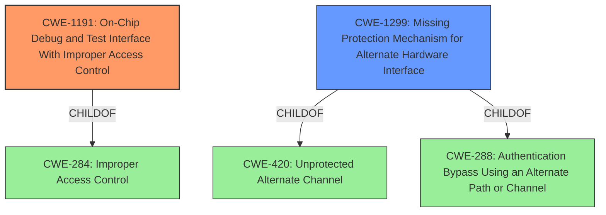

# Analysis for CVE-2021-3788

# Summary
| CWE ID | CWE Name | Confidence | CWE Abstraction Level | CWE Vulnerability Mapping Label | CWE-Vulnerability Mapping Notes |
|---|---|---|---|---|---|
| CWE-1191 | On-Chip Debug and Test Interface With Improper Access Control | 0.9 | Base | Allowed | Primary CWE |
| CWE-1299 | Missing Protection Mechanism for Alternate Hardware Interface | 0.7 | Base | Allowed | Secondary Candidate |

## Evidence and Confidence

*   **Confidence Score:** 0.8
*   **Evidence Strength:** HIGH

## Relationship Analysis
The primary CWE, CWE-1191, focuses on the specific vulnerability of improper access control for on-chip debug and test interfaces. The secondary CWE, CWE-1299, addresses the broader issue of missing protection mechanisms for alternate hardware interfaces. The hierarchical relationships show that CWE-1191 is a peer of itself and related to CWE-284 (Improper Access Control). While CWE-1299 is a child of CWE-420 (Unprotected Alternate Channel) and CWE-288 (Authentication Bypass Using an Alternate Path or Channel). Choosing CWE-1191 provides a more precise classification given the explicit mention of a debug interface.

## Vulnerability Chain
The chain of events starts with an **exposed debug interface** due to **missing or improper access control**. This leads to unauthorized physical access, ultimately resulting in complete device compromise. The root cause is the **lack of sufficient access control** over the debug interface, allowing attackers to bypass intended security measures.

## Summary of Analysis
The analysis is primarily based on the provided vulnerability description and the associated key phrases, which highlight the **exposed debug interface** as the core weakness. The "CVE Reference Links Content Summary" further reinforces this point by explicitly stating the root cause as "An exposed debug interface."

The retriever results suggest several potential CWEs, but CWE-1191 (On-Chip Debug and Test Interface With Improper Access Control) and CWE-1299 (Missing Protection Mechanism for Alternate Hardware Interface) stand out due to their higher scores and relevance to the description.

CWE-1191 is chosen as the primary CWE because the vulnerability description specifically mentions an "exposed debug interface," aligning directly with the focus of CWE-1191 on access control for debug interfaces. The fact that the attacker gains unauthorized access with physical access implies a failure in the authentication/authorization mechanisms for the debug interface.

CWE-1299 is considered as a secondary CWE because it addresses the broader issue of missing protection mechanisms for alternate hardware interfaces, which could encompass the debug interface. However, CWE-1191 provides a more precise classification given the explicit mention of a debug interface.

The selected CWEs are at the optimal level of specificity because they directly address the root cause (**exposed debug interface**) and the resulting impact (unauthorized access). Higher-level CWEs would be too generic, while lower-level variants might not fully capture the essence of the vulnerability.

Relevant CWE Information:

# Enhanced Context (25 CWEs)
The following CWEs were identified as potentially relevant to this vulnerability:

## CWE-1299: Missing Protection Mechanism for Alternate Hardware Interface
**Abstraction Level**: Base
**Similarity Score**: 0.81
**Source**: dense

**Description**:
The lack of protections on alternate paths to access
                control-protected assets (such as unprotected shadow registers
                and other external facing unguarded interfaces) allows an
                attacker to bypass existing protections to the asset that are
		only performed against the primary path.

**Mapping Guidance**:
- Usage: Allowed
- Rationale: This CWE entry is at the Base level of abstraction, which is a preferred level of abstraction for mapping to the root causes of vulnerabilities.

## CWE-1191: On-Chip Debug and Test Interface With Improper Access Control
**Abstraction Level**: Base
**Similarity Score**: 3.64
**Source**: graph

**Description**:
CWE-1191: On-Chip Debug and Test Interface With Improper Access Control

**Mapping Guidance**:
- Usage: Allowed
- Rationale: This CWE entry is at the Base level of abstraction, which is a preferred level of abstraction for mapping to the root causes of vulnerabilities.

**Relationships**:
- CHILDOF -> CWE-284
- PARENTOF -> CWE-1191
- PEEROF -> CWE-1191
- PEEROF -> CWE-1191

## CWE-1191 Technical Explanation:
The vulnerability involves an exposed debug interface in Motorola-branded Binatone Hubble Cameras, potentially allowing unauthorized physical access to the device. This aligns with CWE-1191, which focuses on the **lack of proper access control** for on-chip debug and test interfaces. The security implication is that an attacker with physical access can bypass intended security mechanisms and gain complete control over the device. The parent-child relationship with CWE-284 (Improper Access Control) further emphasizes the root cause of the vulnerability. MITRE's mapping guidance allows for using CWE-1191.
## CWE-1299 Technical Explanation:
CWE-1299 describes a scenario where alternate paths to access control-protected assets lack sufficient protection, enabling attackers to bypass intended security measures. In this case, the **exposed debug interface** serves as the unprotected alternate path, allowing unauthorized access to the device. The relationship with CWE-420 (Unprotected Alternate Channel) and CWE-288 (Authentication Bypass Using an Alternate Path or Channel) highlights the potential for bypassing authentication mechanisms through this interface. MITRE's mapping guidance allows for using CWE-1299.

## Other CWEs Considered:
- CWE-424 (Improper Protection of Alternate Path): This CWE is too high-level and doesn't specifically address debug interfaces.
- CWE-532 (Insertion of Sensitive Information into Log File): This CWE is not relevant as the vulnerability is not about logging sensitive information.
- CWE-1269 (Product Released in Non-Release Configuration): This CWE is not relevant as the vulnerability is about an **exposed interface**, not the product's configuration.
- CWE-1244 (Internal Asset Exposed to Unsafe Debug Access Level or State): While related to debug access, this CWE focuses on incorrect access levels rather than missing access control, making it less appropriate than CWE-1191.
- CWE-1258 (Exposure of Sensitive System Information Due to Uncleared Debug Information): This CWE focuses on sensitive information remaining in debug mode, which is not the primary issue described in the vulnerability.
- CWE-522 (Insufficiently Protected Credentials): This CWE is not relevant as the vulnerability is about an **exposed debug interface**, not credentials.
- CWE-306 (Missing Authentication for Critical Function): This CWE is too general and doesn't specifically address debug interfaces.
- CWE-923 (Improper Restriction of Communication Channel to Intended Endpoints): While related to communication channels, this CWE is not specific to debug interfaces.