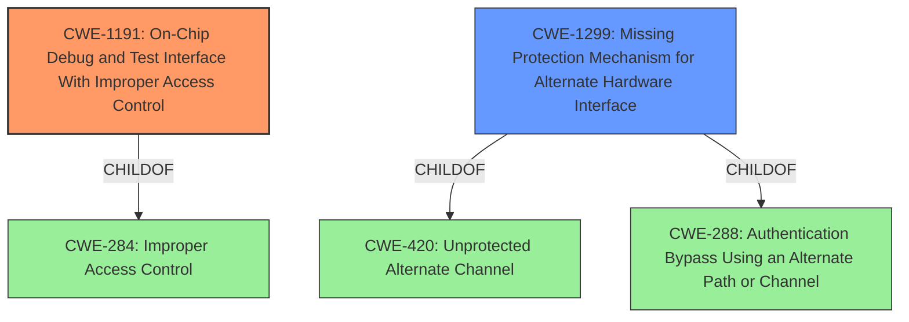

# Analysis for CVE-2021-3788

# Summary
| CWE ID | CWE Name | Confidence | CWE Abstraction Level | CWE Vulnerability Mapping Label | CWE-Vulnerability Mapping Notes |
|---|---|---|---|---|---|
| CWE-1191 | On-Chip Debug and Test Interface With Improper Access Control | 0.9 | Base | Allowed | Primary CWE |
| CWE-1299 | Missing Protection Mechanism for Alternate Hardware Interface | 0.7 | Base | Allowed | Secondary Candidate |

## Evidence and Confidence

*   **Confidence Score:** 0.8
*   **Evidence Strength:** HIGH

## Relationship Analysis
The primary CWE, CWE-1191, focuses on the specific vulnerability of improper access control for on-chip debug and test interfaces. The secondary CWE, CWE-1299, addresses the broader issue of missing protection mechanisms for alternate hardware interfaces. The hierarchical relationships show that CWE-1191 is a peer of itself and related to CWE-284 (Improper Access Control). While CWE-1299 is a child of CWE-420 (Unprotected Alternate Channel) and CWE-288 (Authentication Bypass Using an Alternate Path or Channel). Choosing CWE-1191 provides a more precise classification given the explicit mention of a debug interface.

## Vulnerability Chain
The chain of events starts with an **exposed debug interface** due to **missing or improper access control**. This leads to unauthorized physical access, ultimately resulting in complete device compromise. The root cause is the **lack of sufficient access control** over the debug interface, allowing attackers to bypass intended security measures.

## Summary of Analysis
The analysis is primarily based on the provided vulnerability description and the associated key phrases, which highlight the **exposed debug interface** as the core weakness. The "CVE Reference Links Content Summary" further reinforces this point by explicitly stating the root cause as "An exposed debug interface."

The retriever results suggest several potential CWEs, but CWE-1191 (On-Chip Debug and Test Interface With Improper Access Control) and CWE-1299 (Missing Protection Mechanism for Alternate Hardware Interface) stand out due to their higher scores and relevance to the description.

CWE-1191 is chosen as the primary CWE because the vulnerability description specifically mentions an "exposed debug interface," aligning directly with the focus of CWE-1191 on access control for debug interfaces. The fact that the attacker gains unauthorized access with physical access implies a failure in the authentication/authorization mechanisms for the debug interface.

CWE-1299 is considered as a secondary CWE because it addresses the broader issue of missing protection mechanisms for alternate hardware interfaces, which could encompass the debug interface. However, CWE-1191 provides a more precise classification given the explicit mention of a debug interface.

The selected CWEs are at the optimal level of specificity because they directly address the root cause (**exposed debug interface**) and the resulting impact (unauthorized access). Higher-level CWEs would be too generic, while lower-level variants might not fully capture the essence of the vulnerability.

Relevant CWE Information:

# Enhanced Context (25 CWEs)
The following CWEs were identified as potentially relevant to this vulnerability:

## CWE-1299: Missing Protection Mechanism for Alternate Hardware Interface
**Abstraction Level**: Base
**Similarity Score**: 0.81
**Source**: dense

**Description**:
The lack of protections on alternate paths to access
                control-protected assets (such as unprotected shadow registers
                and other external facing unguarded interfaces) allows an
                attacker to bypass existing protections to the asset that are
		only performed against the primary path.

**Mapping Guidance**:
- Usage: Allowed
- Rationale: This CWE entry is at the Base level of abstraction, which is a preferred level of abstraction for mapping to the root causes of vulnerabilities.

## CWE-1191: On-Chip Debug and Test Interface With Improper Access Control
**Abstraction Level**: Base
**Similarity Score**: 3.64
**Source**: graph

**Description**:
CWE-1191: On-Chip Debug and Test Interface With Improper Access Control

**Mapping Guidance**:
- Usage: Allowed
- Rationale: This CWE entry is at the Base level of abstraction, which is a preferred level of abstraction for mapping to the root causes of vulnerabilities.

**Relationships**:
- CHILDOF -> CWE-284
- PARENTOF -> CWE-1191
- PEEROF -> CWE-1191
- PEEROF -> CWE-1191

## CWE-1191 Technical Explanation:
The vulnerability involves an exposed debug interface in Motorola-branded Binatone Hubble Cameras, potentially allowing unauthorized physical access to the device. This aligns with CWE-1191, which focuses on the **lack of proper access control** for on-chip debug and test interfaces. The security implication is that an attacker with physical access can bypass intended security mechanisms and gain complete control over the device. The parent-child relationship with CWE-284 (Improper Access Control) further emphasizes the root cause of the vulnerability. MITRE's mapping guidance allows for using CWE-1191.
## CWE-1299 Technical Explanation:
CWE-1299 describes a scenario where alternate paths to access control-protected assets lack sufficient protection, enabling attackers to bypass intended security measures. In this case, the **exposed debug interface** serves as the unprotected alternate path, allowing unauthorized access to the device. The relationship with CWE-420 (Unprotected Alternate Channel) and CWE-288 (Authentication Bypass Using an Alternate Path or Channel) highlights the potential for bypassing authentication mechanisms through this interface. MITRE's mapping guidance allows for using CWE-1299.

## Other CWEs Considered:
- CWE-424 (Improper Protection of Alternate Path): This CWE is too high-level and doesn't specifically address debug interfaces.
- CWE-532 (Insertion of Sensitive Information into Log File): This CWE is not relevant as the vulnerability is not about logging sensitive information.
- CWE-1269 (Product Released in Non-Release Configuration): This CWE is not relevant as the vulnerability is about an **exposed interface**, not the product's configuration.
- CWE-1244 (Internal Asset Exposed to Unsafe Debug Access Level or State): While related to debug access, this CWE focuses on incorrect access levels rather than missing access control, making it less appropriate than CWE-1191.
- CWE-1258 (Exposure of Sensitive System Information Due to Uncleared Debug Information): This CWE focuses on sensitive information remaining in debug mode, which is not the primary issue described in the vulnerability.
- CWE-522 (Insufficiently Protected Credentials): This CWE is not relevant as the vulnerability is about an **exposed debug interface**, not credentials.
- CWE-306 (Missing Authentication for Critical Function): This CWE is too general and doesn't specifically address debug interfaces.
- CWE-923 (Improper Restriction of Communication Channel to Intended Endpoints): While related to communication channels, this CWE is not specific to debug interfaces.

# Enhanced Query for CVE-2021-3788

## Vulnerability Description
An **exposed debug interface** was reported in some Motorola-branded Binatone Hubble Cameras that could allow an attacker with physical access unauthorized access to the device.

### Vulnerability Description Key Phrases
- **weakness:** **exposed debug interface**
- **impact:** unauthorized access to device
- **attacker:** attacker with physical access
- **product:** Motorola-branded Binatone Hubble Cameras

## CVE Reference Links Content Summary
- **Root cause of vulnerability:** An exposed debug interface.
- **Weaknesses/vulnerabilities present:** The device has an exposed debug interface.
- **Impact of exploitation:** An attacker with physical access can gain unauthorized access to the device.
- **Attack vectors:** Physical access to the device is required.
- **Required attacker capabilities/position:** The attacker needs physical access to the device.

## Retriever Results

### Top Combined Results

| Rank | CWE ID | Name | Abstraction | Usage  | Retrievers | Individual Scores |
|------|--------|------|-------------|-------|------------|-------------------|
| 1 | 1299 | Missing Protection Mechanism for Alternate Hardware Interface | Base | Allowed | sparse | 0.270 |
| 2 | 424 | Improper Protection of Alternate Path | Class | Allowed-with-Review | sparse | 0.234 |
| 3 | 532 | Insertion of Sensitive Information into Log File | Base | Allowed | sparse | 0.180 |
| 4 | 1191 | On-Chip Debug and Test Interface With Improper Access Control | Base | Allowed | sparse | 0.178 |
| 5 | 1269 | Product Released in Non-Release Configuration | Base | Allowed | sparse | 0.172 |
| 6 | 1244 | Internal Asset Exposed to Unsafe Debug Access Level or State | Base | Allowed | dense | 0.588 |
| 7 | 1258 | Exposure of Sensitive System Information Due to Uncleared Debug Information | Base | Allowed | graph | 0.002 |
| 8 | 522 | Insufficiently Protected Credentials | Class | Allowed-with-Review | sparse | 0.154 |
| 9 | 306 | Missing Authentication for Critical Function | Base | Allowed | sparse | 0.152 |
| 10 | 923 | Improper Restriction of Communication Channel to Intended Endpoints | Class | Allowed-with-Review | sparse | 0.150 |

# Complete CWE Specifications

## CWE-1299: Missing Protection Mechanism for Alternate Hardware Interface
**Abstraction:** Base
**Status:** Draft

### Description
The lack of protections on alternate paths to access
                control-protected assets (such as unprotected shadow registers
                and other external facing unguarded interfaces) allows an
                attacker to bypass existing protections to the asset that are
		only performed against the primary path.

### Extended Description

An asset inside a chip might have access-control protections through one interface. However, if all paths to the asset are not protected, an attacker might compromise the asset through alternate paths. These alternate paths could be through shadow or mirror registers inside the IP core, or could be paths from other external-facing interfaces to the IP core or SoC.

Consider an SoC with various interfaces such as UART, SMBUS, PCIe, USB, etc. If access control is implemented for SoC internal registers only over the PCIe interface, then an attacker could still modify the SoC internal registers through alternate paths by coming through interfaces such as UART, SMBUS, USB, etc. 

Alternatively, attackers might be able to bypass existing protections by exploiting unprotected, shadow registers. Shadow registers and mirror registers typically refer to registers that can be accessed from multiple addresses. Writing to or reading from the aliased/mirrored address has the same effect as writing to the address of the main register. They are typically implemented within an IP core or SoC to temporarily hold certain data. These data will later be updated to the main register, and both registers will be in synch. If the shadow registers are not access-protected, attackers could simply initiate transactions to the shadow registers and compromise system security. 

### Alternative Terms
None

### Relationships
PeerOf -> CWE-1191
ChildOf -> CWE-420
ChildOf -> CWE-288

### Mapping Guidance
**Usage:** Allowed
**Rationale:** This CWE entry is at the Base level of abstraction, which is a preferred level of abstraction for mapping to the root causes of vulnerabilities.
**Comments:** Carefully read both the name and description to ensure that this mapping is an appropriate fit. Do not try to 'force' a mapping to a lower-level Base/Variant simply to comply with this preferred level of abstraction.
**Reasons:**
- Acceptable-Use

### Observed Examples
- **CVE-2022-38399:** Missing protection mechanism on serial connection allows for arbitrary OS command execution.
- **CVE-2020-9285:** Mini-PCI Express slot does not restrict direct memory access.
- **CVE-2020-8004:** When the internal flash is protected by blocking access on the Data Bus (DBUS), it can still be indirectly accessed through the Instruction Bus (IBUS).

## CWE-424: Improper Protection of Alternate Path
**Abstraction:** Class
**Status:** Draft

### Description
The product does not sufficiently protect all possible paths that a user can take to access restricted functionality or resources.

### Extended Description
Not provided

### Alternative Terms
None

### Relationships
ChildOf -> CWE-693
ChildOf -> CWE-638

### Mapping Guidance
**Usage:** Allowed-with-Review
**Rationale:** This CWE entry is a Class and might have Base-level children that would be more appropriate
**Comments:** Examine children of this entry to see if there is a better fit
**Reasons:**
- Abstraction

### Observed Examples
- **CVE-2022-29238:** Access-control setting in web-based document collaboration tool is not properly implemented by the code, which prevents listing hidden directories but does not prevent direct requests to files in those directories.

## CWE-532: Insertion of Sensitive Information into Log File
**Abstraction:** Base
**Status:** Incomplete

### Description
The product writes sensitive information to a log file.

### Extended Description
Not provided

### Alternative Terms
None

### Relationships
ChildOf -> CWE-538
ChildOf -> CWE-200

### Mapping Guidance
**Usage:** Allowed
**Rationale:** This CWE entry is at the Base level of abstraction, which is a preferred level of abstraction for mapping to the root causes of vulnerabilities.
**Comments:** Carefully read both the name and description to ensure that this mapping is an appropriate fit. Do not try to 'force' a mapping to a lower-level Base/Variant simply to comply with this preferred level of abstraction.
**Reasons:**
- Acceptable-Use

### Observed Examples
- **CVE-2017-9615:** verbose logging stores admin credentials in a world-readable log file
- **CVE-2018-1999036:** SSH password for private key stored in build log

## CWE-1191: On-Chip Debug and Test Interface With Improper Access Control
**Abstraction:** Base
**Status:** Stable

### Description
The chip does not implement or does not correctly perform access control to check whether users are authorized to access internal registers and test modes through the physical debug/test interface.

### Extended Description

A device's internal information may be accessed through a scan chain of interconnected internal registers, usually through a JTAG interface. The JTAG interface provides access to these registers in a serial fashion in the form of a scan chain for the purposes of debugging programs running on a device. Since almost all information contained within a device may be accessed over this interface, device manufacturers typically insert some form of authentication and authorization to prevent unintended use of this sensitive information. This mechanism is implemented in addition to on-chip protections that are already present.

If authorization, authentication, or some other form of access control is not implemented or not implemented correctly, a user may be able to bypass on-chip protection mechanisms through the debug interface.

Sometimes, designers choose not to expose the debug pins on the motherboard. Instead, they choose to hide these pins in the intermediate layers of the board. This is primarily done to work around the lack of debug authorization inside the chip. In such a scenario (without debug authorization), when the debug interface is exposed, chip internals are accessible to an attacker.

### Alternative Terms
None

### Relationships
ChildOf -> CWE-284

### Mapping Guidance
**Usage:** Allowed
**Rationale:** This CWE entry is at the Base level of abstraction, which is a preferred level of abstraction for mapping to the root causes of vulnerabilities.
**Comments:** Carefully read both the name and description to ensure that this mapping is an appropriate fit. Do not try to 'force' a mapping to a lower-level Base/Variant simply to comply with this preferred level of abstraction.
**Reasons:**
- Acceptable-Use

### Additional Notes
**[Relationship]** CWE-1191 and CWE-1244 both involve physical debug access, but the weaknesses are different. CWE-1191 is effectively about missing authorization for a debug interface, i.e. JTAG. CWE-1244 is about providing internal assets with the wrong debug access level, exposing the asset to untrusted debug agents.

### Observed Examples
- **CVE-2019-18827:** chain: JTAG interface is not disabled (CWE-1191) during ROM code execution, introducing a race condition (CWE-362) to extract encryption keys

## CWE-1269: Product Released in Non-Release Configuration
**Abstraction:** Base
**Status:** Incomplete

### Description
The product released to market is released in pre-production or manufacturing configuration.

### Extended Description

Products in the pre-production or manufacturing stages are configured to have many debug hooks and debug capabilities, including but not limited to:

  - Ability to override/bypass various cryptographic checks (including authentication, authorization, and integrity)

  - Ability to read/write/modify/dump internal state (including registers and memory)

  - Ability to change system configurations

  - Ability to run hidden or private commands that are not allowed during production (as they expose IP).

The above is by no means an exhaustive list, but it alludes to the greater capability and the greater state of vulnerability of a product during it's preproduction or manufacturing state.

Complexity increases when multiple parties are involved in executing the tests before the final production version. For example, a chipmaker might fabricate a chip and run its own preproduction tests, following which the chip would be delivered to the Original Equipment Manufacturer (OEM), who would now run a second set of different preproduction tests on the same chip. Only after both of these sets of activities are complete, can the overall manufacturing phase be called "complete" and have the "Manufacturing Complete" fuse blown. However, if the OEM forgets to blow the Manufacturing Complete fuse, then the system remains in the manufacturing stage, rendering the system both exposed and vulnerable.

### Alternative Terms
None

### Relationships
ChildOf -> CWE-693

### Mapping Guidance
**Usage:** Allowed
**Rationale:** This CWE entry is at the Base level of abstraction, which is a preferred level of abstraction for mapping to the root causes of vulnerabilities.
**Comments:** Carefully read both the name and description to ensure that this mapping is an appropriate fit. Do not try to 'force' a mapping to a lower-level Base/Variant simply to comply with this preferred level of abstraction.
**Reasons:**
- Acceptable-Use

### Observed Examples
- **CVE-2019-13945:** Regarding SSA-686531, a hardware based manufacturing access on S7-1200 and S7-200 SMART has occurred. A vulnerability has been identified in SIMATIC S7-1200 CPU family (incl. SIPLUS variants) (All versions), SIMATIC S7-200 SMART CPU family (All versions). There is an access mode used during manufacturing of S7-1200 CPUs that allows additional diagnostic functionality. The security vulnerability could be exploited by an attacker with physical access to the UART interface during boot process. At the time of advisory publication, no public exploitation of this security vulnerability was known.
- **CVE-2018-4251:** Laptops with Intel chipsets were found to be running in Manufacturing Mode. After this information was reported to the OEM, the vulnerability (CVE-2018-4251) was patched disallowing access to the interface.

## CWE-1244: Internal Asset Exposed to Unsafe Debug Access Level or State
**Abstraction:** Base
**Status:** Stable

### Description
The product uses physical debug or test
        interfaces with support for multiple access levels, but it
        assigns the wrong debug access level to an internal asset,
        providing unintended access to the asset from untrusted debug
        agents.

### Extended Description

Debug authorization can have multiple levels of access, defined such that different system internal assets are accessible based on the current authorized debug level. Other than debugger authentication (e.g., using passwords or challenges), the authorization can also be based on the system state or boot stage. For example, full system debug access might only be allowed early in boot after a system reset to ensure that previous session data is not accessible to the authenticated debugger.

If this protection mechanism does not ensure that internal assets have the correct debug access level during each boot stage or change in system state, an attacker could obtain sensitive information from the internal asset using a debugger.

### Alternative Terms
None

### Relationships
ChildOf -> CWE-863

### Mapping Guidance
**Usage:** Allowed
**Rationale:** This CWE entry is at the Base level of abstraction, which is a preferred level of abstraction for mapping to the root causes of vulnerabilities.
**Comments:** Carefully read both the name and description to ensure that this mapping is an appropriate fit. Do not try to 'force' a mapping to a lower-level Base/Variant simply to comply with this preferred level of abstraction.
**Reasons:**
- Acceptable-Use

### Additional Notes
**[Relationship]** CWE-1191 and CWE-1244 both involve physical debug access, but the weaknesses are different. CWE-1191 is effectively about missing authorization for a debug interface, i.e. JTAG. CWE-1244 is about providing internal assets with the wrong debug access level, exposing the asset to untrusted debug agents.

### Observed Examples
- **CVE-2019-18827:** After ROM code execution, JTAG access is disabled. But before the ROM code is executed, JTAG access is possible, allowing a user full system access. This allows a user to modify the boot flow and successfully bypass the secure-boot process.

## CWE-1258: Exposure of Sensitive System Information Due to Uncleared Debug Information
**Abstraction:** Base
**Status:** Draft

### Description
The hardware does not fully clear security-sensitive values, such as keys and intermediate values in cryptographic operations, when debug mode is entered.

### Extended Description

Security sensitive values, keys, intermediate steps of cryptographic operations, etc. are stored in temporary registers in the hardware. If these values are not cleared when debug mode is entered they may be accessed by a debugger allowing sensitive information to be accessible by untrusted parties.

### Alternative Terms
None

### Relationships
ChildOf -> CWE-212
ChildOf -> CWE-200

### Mapping Guidance
**Usage:** Allowed
**Rationale:** This CWE entry is at the Base level of abstraction, which is a preferred level of abstraction for mapping to the root causes of vulnerabilities.
**Comments:** Carefully read both the name and description to ensure that this mapping is an appropriate fit. Do not try to 'force' a mapping to a lower-level Base/Variant simply to comply with this preferred level of abstraction.
**Reasons:**
- Acceptable-Use

### Observed Examples
- **CVE-2021-33080:** Uncleared debug information in memory accelerator for SSD product exposes sensitive system information
- **CVE-2022-31162:** Rust library leaks Oauth client details in application debug logs

## CWE-522: Insufficiently Protected Credentials
**Abstraction:** Class
**Status:** Incomplete

### Description
The product transmits or stores authentication credentials, but it uses an insecure method that is susceptible to unauthorized interception and/or retrieval.

### Extended Description
Not provided

### Alternative Terms
None

### Relationships
ChildOf -> CWE-1390
ChildOf -> CWE-287
ChildOf -> CWE-668

### Mapping Guidance
**Usage:** Allowed-with-Review
**Rationale:** This CWE entry is a Class and might have Base-level children that would be more appropriate
**Comments:** Examine children of this entry to see if there is a better fit
**Reasons:**
- Abstraction

### Observed Examples
- **CVE-2022-30018:** A messaging platform serializes all elements of User/Group objects, making private information available to adversaries
- **CVE-2022-29959:** Initialization file contains credentials that can be decoded using a "simple string transformation"
- **CVE-2022-35411:** Python-based RPC framework enables pickle functionality by default, allowing clients to unpickle untrusted data.

## CWE-306: Missing Authentication for Critical Function
**Abstraction:** Base
**Status:** Draft

### Description
The product does not perform any authentication for functionality that requires a provable user identity or consumes a significant amount of resources.

### Extended Description
Not provided

### Alternative Terms
None

### Relationships
ChildOf -> CWE-287
ChildOf -> CWE-287

### Mapping Guidance
**Usage:** Allowed
**Rationale:** This CWE entry is at the Base level of abstraction, which is a preferred level of abstraction for mapping to the root causes of vulnerabilities.
**Comments:** Carefully read both the name and description to ensure that this mapping is an appropriate fit. Do not try to 'force' a mapping to a lower-level Base/Variant simply to comply with this preferred level of abstraction.
**Reasons:**
- Acceptable-Use

### Observed Examples
- **CVE-2022-31260:** Chain: a digital asset management program has an undisclosed backdoor in the legacy version of a PHP script (CWE-912) that could allow an unauthenticated user to export metadata (CWE-306)
- **CVE-2022-29951:** TCP-based protocol in Programmable Logic Controller (PLC) has no authentication.
- **CVE-2022-29952:** Condition Monitor firmware uses a protocol that does not require authentication.

## CWE-923: Improper Restriction of Communication Channel to Intended Endpoints
**Abstraction:** Class
**Status:** Incomplete

### Description
The product establishes a communication channel to (or from) an endpoint for privileged or protected operations, but it does not properly ensure that it is communicating with the correct endpoint.

### Extended Description

Attackers might be able to spoof the intended endpoint from a different system or process, thus gaining the same level of access as the intended endpoint.

While this issue frequently involves authentication between network-based clients and servers, other types of communication channels and endpoints can have this weakness.

### Alternative Terms
None

### Relationships
ChildOf -> CWE-284

### Mapping Guidance
**Usage:** Allowed-with-Review
**Rationale:** This CWE entry is a Class and might have Base-level children that would be more appropriate
**Comments:** Examine children of this entry to see if there is a better fit
**Reasons:**
- Abstraction

### Observed Examples
- **CVE-2022-30319:** S-bus functionality in a home automation product performs access control using an IP allowlist, which can be bypassed by a forged IP address.
- **CVE-2022-22547:** A troubleshooting tool exposes a web server on a random port between 9000-65535 that could be used for information gathering
- **CVE-2022-4390:** A WAN interface on a router has firewall restrictions enabled for IPv4, but it does not for IPv6, which is enabled by default

