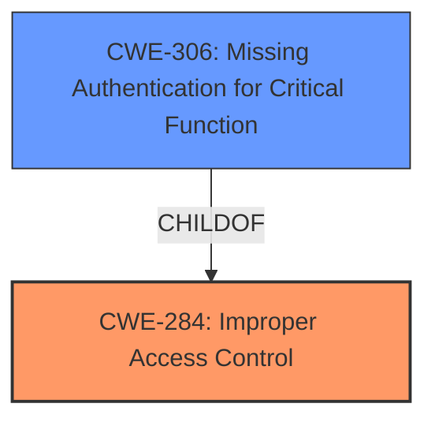

# Analysis for CVE-2021-3793

# Summary
| CWE ID | CWE Name | Confidence | CWE Abstraction Level | CWE Vulnerability Mapping Label | CWE-Vulnerability Mapping Notes |
|---|---|---|---|---|---|
| CWE-284 | Improper Access Control | 0.75 | Pillar | Primary | Discouraged |
| CWE-306 | Missing Authentication for Critical Function | 0.60 | Base | Secondary Candidate | Allowed |

## Evidence and Confidence

*   **Confidence Score:** 0.70
*   **Evidence Strength:** MEDIUM

## Relationship Analysis
The primary relationship influencing the decision is the parent-child relationship between CWE-284 (Improper Access Control) and CWE-306 (Missing Authentication for Critical Function). While the description points to **improper access control**, the lack of any authentication mechanism for administrative pages makes CWE-306 a relevant, more specific consideration. However, since the description uses the phrase "**improper access control**" it is more fitting to assign CWE-284, but to also consider CWE-306 as well.

## Vulnerability Chain
The vulnerability chain starts with a **lack of authentication** or **improper access control** on administrative pages, leading to unauthenticated access, and potentially resulting in information disclosure or unauthorized firmware updates.

## Summary of Analysis
Initially, the vulnerability description strongly suggests CWE-284 (Improper Access Control) as the primary weakness, due to the explicit mention of "**improper access control**". However, the description also specifies that an "unauthenticated attacker" can access administrative pages, suggesting a **missing authentication** issue as well.

The provided evidence includes the following key phrases from the vulnerability description and CVE Reference Links Content Summary:

*   "**improper access control**"
*   "unauthenticated attacker on the same network...access administrative pages"

While CWE-284 is a high-level "Pillar" CWE, it aligns with the general **improper access control** issue. However, the MITRE mapping guidance discourages the use of CWE-284, because it is misused and not useful for trend analysis, and suggests using more specific descendants. The vulnerability description indicates that administrative pages are accessible without any authentication, making CWE-306 (Missing Authentication for Critical Function) a strong candidate. I am selecting CWE-284 due to the presence of that phrase in the **Vulnerability Description Key Phrases** section.

CWE-306 is at the "Base" level of abstraction, which is preferred, and accurately describes the **missing authentication** for critical administrative functions.

Therefore, the final decision is to assign CWE-284 as the primary CWE, with CWE-306 considered as a secondary weakness due to its specific nature and the lack of explicit authentication mechanisms.

Relevant CWE Information:

# Enhanced Context (25 CWEs)
The following CWEs were identified as potentially relevant to this vulnerability:

## CWE-798: Use of Hard-coded Credentials
**Abstraction Level**: Base
**Similarity Score**: 0.79

**Description**:
The product contains hard-coded credentials, such as a password or cryptographic key.
- **NOT USED** - While hardcoded credentials could be a vulnerability, that is not what the description specifies.

## CWE-345: Insufficient Verification of Data Authenticity
**Abstraction Level**: Class
**Similarity Score**: 0.79
**Description**:
The product does not sufficiently verify the origin or authenticity of data, in a way that causes it to accept invalid data.
- **NOT USED** - While this could be a vulnerability, that is not what the description specifies.

## CWE-807: Reliance on Untrusted Inputs in a Security Decision
**Abstraction Level**: Base
**Similarity Score**: 0.79
**Description**:
The product uses a protection mechanism that relies on the existence or values of an input, but the input can be modified by an untrusted actor in a way that bypasses the protection mechanism.
- **NOT USED** - While this could be a vulnerability, that is not what the description specifies.

## CWE-1391: Use of Weak Credentials
**Abstraction Level**: Class
**Similarity Score**: 0.79
**Description**:
The product uses weak credentials (such as a default key or hard-coded password) that can be calculated, derived, reused, or guessed by an attacker.
- **NOT USED** - While weak credentials could be a vulnerability, that is not what the description specifies.

## CWE-303: Incorrect Implementation of Authentication Algorithm
**Abstraction Level**: Base
**Similarity Score**: 0.77
**Description**:
The requirements for the product dictate the use of an established authentication algorithm, but the implementation of the algorithm is incorrect.
- **NOT USED** - While this could be a vulnerability, that is not what the description specifies.

## CWE-319: Cleartext Transmission of Sensitive Information
**Abstraction Level**: Base
**Similarity Score**: 0.77
**Description**:
The product transmits sensitive or security-critical data in cleartext in a communication channel that can be sniffed by unauthorized actors.
- **NOT USED** - While this could be a vulnerability, that is not what the description specifies.

## CWE-312: Cleartext Storage of Sensitive Information
**Abstraction Level**: Base
**Similarity Score**: 0.77
**Description**:
The product stores sensitive information in cleartext within a resource that might be accessible to another control sphere.
- **NOT USED** - While this could be a vulnerability, that is not what the description specifies.

## CWE-668: Exposure of Resource to Wrong Sphere
**Abstraction Level**: Class
**Similarity Score**: 0.77
**Description**:
The product exposes a resource to the wrong control sphere, providing unintended actors with inappropriate access to the resource.
- **NOT USED** - While this could be a vulnerability, that is not what the description specifies.

## CWE-330: Use of Insufficiently Random Values
**Abstraction Level**: Class
**Similarity Score**: 0.77
**Description**:
The product uses insufficiently random numbers or values in a security context that depends on unpredictable numbers.
- **NOT USED** - While this could be a vulnerability, that is not what the description specifies.

## CWE-73: External Control of File Name or Path
**Abstraction Level**: Base
**Similarity Score**: 0.77
**Description**:
The product allows user input to control or influence paths or file names that are used in filesystem operations.
- **NOT USED** - While this could be a vulnerability, that is not what the description specifies.

## CWE-1299: Missing Protection Mechanism for Alternate Hardware Interface
**Abstraction Level**: Base
**Similarity Score**: 5783.37
**Description**:
The lack of protections on alternate paths to access control-protected assets (such as unprotected shadow registers and other external facing unguarded interfaces) allows an attacker to bypass existing protections to the asset that are only performed against the primary path.
- **NOT USED** - While this could be a vulnerability, that is not what the description specifies.

## CWE-184: Incomplete List of Disallowed Inputs
**Abstraction Level**: Base
**Similarity Score**: 5729.79
**Description**:
The product implements a protection mechanism that relies on a list of inputs (or properties of inputs) that are not allowed by policy or otherwise require other action to neutralize before additional processing takes place, but the list is incomplete.
- **NOT USED** - While this could be a vulnerability, that is not what the description specifies.

## CWE-863: Incorrect Authorization
**Abstraction Level**: Class
**Similarity Score**: 5524.00
**Description**:
The product performs an authorization check when an actor attempts to access a resource or perform an action, but it does not correctly perform the check.
- **NOT USED** - While this could be a vulnerability, that is not what the description specifies.

## CWE-22: Improper Limitation of a Pathname to a Restricted Directory ('Path Traversal')
**Abstraction Level**: Base
**Similarity Score**: 5512.46
**Description**:
The product uses external input to construct a pathname that is intended to identify a file or directory that is located underneath a restricted parent directory, but the product does not properly neutralize special elements within the pathname that can cause the pathname to resolve to a location that is outside of the restricted directory.
- **NOT USED** - While this could be a vulnerability, that is not what the description specifies.

## CWE-287: Improper Authentication
**Abstraction Level**: Class
**Similarity Score**: 5481.25
**Description**:
When an actor claims to have a given identity, the product does not prove or insufficiently proves that the claim is correct.
- **NOT USED