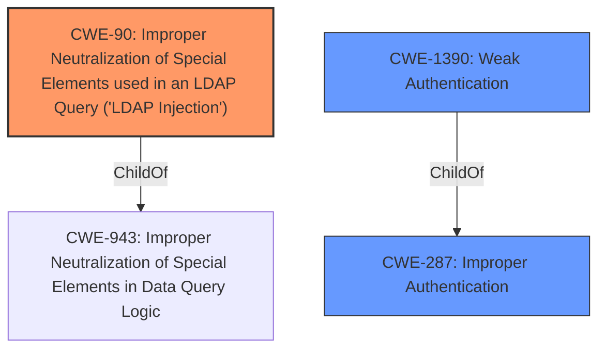

# Analysis for CVE-2021-37933

# Summary
| CWE ID | CWE Name | Confidence | CWE Abstraction Level | CWE Vulnerability Mapping Label | CWE-Vulnerability Mapping Notes |
|---|---|---|---|---|---|
| CWE-90 | Improper Neutralization of Special Elements used in an LDAP Query ('LDAP Injection') | 1 | Base | Allowed | Primary CWE |
| CWE-287 | Improper Authentication | 0.7 | Class | Discouraged | Secondary Candidate |
| CWE-1390 | Weak Authentication | 0.7 | Class | Allowed-with-Review | Secondary Candidate |

## Evidence and Confidence

*   **Confidence Score:** 0.9
*   **Evidence Strength:** HIGH

## Relationship Analysis
The primary CWE is CWE-90, which is a Base level CWE and a child of CWE-943 (Improper Neutralization of Special Elements in Data Query Logic). CWE-90 directly addresses the **LDAP injection** vulnerability described. CWE-287 and CWE-1390 represent the broader category of authentication issues that can arise from **LDAP injection**. CWE-90 CanPrecede CWE-287.

## Vulnerability Chain
The vulnerability chain starts with **insufficient server-side validation of the email parameter**, leading to **LDAP injection**, and ultimately resulting in the ability to bypass authentication.

## Summary of Analysis
The analysis is based on the provided vulnerability description and CVE reference links, which clearly indicate an **LDAP injection** vulnerability due to **insufficient validation of the email parameter**.

The evidence from the vulnerability description: "An **LDAP injection** vulnerability in /account/login in Huntflow Enterprise before 3.10.6 could allow an unauthenticated, remote user to modify the logic of an LDAP query and bypass authentication. The vulnerability is due to **insufficient server-side validation of the email parameter** before using it to construct LDAP queries. An attacker could bypass authentication exploiting this vulnerability by sending login attempts in which there is a valid password but a wildcard character in email parameter."

The evidence from the CVE Reference Links Content Summary:
*   "Root cause of vulnerability": "**Insufficient server-side validation of the email parameter** before using it to construct LDAP queries."
*   "Weaknesses/vulnerabilities present": "**LDAP injection** vulnerability."
*   "Impact of exploitation": "An unauthenticated, remote user can modify the logic of an LDAP query and bypass authentication."

CWE-90 is the most specific and appropriate CWE because it directly addresses the **LDAP injection** vulnerability. While CWE-287 and CWE-1390 are related to authentication bypass, they are higher-level classifications.

Relevant CWE Information:

# Enhanced Context (25 CWEs)
The following CWEs were identified as potentially relevant to this vulnerability:

## CWE-113: Improper Neutralization of CRLF Sequences in HTTP Headers ('HTTP Request/Response Splitting')
**Abstraction Level**: Variant
**Similarity Score**: 0.77
**Source**: dense

**Description**:
The product receives data from an HTTP agent/component (e.g., web server, proxy, browser, etc.), but it does not neutralize or incorrectly neutralizes CR and LF characters before the data is included in outgoing HTTP headers.
**Reason Not Used:** This CWE is not related to the described vulnerability.

## CWE-74: Improper Neutralization of Special Elements in Output Used by a Downstream Component ('Injection')
**Abstraction Level**: Class
**Similarity Score**: 0.76
**Source**: dense

**Description**:
The product constructs all or part of a command, data structure, or record using externally-influenced input from an upstream component, but it does not neutralize or incorrectly neutralizes special elements that could modify how it is parsed or interpreted when it is sent to a downstream component.
**Reason Not Used:** While this is a parent of CWE-90, CWE-90 is more specific.

## CWE-943: Improper Neutralization of Special Elements in Data Query Logic
**Abstraction Level**: Class
**Similarity Score**: 0.76
**Source**: dense

**Description**:
The product generates a query intended to access or manipulate data in a data store such as a database, but it does not neutralize or incorrectly neutralizes special elements that can modify the intended logic of the query.
**Reason Not Used:** While this is a parent of CWE-90, CWE-90 is more specific.

## CWE-93: Improper Neutralization of CRLF Sequences ('CRLF Injection')
**Abstraction Level**: Base
**Similarity Score**: 0.75
**Source**: dense

**Description**:
The product uses CRLF (carriage return line feeds) as a special element, e.g. to separate lines or records, but it does not neutralize or incorrectly neutralizes CRLF sequences from inputs.
**Reason Not Used:** This CWE is not related to the described vulnerability.

## CWE-90: Improper Neutralization of Special Elements used in an LDAP Query ('LDAP Injection')
**Abstraction Level**: Base
**Similarity Score**: 0.74
**Source**: dense

**Description**:
The product constructs all or part of an LDAP query using externally-influenced input from an upstream component, but it does not neutralize or incorrectly neutralizes special elements that could modify the intended LDAP query when it is sent to a downstream component.

### Mapping Guidance
**Usage:** Allowed
**Rationale:** This CWE entry is at the Base level of abstraction, which is a preferred level of abstraction for mapping to the root causes of vulnerabilities.
**Comments:** Carefully read both the name and description to ensure that this mapping is an appropriate fit. Do not try to 'force' a mapping to a lower-level Base/Variant simply to comply with this preferred level of abstraction.
**Reasons:**
- Acceptable-Use

## CWE-41: Improper Resolution of Path Equivalence
**Abstraction Level**: Base
**Similarity Score**: 0.74
**Source**: dense

**Description**:
The product is vulnerable to file system contents disclosure through path equivalence. Path equivalence involves the use of special characters in file and directory names. The associated manipulations are intended to generate multiple names for the same object.
**Reason Not Used:** This CWE is not related to the described vulnerability.

## CWE-472: External Control of Assumed-Immutable Web Parameter
**Abstraction Level**: Base
**Similarity Score**: 0.74
**Source**: dense

**Description**:
The web application does not sufficiently verify inputs that are assumed to be immutable but are actually externally controllable, such as hidden form fields.
**Reason Not Used:** This CWE is not related to the described vulnerability.

## CWE-1289: Improper Validation of Unsafe Equivalence in Input
**Abstraction Level**: Base
**Similarity Score**: 0.74
**Source**: dense

**Description**:
The product receives an input value that is used as a resource identifier or other type of reference, but it does not validate or incorrectly validates that the input is equivalent to a potentially-unsafe value.
**Reason Not Used:** This CWE is not related to the described vulnerability.

## CWE-212: Improper Removal of Sensitive Information Before Storage or Transfer
**Abstraction Level**: Base
**Similarity Score**: 0.74
**Source**: dense

**Description**:
The product stores, transfers, or shares a resource that contains sensitive information, but it does not properly remove that information before the product makes the resource available to unauthorized actors.
**Reason Not Used:** This CWE is not related to the described vulnerability.

## CWE-807: Reliance on Untrusted Inputs in a Security Decision
**Abstraction Level**: Base
**Similarity Score**: 0.74
**Source**: dense

**Description**:
The product uses a protection mechanism that relies on the existence or values of an input, but the input can be modified by an untrusted actor in a way that bypasses the protection mechanism.
**Reason Not Used:** This CWE is not directly related to the described vulnerability.

## CWE-943: Improper Neutralization of Special Elements in Data Query Logic
**Abstraction Level**: Class
**Similarity Score**: 4663.93
**Source**: sparse

**Description**:
The product generates a query intended to access or manipulate data in a data store such as a database, but it does not neutralize or incorrectly neutralizes special elements that can modify the intended logic of the query.
**Reason Not Used:** While this is a parent of CWE-90, CWE-90 is more specific