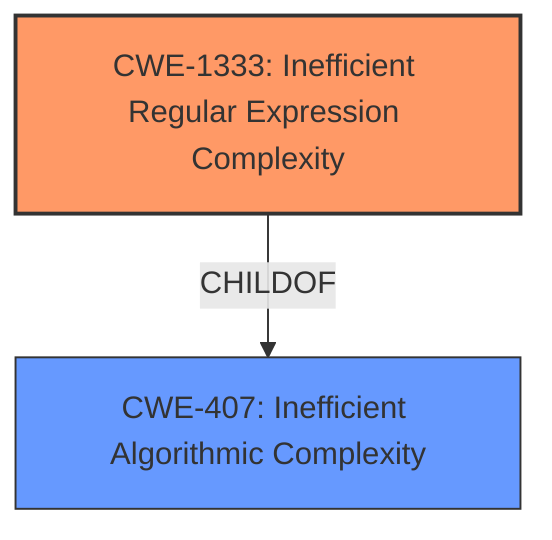

# Analysis for CVE-2021-3794

# Summary
| CWE ID  | CWE Name  | Confidence | CWE Abstraction Level | CWE Vulnerability Mapping Label | CWE-Vulnerability Mapping Notes |
|---|---|---|---|---|---|
| CWE-1333 | Inefficient Regular Expression Complexity | 1.0  | Base  | Allowed  | Primary CWE |

## Evidence and Confidence

*   **Confidence Score:** 1.0
*   **Evidence Strength:** HIGH

## Relationship Analysis
The primary relationship that influenced the decision was the ChildOf relationship between CWE-1333 and CWE-407. While CWE-407 is a broader class, CWE-1333 specifically addresses inefficiencies in regular expressions, making it a more precise fit for the vulnerability description.

## Vulnerability Chain
The vulnerability chain is relatively simple: a poorly designed regular expression (CWE-1333) leads to excessive CPU consumption, potentially causing a denial-of-service condition.

## Summary of Analysis
The assessment is heavily based on the provided evidence, particularly the "Vulnerability Description Key Phrases" which states the **rootcause** as "**inefficient regular expression complexity**". The "CVE Reference Links Content Summary" section further confirms that the vulnerability stems from a flawed regular expression in the `url` validator, which could lead to catastrophic backtracking and a denial of service.

The selection of CWE-1333 is optimal because it is a Base-level CWE that directly addresses the root cause of the vulnerability: the inefficient regular expression. The retriever results also ranked CWE-1333 as the top candidate.

Relevant CWE Information:

# Enhanced Context (25 CWEs)

## CWE-1333: Inefficient Regular Expression Complexity
**Abstraction Level**: Base
**Similarity Score**: 0.77
**Source**: dense

**Description**:
The product uses a regular expression with an inefficient, possibly exponential worst-case computational complexity that consumes excessive CPU cycles.

**Mapping Guidance**:
- Usage: Allowed
- Rationale: This CWE entry is at the Base level of abstraction, which is a preferred level of abstraction for mapping to the root causes of vulnerabilities.

## CWE-186: Overly Restrictive Regular Expression
**Abstraction Level**: Base
**Similarity Score**: 0.75
This CWE was considered but ruled out because the vulnerability isn't about a regex being overly restrictive but rather inefficient.

## CWE-407: Inefficient Algorithmic Complexity
**Abstraction Level**: Class
**Similarity Score**: 0.77
This CWE was considered but ruled out because it is too general and doesn't specifically address regular expressions.

### Detailed Analysis of CWE-1333: Inefficient Regular Expression Complexity

*   **How the vulnerability's details match the CWE's characteristics:** The vulnerability description explicitly mentions "**inefficient regular expression complexity**" as the **rootcause**. The CVE Reference Links Content Summary confirms that the `url` validator's regex was susceptible to ReDoS attacks, leading to excessive CPU consumption. This aligns perfectly with CWE-1333's description of a regular expression with inefficient computational complexity that consumes excessive CPU cycles.
*   **The security implications and potential impact:** The primary security implication is a denial-of-service (DoS) condition. An attacker can craft malicious URLs that trigger excessive backtracking in the regex engine, causing the server or application to become unresponsive.
*   **Any parent-child relationships or chain patterns that influenced your mapping:** CWE-1333 is a child of CWE-407 (Inefficient Algorithmic Complexity). While CWE-407 is relevant, CWE-1333 provides a more specific and accurate representation of the vulnerability.
*   **Whether the weakness is primary or secondary in the vulnerability:** The inefficient regular expression is the primary weakness and the direct cause of the potential denial-of-service.
*   **How the official MITRE mapping guidance influenced your decision:** The MITRE mapping guidance for CWE-1333 states that it is at the Base level of abstraction, which is preferred. The guidance also advises careful consideration of the name and description to ensure a proper fit, which is confirmed in this case.

# Enhanced Query for CVE-2021-3794

## Vulnerability Description
vuelidate is vulnerable to Inefficient Regular Expression Complexity

### Vulnerability Description Key Phrases
- **rootcause:** **inefficient regular expression complexity**
- **product:** vuelidate

## CVE Reference Links Content Summary
Based on the provided content, here's an analysis of the vulnerability:

**Root Cause:**
The vulnerability stems from a flawed regular expression used in the `url` validator of the `vuelidate` library. The original regex was susceptible to Regular Expression Denial of Service (ReDoS) attacks.

**Weaknesses/Vulnerabilities:**
- **ReDoS Vulnerability:** The original regular expression for URL validation was complex and could lead to catastrophic backtracking when processing specially crafted, malicious URLs. This could cause the server or application using the validator to become unresponsive, consuming excessive resources, leading to a denial of service.

**Impact of Exploitation:**
- **Denial of Service (DoS):** An attacker could exploit this by providing a malicious URL string to the vulnerable application which uses `vuelidate`. The application's URL validation logic would then get stuck in the regex engine, consuming CPU and memory resources. Repeated attempts of this can cause the application to become unresponsive and unavailable.

**Attack Vectors:**
- **Input Manipulation:** The attacker could craft a malicious URL string and provide it as input to the vulnerable application through any entry point that leverages the vulnerable `vuelidate` URL validator.

**Required Attacker Capabilities/Position:**
- The attacker needs the ability to provide input to an application that uses the vulnerable version of `vuelidate`. The attacker does not require any special privileges or access besides the ability to interact with the input interface.

**Additional Details from the provided content:**
- The provided content includes a commit that fixes the vulnerability by updating the regular expression used for URL validation. The commit message explicitly mentions "reduce potential ReDos attacks" and references a pull request related to the issue.
- The diff shows the change of the regular expression in `packages/validators/src/raw/url.js` file and the updated tests in the `packages/validators/src/raw/__tests__/url.spec.js` file which include a wider range of test cases.

## Retriever Results

### Top Combined Results

| Rank | CWE ID | Name | Abstraction | Usage  | Retrievers | Individual Scores |
|------|--------|------|-------------|-------|------------|-------------------|
| 1 | 1333 | Inefficient Regular Expression Complexity | Base | Allowed | sparse | 0.216 |
| 2 | 186 | Overly Restrictive Regular Expression | Base | Allowed | sparse | 0.135 |
| 3 | 407 | Inefficient Algorithmic Complexity | Class | Allowed-with-Review | sparse | 0.131 |
| 4 | 185 | Incorrect Regular Expression | Class | Allowed-with-Review | sparse | 0.103 |
| 5 | 777 | Regular Expression without Anchors | Variant | Allowed | sparse | 0.101 |
| 6 | 624 | Executable Regular Expression Error | Base | Allowed | dense | 0.434 |
| 7 | 35 | Path Traversal: '.../...//' | Variant | Allowed | graph | 0.002 |
| 8 | 637 | Unnecessary Complexity in Protection Mechanism (Not Using 'Economy of Mechanism') | Class | Allowed-with-Review | sparse | 0.094 |
| 9 | 1176 | Inefficient CPU Computation | Class | Allowed-with-Review | sparse | 0.087 |
| 10 | 626 | Null Byte Interaction Error (Poison Null Byte) | Variant | Allowed | sparse | 0.084 |

# Complete CWE Specifications

## CWE-1333: Inefficient Regular Expression Complexity
**Abstraction:** Base
**Status:** Draft

### Description
The product uses a regular expression with an inefficient, possibly exponential worst-case computational complexity that consumes excessive CPU cycles.

### Extended Description
Some regular expression engines have a feature called "backtracking". If the token cannot match, the engine "backtracks" to a position that may result in a different token that can match.
 Backtracking becomes a weakness if all of these conditions are met:

  - The number of possible backtracking attempts are exponential relative to the length of the input.

  - The input can fail to match the regular expression.

  - The input can be long enough.

 Attackers can create crafted inputs that intentionally cause the regular expression to use excessive backtracking in a way that causes the CPU consumption to spike. 

### Alternative Terms
ReDoS: ReDoS is an abbreviation of "Regular expression Denial of Service".
Regular Expression Denial of Service: While this term is attack-focused, this is commonly used to describe the weakness.
Catastrophic backtracking: This term is used to describe the behavior of the regular expression as a negative technical impact.

### Relationships
ChildOf -> CWE-407
ChildOf -> CWE-407

### Mapping Guidance
**Usage:** Allowed
**Rationale:** This CWE entry is at the Base level of abstraction, which is a preferred level of abstraction for mapping to the root causes of vulnerabilities.
**Comments:** Carefully read both the name and description to ensure that this mapping is an appropriate fit. Do not try to 'force' a mapping to a lower-level Base/Variant simply to comply with this preferred level of abstraction.
**Reasons:**
- Acceptable-Use

### Observed Examples
- **CVE-2020-5243:** server allows ReDOS with crafted User-Agent strings, due to overlapping capture groups that cause excessive backtracking.
- **CVE-2021-21317:** npm package for user-agent parser prone to ReDoS due to overlapping capture groups
- **CVE-2019-16215:** Markdown parser uses inefficient regex when processing a message, allowing users to cause CPU consumption and delay preventing processing of other messages.

## CWE-186: Overly Restrictive Regular Expression
**Abstraction:** Base
**Status:** Draft

### Description
A regular expression is overly restrictive, which prevents dangerous values from being detected.

### Extended Description
This weakness is not about regular expression complexity. Rather, it is about a regular expression that does not match all values that are intended. Consider the use of a regexp to identify acceptable values or to spot unwanted terms. An overly restrictive regexp misses some potentially security-relevant values leading to either false positives *or* false negatives, depending on how the regexp is being used within the code. Consider the expression /[0-8]/ where the intention was /[0-9]/. This expression is not "complex" but the value "9" is not matched when maybe the programmer planned to check for it.

### Alternative Terms
None

### Relationships
ChildOf -> CWE-185
CanAlsoBe -> CWE-184
CanAlsoBe -> CWE-183

### Mapping Guidance
**Usage:** Allowed
**Rationale:** This CWE entry is at the Base level of abstraction, which is a preferred level of abstraction for mapping to the root causes of vulnerabilities.
**Comments:** Carefully read both the name and description to ensure that this mapping is an appropriate fit. Do not try to 'force' a mapping to a lower-level Base/Variant simply to comply with this preferred level of abstraction.
**Reasons:**
- Acceptable-Use

### Additional Notes
**[Relationship]** Can overlap allowlist/denylist errors (CWE-183/CWE-184)

### Observed Examples
- **CVE-2005-1604:** MIE. ".php.ns" bypasses ".php$" regexp but is still parsed as PHP by Apache. (manipulates an equivalence property under Apache)

## CWE-407: Inefficient Algorithmic Complexity
**Abstraction:** Class
**Status:** Incomplete

### Description
An algorithm in a product has an inefficient worst-case computational complexity that may be detrimental to system performance and can be triggered by an attacker, typically using crafted manipulations that ensure that the worst case is being reached.

### Extended Description
Not provided

### Alternative Terms
Quadratic Complexity: Used when the algorithmic complexity is related to the square of the number of inputs (N^2)

### Relationships
ChildOf -> CWE-405

### Mapping Guidance
**Usage:** Allowed-with-Review
**Rationale:** This CWE entry is a Class and might have Base-level children that would be more appropriate
**Comments:** Examine children of this entry to see if there is a better fit
**Reasons:**
- Abstraction

### Observed Examples
- **CVE-2021-32617:** C++ library for image metadata has "quadratic complexity" issue with unnecessarily repetitive parsing each time an invalid character is encountered
- **CVE-2020-10735:** Python has "quadratic complexity" issue when converting string to int with many digits in unexpected bases
- **CVE-2020-5243:** server allows ReDOS with crafted User-Agent strings, due to overlapping capture groups that cause excessive backtracking.

## CWE-185: Incorrect Regular Expression
**Abstraction:** Class
**Status:** Draft

### Description
The product specifies a regular expression in a way that causes data to be improperly matched or compared.

### Extended Description
When the regular expression is used in protection mechanisms such as filtering or validation, this may allow an attacker to bypass the intended restrictions on the incoming data.

### Alternative Terms
None

### Relationships
ChildOf -> CWE-697
CanPrecede -> CWE-187
CanPrecede -> CWE-182

### Mapping Guidance
**Usage:** Allowed-with-Review
**Rationale:** This CWE entry is a Class and might have Base-level children that would be more appropriate
**Comments:** Examine children of this entry to see if there is a better fit
**Reasons:**
- Abstraction

### Additional Notes
**[Relationship]** While there is some overlap with allowlist/denylist problems, this entry is intended to deal with incorrectly written regular expressions, regardless of their intended use. Not every regular expression is intended for use as an allowlist or denylist. In addition, allowlists and denylists can be implemented using other mechanisms besides regular expressions.

**[Research Gap]** Regexp errors are likely a primary factor in many MFVs, especially those that require multiple manipulations to exploit. However, they are rarely diagnosed at this level of detail.

### Observed Examples
- **CVE-2002-2109:** Regexp isn't "anchored" to the beginning or end, which allows spoofed values that have trusted values as substrings.
- **CVE-2005-1949:** Regexp for IP address isn't anchored at the end, allowing appending of shell metacharacters.
- **CVE-2001-1072:** Bypass access restrictions via multiple leading slash, which causes a regular expression to fail.

## CWE-777: Regular Expression without Anchors
**Abstraction:** Variant
**Status:** Incomplete

### Description
The product uses a regular expression to perform neutralization, but the regular expression is not anchored and may allow malicious or malformed data to slip through.

### Extended Description
When performing tasks such as validating against a set of allowed inputs (allowlist), data is examined and possibly modified to ensure that it is well-formed and adheres to a list of safe values. If the regular expression is not anchored, malicious or malformed data may be included before or after any string matching the regular expression. The type of malicious data that is allowed will depend on the context of the application and which anchors are omitted from the regular expression.

### Alternative Terms
None

### Relationships
ChildOf -> CWE-625

### Mapping Guidance
**Usage:** Allowed
**Rationale:** This CWE entry is at the Variant level of abstraction, which is a preferred level of abstraction for mapping to the root causes of vulnerabilities.
**Comments:** Carefully read both the name and description to ensure that this mapping is an appropriate fit. Do not try to 'force' a mapping to a lower-level Base/Variant simply to comply with this preferred level of abstraction.
**Reasons:**
- Acceptable-Use

### Observed Examples
- **CVE-2022-30034:** Chain: Web UI for a Python RPC framework does not use regex anchors to validate user login emails (CWE-777), potentially allowing bypass of OAuth (CWE-1390).

## CWE-624: Executable Regular Expression Error
**Abstraction:** Base
**Status:** Incomplete

### Description
The product uses a regular expression that either (1) contains an executable component with user-controlled inputs, or (2) allows a user to enable execution by inserting pattern modifiers.

### Extended Description
Case (2) is possible in the PHP preg_replace() function, and possibly in other languages when a user-controlled input is inserted into a string that is later parsed as a regular expression.

### Alternative Terms
None

### Relationships
ChildOf -> CWE-77
ChildOf -> CWE-77
ChildOf -> CWE-77

### Mapping Guidance
**Usage:** Allowed
**Rationale:** This CWE entry is at the Base level of abstraction, which is a preferred level of abstraction for mapping to the root causes of vulnerabilities.
**Comments:** Carefully read both the name and description to ensure that this mapping is an appropriate fit. Do not try to 'force' a mapping to a lower-level Base/Variant simply to comply with this preferred level of abstraction.
**Reasons:**
- Acceptable-Use

### Additional Notes
**[Research Gap]** Under-studied. The existing PHP reports are limited to highly skilled researchers, but there are few examples for other languages. It is suspected that this is under-reported for all languages. Usability factors might make it more prevalent in PHP, but this theory has not been investigated.

### Observed Examples
- **CVE-2006-2059:** Executable regexp in PHP by inserting "e" modifier into first argument to preg_replace
- **CVE-2005-3420:** Executable regexp in PHP by inserting "e" modifier into first argument to preg_replace
- **CVE-2006-2878:** Complex curly syntax inserted into the replacement argument to PHP preg_replace(), which uses the "/e" modifier

## CWE-35: Path Traversal: '.../...//'
**Abstraction:** Variant
**Status:** Incomplete

### Description
The product uses external input to construct a pathname that should be within a restricted directory, but it does not properly neutralize '.../...//' (doubled triple dot slash) sequences that can resolve to a location that is outside of that directory.

### Extended Description

This allows attackers to traverse the file system to access files or directories that are outside of the restricted directory.

The '.../...//' manipulation is useful for bypassing some path traversal protection schemes. If "../" is filtered in a sequential fashion, as done by some regular expression engines, then ".../...//" can collapse into the "../" unsafe value (CWE-182). Removing the first "../" yields "....//"; the second removal yields "../". Depending on the algorithm, the product could be susceptible to CWE-34 but not CWE-35, or vice versa.

### Alternative Terms
None

### Relationships
ChildOf -> CWE-23

### Mapping Guidance
**Usage:** Allowed
**Rationale:** This CWE entry is at the Variant level of abstraction, which is a preferred level of abstraction for mapping to the root causes of vulnerabilities.
**Comments:** Carefully read both the name and description to ensure that this mapping is an appropriate fit. Do not try to 'force' a mapping to a lower-level Base/Variant simply to comply with this preferred level of abstraction.
**Reasons:**
- Acceptable-Use

### Observed Examples
- **CVE-2005-2169:** chain: ".../...//" bypasses protection mechanism using regexp's that remove "../" resulting in collapse into an unsafe value "../" (CWE-182) and resultant path traversal.
- **CVE-2005-0202:** ".../....///" bypasses regexp's that remove "./" and "../"

## CWE-637: Unnecessary Complexity in Protection Mechanism (Not Using 'Economy of Mechanism')
**Abstraction:** Class
**Status:** Draft

### Description
The product uses a more complex mechanism than necessary, which could lead to resultant weaknesses when the mechanism is not correctly understood, modeled, configured, implemented, or used.

### Extended Description
Security mechanisms should be as simple as possible. Complex security mechanisms may engender partial implementations and compatibility problems, with resulting mismatches in assumptions and implemented security. A corollary of this principle is that data specifications should be as simple as possible, because complex data specifications result in complex validation code. Complex tasks and systems may also need to be guarded by complex security checks, so simple systems should be preferred.

### Alternative Terms
Unnecessary Complexity

### Relationships
ChildOf -> CWE-657

### Mapping Guidance
**Usage:** Allowed-with-Review
**Rationale:** This CWE entry is a Class and might have Base-level children that would be more appropriate
**Comments:** Examine children of this entry to see if there is a better fit
**Reasons:**
- Abstraction

### Observed Examples
- **CVE-2007-6067:** Support for complex regular expressions leads to a resultant algorithmic complexity weakness (CWE-407).
- **CVE-2007-1552:** Either a filename extension and a Content-Type header could be used to infer the file type, but the developer only checks the Content-Type, enabling unrestricted file upload (CWE-434).
- **CVE-2007-6479:** In Apache environments, a "filename.php.gif" can be redirected to the PHP interpreter instead of being sent as an image/gif directly to the user. Not knowing this, the developer only checks the last extension of a submitted filename, enabling arbitrary code execution.

## CWE-1176: Inefficient CPU Computation
**Abstraction:** Class
**Status:** Incomplete

### Description
The product performs CPU computations using
         algorithms that are not as efficient as they could be for the
         needs of the developer, i.e., the computations can be
         optimized further.

### Extended Description

This issue can make the product perform more slowly, possibly in ways that are noticeable to the users. If an attacker can influence the amount of computation that must be performed, e.g. by triggering worst-case complexity, then this performance problem might introduce a vulnerability.

### Alternative Terms
None

### Relationships
ChildOf -> CWE-405

### Mapping Guidance
**Usage:** Allowed-with-Review
**Rationale:** This CWE entry is a Class and might have Base-level children that would be more appropriate
**Comments:** Examine children of this entry to see if there is a better fit
**Reasons:**
- Abstraction

### Observed Examples
- **CVE-2022-37734:** Chain: lexer in Java-based GraphQL server does not enforce maximum of tokens early enough (CWE-696), allowing excessive CPU consumption (CWE-1176)

## CWE-626: Null Byte Interaction Error (Poison Null Byte)
**Abstraction:** Variant
**Status:** Draft

### Description
The product does not properly handle null bytes or NUL characters when passing data between different representations or components.

### Extended Description

A null byte (NUL character) can have different meanings across representations or languages. For example, it is a string terminator in standard C libraries, but Perl and PHP strings do not treat it as a terminator. When two representations are crossed - such as when Perl or PHP invokes underlying C functionality - this can produce an interaction error with unexpected results. Similar issues have been reported for ASP. Other interpreters written in C might also be affected.

The poison null byte is frequently useful in path traversal attacks by terminating hard-coded extensions that are added to a filename. It can play a role in regular expression processing in PHP.

### Alternative Terms
None

### Relationships
ChildOf -> CWE-147
ChildOf -> CWE-436

### Mapping Guidance
**Usage:** Allowed
**Rationale:** This CWE entry is at the Variant level of abstraction, which is a preferred level of abstraction for mapping to the root causes of vulnerabilities.
**Comments:** Carefully read both the name and description to ensure that this mapping is an appropriate fit. Do not try to 'force' a mapping to a lower-level Base/Variant simply to comply with this preferred level of abstraction.
**Reasons:**
- Acceptable-Use

### Additional Notes
**[Terminology]** Current usage of "poison null byte" is typically related to this C/Perl/PHP interaction error, but the original term in 1998 was applied to an off-by-one buffer overflow involving a null byte.

**[Research Gap]** There are not many CVE examples, because the poison NULL byte is a design limitation, which typically is not included in CVE by itself. It is typically used as a facilitator manipulation to widen the scope of potential attacks against other vulnerabilities.

### Observed Examples
- **CVE-2005-4155:** NUL byte bypasses PHP regular expression check
- **CVE-2005-3153:** inserting SQL after a NUL byte bypasses allowlist regexp, enabling SQL injection

