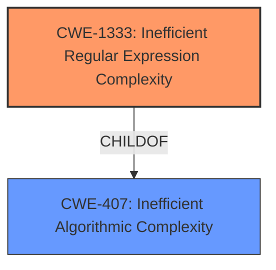

# Analysis Report for CVE-2021-3794

# Vulnerability Analysis Report: CVE-2021-3794

## Description


## Analysis (with Relationship Data)

# Summary
| CWE ID  | CWE Name  | Confidence | CWE Abstraction Level | CWE Vulnerability Mapping Label | CWE-Vulnerability Mapping Notes |
|---|---|---|---|---|---|
| CWE-1333 | Inefficient Regular Expression Complexity | 1.0  | Base  | Allowed  | Primary CWE |

## Evidence and Confidence

*   **Confidence Score:** 1.0
*   **Evidence Strength:** HIGH

## Relationship Analysis
The primary relationship that influenced the decision was the ChildOf relationship between CWE-1333 and CWE-407. While CWE-407 is a broader class, CWE-1333 specifically addresses inefficiencies in regular expressions, making it a more precise fit for the vulnerability description.



## Vulnerability Chain
The vulnerability chain is relatively simple: a poorly designed regular expression (CWE-1333) leads to excessive CPU consumption, potentially causing a denial-of-service condition.

## Summary of Analysis
The assessment is heavily based on the provided evidence, particularly the "Vulnerability Description Key Phrases" which states the **rootcause** as "**inefficient regular expression complexity**". The "CVE Reference Links Content Summary" section further confirms that the vulnerability stems from a flawed regular expression in the `url` validator, which could lead to catastrophic backtracking and a denial of service.

The selection of CWE-1333 is optimal because it is a Base-level CWE that directly addresses the root cause of the vulnerability: the inefficient regular expression. The retriever results also ranked CWE-1333 as the top candidate.

Relevant CWE Information:

# Enhanced Context (25 CWEs)

## CWE-1333: Inefficient Regular Expression Complexity
**Abstraction Level**: Base
**Similarity Score**: 0.77
**Source**: dense

**Description**:
The product uses a regular expression with an inefficient, possibly exponential worst-case computational complexity that consumes excessive CPU cycles.

**Mapping Guidance**:
- Usage: Allowed
- Rationale: This CWE entry is at the Base level of abstraction, which is a preferred level of abstraction for mapping to the root causes of vulnerabilities.

## CWE-186: Overly Restrictive Regular Expression
**Abstraction Level**: Base
**Similarity Score**: 0.75
This CWE was considered but ruled out because the vulnerability isn't about a regex being overly restrictive but rather inefficient.

## CWE-407: Inefficient Algorithmic Complexity
**Abstraction Level**: Class
**Similarity Score**: 0.77
This CWE was considered but ruled out because it is too general and doesn't specifically address regular expressions.

### Detailed Analysis of CWE-1333: Inefficient Regular Expression Complexity

*   **How the vulnerability's details match the CWE's characteristics:** The vulnerability description explicitly mentions "**inefficient regular expression complexity**" as the **rootcause**. The CVE Reference Links Content Summary confirms that the `url` validator's regex was susceptible to ReDoS attacks, leading to excessive CPU consumption. This aligns perfectly with CWE-1333's description of a regular expression with inefficient computational complexity that consumes excessive CPU cycles.
*   **The security implications and potential impact:** The primary security implication is a denial-of-service (DoS) condition. An attacker can craft malicious URLs that trigger excessive backtracking in the regex engine, causing the server or application to become unresponsive.
*   **Any parent-child relationships or chain patterns that influenced your mapping:** CWE-1333 is a child of CWE-407 (Inefficient Algorithmic Complexity). While CWE-407 is relevant, CWE-1333 provides a more specific and accurate representation of the vulnerability.
*   **Whether the weakness is primary or secondary in the vulnerability:** The inefficient regular expression is the primary weakness and the direct cause of the potential denial-of-service.
*   **How the official MITRE mapping guidance influenced your decision:** The MITRE mapping guidance for CWE-1333 states that it is at the Base level of abstraction, which is preferred. The guidance also advises careful consideration of the name and description to ensure a proper fit, which is confirmed in this case.


## CWE Relationship Analysis

Current CWEs represent these abstraction levels: .


### Vulnerability Chain Analysis

**Chain starting from CWE-186:**
- 186 (Overly Restrictive Regular Expression) - ROOT


**Chain starting from CWE-407:**
- 407 (Inefficient Algorithmic Complexity) - ROOT


### CWE Relationship Diagram

```mermaid
graph TD
    classDef primary fill:#f96,stroke:#333,stroke-width:2px
    classDef secondary fill:#69f,stroke:#333
    classDef tertiary fill:#9e9,stroke:#333
```


*Report generated on 2025-04-02 15:13:03*
