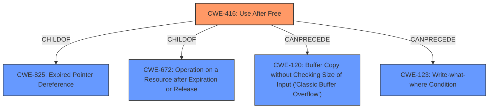

# Analysis for CVE-2021-37962

# Summary
| CWE ID | CWE Name | Confidence | CWE Abstraction Level | CWE Vulnerability Mapping Label | CWE-Vulnerability Mapping Notes |
|---|---|---|---|---|---|
| CWE-416 | Use After Free | 1.0 | Variant | Allowed | Primary CWE |

## Evidence and Confidence

*   **Confidence Score:** 1.0
*   **Evidence Strength:** HIGH

## Relationship Analysis
The primary relationship influencing my decision is that **CWE-416 (Use After Free)** is a Variant level CWE, which is the preferred level of abstraction for mapping to root causes. It is also related to other CWEs through ChildOf relationships with **CWE-825 (Expired Pointer Dereference)** and **CWE-672 (Operation on a Resource after Expiration or Release)**. There are also CanPrecede relationships to memory corruption issues such as **CWE-120 (Buffer Copy without Checking Size of Input ('Classic Buffer Overflow'))** and **CWE-123 (Write-what-where Condition)**.

## Vulnerability Chain
The vulnerability chain starts with a **use after free** condition (**CWE-416**), which then leads to potential heap corruption.

## Summary of Analysis
The vulnerability description explicitly states a **"use after free"** condition in Google Chrome. The "CVE Reference Links Content Summary" section confirms that the root cause is a **"Use-after-free vulnerability"**. The retriever results also list **CWE-416 (Use After Free)** as the top candidate.

The evidence is strong and clearly points to **CWE-416**. The description of **CWE-416** perfectly matches the vulnerability: "The product reuses or references memory after it has been freed."

Other CWEs considered but not used:

*   CWE-366, CWE-362 (Race Condition): While race conditions can sometimes lead to use-after-free vulnerabilities, there's no direct evidence of a race condition in the description.
*   CWE-122 (Heap-based Buffer Overflow): The vulnerability description mentions "heap corruption" as a potential impact, but the root cause is the **use after free**, not a buffer overflow.
*   CWE-415 (Double Free): Similar to race conditions, double frees can sometimes lead to memory corruption but the provided evidence specifies a **use after free**.
*   CWE-123 (Write-what-where Condition): This is a potential impact of a **use after free**, not the root cause.

Therefore, **CWE-416 (Use After Free)** is the most specific and accurate classification based on the available evidence.