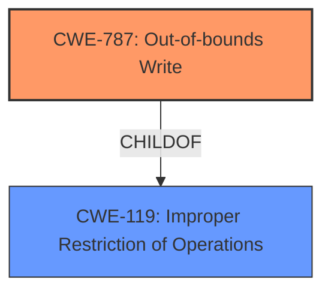

# Enhanced Analysis for CVE-2021-37969

# Summary
| CWE ID | CWE Name | Confidence | CWE Abstraction Level | CWE Vulnerability Mapping Label | CWE-Vulnerability Mapping Notes |
|---|---|---|---|---|---|
| CWE-787 | Out-of-bounds Write | 0.7 | Base | Primary | Allowed |
| CWE-119 | Improper Restriction of Operations within a Memory Buffer | 0.6 | Class | Secondary | Allowed-with-Review |

## Evidence and Confidence

*   **Confidence Score:** 0.7
*   **Evidence Strength:** MEDIUM

## Relationship Analysis
The primary CWE, CWE-787, is a base-level CWE that directly relates to writing data outside the intended buffer. It is a child of CWE-119, which represents a more general class of memory buffer errors. The choice of CWE-787 is supported by the vulnerability description mentioning an "inappropriate implementation" leading to a local privilege escalation, which often involves memory corruption due to out-of-bounds writes. Choosing the base level CWE-787 provides greater specificity.



## Vulnerability Chain
The vulnerability chain involves an **inappropriate implementation** within Google Updater, leading to an out-of-bounds write (CWE-787). The out-of-bounds write leads to memory corruption, and ultimately results in a local privilege escalation.

## Summary of Analysis
The initial analysis focused on identifying the **root cause** of the vulnerability based on the provided description and CVE reference summary. The **inappropriate implementation** in Google Updater, which allows a remote attacker to perform local privilege escalation via a crafted file, points towards a memory corruption issue.

The retriever results suggested several CWEs, including CWE-204, CWE-416, CWE-346, CWE-843, CWE-356, CWE-451, CWE-123, CWE-1021, CWE-40 and CWE-122. However, these CWEs didn't accurately reflect the root cause as much as CWE-787.

CWE-787 (Out-of-bounds Write) was selected as the primary CWE because it directly addresses the scenario where data is written outside the intended buffer, leading to memory corruption and privilege escalation. The CVE reference summary mentions the **inappropriate implementation** within the Google Updater component, which can lead to memory corruption via a crafted file.

CWE-119 (Improper Restriction of Operations within a Memory Buffer) was considered as a secondary CWE because it's a broader category encompassing various memory buffer errors, and CWE-787 is a child of CWE-119. While CWE-119 is relevant, CWE-787 provides a more specific characterization of the vulnerability.

The choice of CWE-787 is based on the evidence that the **inappropriate implementation** leads to writing data outside the intended buffer. The relationship analysis confirms that CWE-787 is a specific type of memory buffer error (child of CWE-119). The mapping guidance for CWE-787 allows its usage, as it's a base-level CWE.

Relevant CWE Information:

# Enhanced Context (25 CWEs)
The following CWEs were identified as potentially relevant to this vulnerability:

## CWE-131: Incorrect Calculation of Buffer Size
**Abstraction Level**: Base
**Similarity Score**: 0.78
**Source**: dense

**Description**:
The product does not correctly calculate the size to be used when allocating a buffer, which could lead to a buffer overflow.
- Considered but not used. Incorrect buffer size calculation could lead to an out-of-bounds write, but it's not explicitly mentioned in the vulnerability description.

## CWE-843: Access of Resource Using Incompatible Type ('Type Confusion')
**Abstraction Level**: Base
**Similarity Score**: 0.78
**Source**: dense

**Description**:
The product allocates or initializes a resource such as a pointer, object, or variable using one type, but it later accesses that resource using a type that is incompatible with the original type.
- Considered but not used. Type confusion could lead to memory corruption, but it's not explicitly mentioned in the vulnerability description.

## CWE-191: Integer Underflow (Wrap or Wraparound)
**Abstraction Level**: Base
**Similarity Score**: 0.78
**Source**: dense

**Description**:
The product subtracts one value from another, such that the result is less than the minimum allowable integer value, which produces a value that is not equal to the correct result.
- Considered but not used. Integer underflow is not explicitly mentioned in the vulnerability description.

## CWE-125: Out-of-bounds Read
**Abstraction Level**: Base
**Similarity Score**: 0.78
**Source**: dense

**Description**:
The product reads data past the end, or before the beginning, of the intended buffer.
- Considered but not used. The vulnerability description focuses on writing, not reading, out of bounds.

## CWE-404: Improper Resource Shutdown or Release
**Abstraction Level**: Class
**Similarity Score**: 0.78
**Source**: dense

**Description**:
The product does not release or incorrectly releases a resource before it is made available for re-use.
- Considered but not used. Resource release is not mentioned in the vulnerability description.

## CWE-667: Improper Locking
**Abstraction Level**: Class
**Similarity Score**: 0.78
**Source**: dense

**Description**:
The product does not properly acquire or release a lock on a resource, leading to unexpected resource state changes and behaviors.
- Considered but not used. Improper locking is not mentioned in the vulnerability description.

## CWE-681: Incorrect Conversion between Numeric Types
**Abstraction Level**: Base
**Similarity Score**: 0.78
**Source**: dense

**Description**:
When converting from one data type to another, such as long to integer, data can be omitted or translated in a way that produces unexpected values. If the resulting values are used in a sensitive context, then dangerous behaviors may occur.
- Considered but not used. Type conversion is not mentioned in the vulnerability description.

## CWE-1289: Improper Validation of Unsafe Equivalence in Input
**Abstraction Level**: Base
**Similarity Score**: 0.77
**Source**: dense

**Description**:
The product receives an input value that is used as a resource identifier or other type of reference, but it does not validate or incorrectly validates that the input is equivalent to a potentially-unsafe value.
- Considered but not used. Input validation is not explicitly mentioned in the vulnerability description.

## CWE-41: Improper Resolution of Path Equivalence
**Abstraction Level**: Base
**Similarity Score**: 0.77
**Source**: dense

**Description**:
The product is vulnerable to file system contents disclosure through path equivalence. Path equivalence involves the use of special characters in file and directory names. The associated manipulations are intended to generate multiple names for the same object.
- Considered but not used. Path equivalence is not mentioned in the vulnerability description.

## CWE-451: User Interface (UI) Misrepresentation of Critical Information
**Abstraction Level**: Class
**Similarity Score**: 0.77
**Source**: dense

**Description**:
The user interface (UI) does not properly represent critical information to the user, allowing the information - or its source - to be obscured or spoofed. This is often a component in phishing attacks.
- Considered but not used. UI misrepresentation is not relevant to the vulnerability.

## CWE-125: Out-of-bounds Read
**Abstraction Level**: Base
**Similarity Score**: 5075.53
**Source**: sparse

**Description**:
The product reads data past the end, or before the beginning, of the intended buffer.
- Considered but not used. The vulnerability description focuses on writing, not reading, out of bounds.

## CWE-190: Integer Overflow or Wraparound
**Abstraction Level**: Base
**Similarity Score**: 5026.96
**Source**: sparse

**Description**:
The product performs a calculation that can
         produce an integer overflow or wraparound when the logic
         assumes that the resulting value will always be larger than
         the original value. This occurs when an integer value is
         incremented to a value that is too large to store in the
         associated representation. When this occurs, the value may
         become a very small or negative number.
- Considered but not used. Integer overflow is not explicitly mentioned in the vulnerability description.

## CWE-367: Time-of-check Time-of-use (TOCTOU) Race Condition
**Abstraction Level**: Base
**Similarity Score**: 4921.09
**Source**: sparse

**Description**:
The product checks the state of a


## CWE Relationship Analysis

Current CWEs represent these abstraction levels: .


### Vulnerability Chain Analysis

**Chain starting from CWE-787:**
- 787 (Out-of-bounds Write) - ROOT


**Chain starting from CWE-123:**
- 123 (Write-what-where Condition) - ROOT


### CWE Relationship Diagram

```mermaid
graph TD
    classDef primary fill:#f96,stroke:#333,stroke-width:2px
    classDef secondary fill:#69f,stroke:#333
    classDef tertiary fill:#9e9,stroke:#333
```