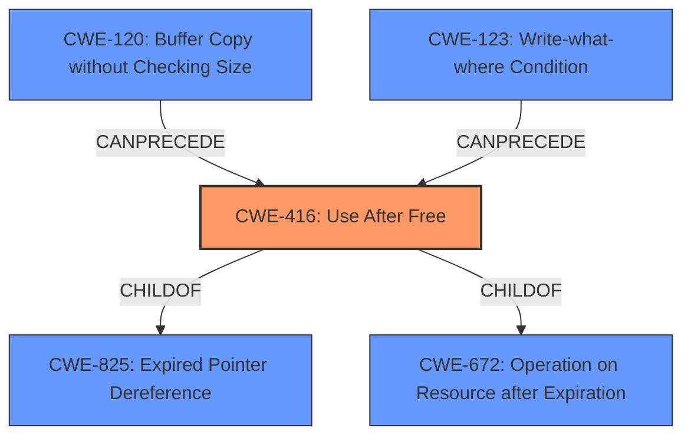

# Analysis Report for CVE-2021-37970

# Vulnerability Analysis Report: CVE-2021-37970

## Description


## Analysis (with Relationship Data)

# Summary
| CWE ID  | CWE Name                                                                                       | Confidence | CWE Abstraction Level | CWE Vulnerability Mapping Label | CWE-Vulnerability Mapping Notes |
| :-------- | :--------------------------------------------------------------------------------------------- | :---------- | :---------------------- | :------------------------------ | :------------------------------ |
| CWE-416 | Use After Free                                                                               | 1          | Variant                  | Primary CWE                     | Allowed                       |

## Evidence and Confidence

*   **Confidence Score:** 1
*   **Evidence Strength:** HIGH

## Relationship Analysis
The primary identified CWE is CWE-416, "Use After Free". This is a variant level CWE which is preferred. CWE-416 is a child of CWE-825 (Expired Pointer Dereference) and CWE-672 (Operation on Resource after Expiration). CWE-416 can be preceded by CWE-120 (Buffer Copy without Checking Size) and CWE-123 (Write-what-where Condition).



## Vulnerability Chain
The vulnerability chain starts with a **use after free** (CWE-416) in the File System API of Google Chrome. This **rootcause** allows a remote attacker to potentially exploit heap corruption and potentially execute arbitrary code via a crafted HTML page.

## Summary of Analysis
The analysis is based on the vulnerability description, the key phrases, and the CVE reference links content summary, all of which point to **use after free** as the root cause. The primary CWE match from similar CVE descriptions is CWE-416, further supporting this classification. The retriever results also list CWE-416 as the top combined result.

The vulnerability description clearly states "**use after free** in File System API... allowed a remote attacker to potentially exploit heap corruption...". The CVE Reference Links Content Summary confirms this, stating the **root_cause** and **weakness** is "**Use after free**".

CWE-416 is at the Variant level of abstraction, which is preferred. Given the strong evidence and clear alignment with the CWE description, CWE-416 is the most appropriate classification.


## CWE Relationship Analysis

Current CWEs represent these abstraction levels: .


### Vulnerability Chain Analysis

**Chain starting from CWE-123:**
- 123 (Write-what-where Condition) - ROOT


**Chain starting from CWE-416:**
- 416 (Use After Free) - ROOT


### CWE Relationship Diagram

```mermaid
graph TD
    classDef primary fill:#f96,stroke:#333,stroke-width:2px
    classDef secondary fill:#69f,stroke:#333
    classDef tertiary fill:#9e9,stroke:#333
```


*Report generated on 2025-04-02 00:54:16*
