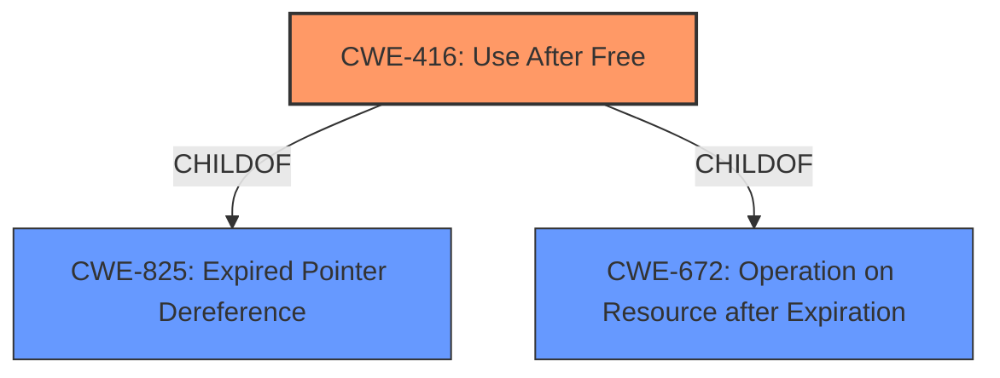

# Enhanced Analysis for CVE-2021-37974

# Summary
| CWE ID | CWE Name | Confidence | CWE Abstraction Level | CWE Vulnerability Mapping Label | CWE-Vulnerability Mapping Notes |
|---|---|---|---|---|---|
| CWE-416 | Use After Free | 1.0 | Variant | Allowed | Primary CWE |

## Evidence and Confidence

*   **Confidence Score:** 1.0
*   **Evidence Strength:** HIGH

## Relationship Analysis
The primary relationship considered was the parent-child relationship, specifically examining children of CWE-825 (Expired Pointer Dereference) and CWE-672 (Operation on Resource after Expiration). CWE-416 is a variant of both, making it a more specific fit than either of its parents. No significant chain relationships influenced the decision, as the description focuses primarily on the root cause.



## Vulnerability Chain
The vulnerability chain is relatively simple:
  1. **Root Cause:** **Use-after-free** (CWE-416)
  2. **Impact:** Heap corruption

## Summary of Analysis
The primary CWE is CWE-416 (Use After Free). This is based on the vulnerability description, which explicitly states "**use after free**" as the root cause. The CVE Reference Links Content Summary also confirms this, stating the "**root_cause**" as "Use after free in Safe Browsing component of Chromium" and listing "**Use-after-free**" as one of the "**weaknesses**".

The retriever results also ranked CWE-416 as the top candidate. The mapping guidance for CWE-416 states that it is at the Variant level of abstraction, which is a preferred level of abstraction for mapping to the root causes of vulnerabilities and that its usage is Allowed.

Other CWEs were considered, but ultimately deemed less suitable. CWE-787 (Out-of-bounds Write) was a top CWE for similar CVE descriptions, but the description explicitly identifies a **use-after-free**, which is a memory management error, rather than an out-of-bounds write, which is a buffer overflow. CWE-362 (Concurrent Execution using Shared Resource with Improper Synchronization ('Race Condition')) was also considered, but there's no evidence of concurrency issues in the provided description.

The selection of CWE-416 is at the optimal level of specificity because it directly reflects the **root cause** of the vulnerability as described in the vulnerability description and the CVE Reference Links Content Summary.


## CWE Relationship Analysis

Current CWEs represent these abstraction levels: .


### Vulnerability Chain Analysis

**Chain starting from CWE-787:**
- 787 (Out-of-bounds Write) - ROOT


**Chain starting from CWE-416:**
- 416 (Use After Free) - ROOT


### CWE Relationship Diagram

```mermaid
graph TD
    classDef primary fill:#f96,stroke:#333,stroke-width:2px
    classDef secondary fill:#69f,stroke:#333
    classDef tertiary fill:#9e9,stroke:#333
```