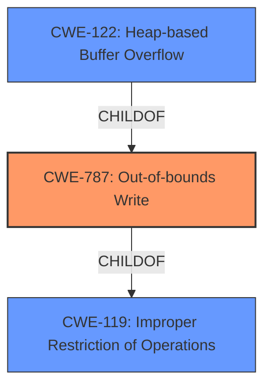

# Analysis for CVE-2021-37978

# Summary
| CWE ID | CWE Name | Confidence | CWE Abstraction Level | CWE Vulnerability Mapping Label | CWE-Vulnerability Mapping Notes |
|---|---|---|---|---|---|
| CWE-787 | Out-of-bounds Write | 1.0 | Base | Primary | Allowed |
| CWE-122 | Heap-based Buffer Overflow | 0.7 | Variant | Secondary | Allowed |
| CWE-119 | Improper Restriction of Operations within the Bounds of a Memory Buffer | 0.5 | Class | Secondary | Discouraged |

## Evidence and Confidence

*   **Confidence Score:** 0.9
*   **Evidence Strength:** HIGH

## Relationship Analysis
The primary CWE is CWE-787 (**Out-of-bounds Write**), which is a base CWE. CWE-122 (**Heap-based Buffer Overflow**) is a variant of CWE-787 and a more specific case when the buffer is allocated on the heap. CWE-119 (**Improper Restriction of Operations within the Bounds of a Memory Buffer**) is a class CWE that is a parent of CWE-787. The relationship shows the progression from a general memory buffer issue (CWE-119) to a specific out-of-bounds write (CWE-787) and then its specific location on the heap (CWE-122).

## Vulnerability Chain
The vulnerability chain starts with a **heap buffer overflow** (**WEAKNESS**) in the Blink component, which leads to heap corruption (**IMPACT**). The vulnerability is triggered by a crafted HTML page (**VECTOR**).

## Summary of Analysis
The initial analysis strongly suggests CWE-787 (**Out-of-bounds Write**) as the primary weakness, based on the description "**Heap buffer overflow**" and the associated heap corruption. The primary CWE match from similar CVE descriptions is also CWE-787. The CVE Reference Links Content Summary confirms a **heap buffer overflow** exists in the Blink component. This confirms the assessment based on the evidence.

The graph relationships influenced the selection by providing a hierarchy. While CWE-119 (**Improper Restriction of Operations within the Bounds of a Memory Buffer**) is a parent, CWE-787 (**Out-of-bounds Write**) is more specific and therefore preferred. CWE-122 (**Heap-based Buffer Overflow**) is even more specific, but the description doesn't explicitly say the overflow occurred during a copy operation, so it's a secondary consideration.

CWE-787 (**Out-of-bounds Write**) is selected as the primary CWE due to its direct match with the vulnerability description and supporting evidence. It's at the optimal level of specificity, representing the **ROOT CAUSE** of the vulnerability, which is an out-of-bounds write.

Relevant CWE Information:

# Enhanced Context (25 CWEs)

## CWE-415: Double Free
**Abstraction Level**: Variant
**Similarity Score**: 0.76

This CWE was considered but not selected because the vulnerability description doesn't mention anything about freeing the same memory twice. It describes a buffer overflow, not a double free.

## CWE-226: Sensitive Information in Resource Not Removed Before Reuse
**Abstraction Level**: Base
**Similarity Score**: 0.76

This CWE was considered but not selected because the vulnerability description doesn't mention anything about sensitive information being left in a resource before reuse. It describes a buffer overflow.

## CWE-366: Race Condition within a Thread
**Abstraction Level**: Base
**Similarity Score**: 0.76

This CWE was considered but not selected because the vulnerability description doesn't mention anything about race conditions or multiple threads. It describes a buffer overflow.

## CWE-131: Incorrect Calculation of Buffer Size
**Abstraction Level**: Base
**Similarity Score**: 0.75

This CWE was considered but not selected because the description doesn't explicitly state the buffer size calculation was incorrect. While a buffer overflow implies an incorrect size somehow, CWE-787 is more direct.

## CWE-404: Improper Resource Shutdown or Release
**Abstraction Level**: Class
**Similarity Score**: 0.75

This CWE was considered but not selected because the vulnerability description doesn't mention anything about improper resource shutdown or release. It describes a buffer overflow.

## CWE-124: Buffer Underwrite ('Buffer Underflow')
**Abstraction Level**: Base
**Similarity Score**: 0.75

This CWE was considered but not selected because the vulnerability description states "**Heap buffer overflow**", indicating an overwrite, not an underwrite.

## CWE-667: Improper Locking
**Abstraction Level**: Class
**Similarity Score**: 0.74

This CWE was considered but not selected because the vulnerability description doesn't mention anything about improper locking. It describes a buffer overflow.

## CWE-191: Integer Underflow (Wrap or Wraparound)
**Abstraction Level**: Base
**Similarity Score**: 0.74

This CWE was considered but not selected because the vulnerability description doesn't mention anything about integer underflow. It describes a buffer overflow.

## CWE-193: Off-by-one Error
**Abstraction Level**: Base
**Similarity Score**: 0.74

This CWE was considered but not selected because the vulnerability description doesn't explicitly mention an off-by-one error. While possible, the more direct description is a **heap buffer overflow**, which maps better to CWE-787.

## CWE-126: Buffer Over-read
**Abstraction Level**: Variant
**Similarity Score**: 0.74

This CWE was considered but not selected because the vulnerability description states "**Heap buffer overflow**", indicating an overwrite, not an over-read.

## CWE-190: Integer Overflow or Wraparound
**Abstraction Level**: Base
**Similarity Score**: 6988.51

This CWE was considered but not selected because the vulnerability description doesn't mention anything about integer overflow. It describes a buffer overflow.

## CWE-125: Out-of-bounds Read
**Abstraction Level**: Base
**Similarity Score**: 6611.90

This CWE was considered but not selected because the vulnerability description states "**Heap buffer overflow**", indicating an overwrite, not an over-read.

## CWE-193: Off-by-one Error
**Abstraction Level**: Base
**Similarity Score**: 6526.70

This CWE was considered but not selected because the vulnerability description doesn't explicitly mention an off-by-one error.

## CWE-119: Improper Restriction of Operations within the Bounds of a Memory Buffer
**Abstraction Level**: Class
**Similarity Score**: 6401.65

This CWE was considered but not selected as the primary CWE because it's a higher-level class. CWE-787 (**Out-of-bounds Write**) is a more specific Base CWE. It is considered as a secondary candidate since heap overflows violate memory buffer boundaries.

## CWE-197: Numeric Truncation Error
**Abstraction Level**: Base
**Similarity Score**: 6232.02

This CWE was considered but not selected because the vulnerability description doesn't mention anything about numeric truncation. It describes a buffer overflow.

## CWE-123: Write-what-where Condition
**Abstraction Level**: base
**Similarity Score**: 5.03

This CWE was considered but not selected because the vulnerability description doesn't provide enough information to determine if a write-what-where condition exists.

## CWE-170: Improper Null Termination
**Abstraction Level**: base
**Similarity Score**: 5.03

This CWE was considered but not selected because the vulnerability description doesn't mention anything about improper null termination.

## CWE-120: Buffer Copy without Checking Size of Input ('Classic Buffer Overflow')
**Abstraction Level**: base
**Similarity Score**: 4.82

This CWE was considered but not selected because the vulnerability description doesn't explicitly state the **heap buffer overflow** occurred during a buffer copy without checking size.

## CWE-195: Signed to Unsigned Conversion Error
**Abstraction Level**: variant
**Similarity Score**: 4.53

This CWE was considered but not selected because the vulnerability description doesn't mention anything about signed to unsigned conversion errors.

## CWE-787: Out-of-bounds Write
**Abstraction Level**: base
**Similarity Score**: 4.33

This is the selected Primary CWE.

## CWE-825: Expired Pointer Dereference
**Abstraction Level**: