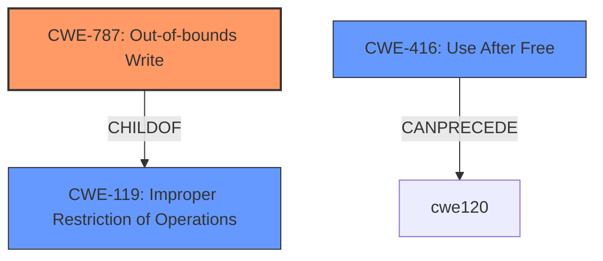

# Analysis for CVE-2021-37979

# Summary
| CWE ID  | CWE Name                                                                          | Confidence | CWE Abstraction Level | CWE Vulnerability Mapping Label | CWE-Vulnerability Mapping Notes |
| :------- | :--------------------------------------------------------------------------------- | :--------- | :---------------------- | :------------------------------ | :-------------------------------- |
| CWE-787 | Out-of-bounds Write                                                              | 1.0        | Base                    | Allowed                         | Primary CWE                       |
| CWE-416 | Use After Free                                                                  | 0.7        | Variant                 | Allowed                         | Secondary Candidate             |

## Evidence and Confidence

*   **Confidence Score:** 0.85
*   **Evidence Strength:** HIGH

## Relationship Analysis
The primary weakness is CWE-787 (Out-of-bounds Write), which is a base CWE. CWE-119 (Improper Restriction of Operations within the Bounds of a Memory Buffer) is a class CWE and parent of CWE-787 and represents a more general case of memory corruption. CWE-416 (Use After Free) is a variant CWE that is related to memory management issues and could be present alongside CWE-787. The vulnerability description and CVE details provide sufficient evidence to choose CWE-787 as the primary root cause and CWE-416 as a possible secondary cause.

## Vulnerability Chain
The vulnerability chain begins with **improper handling of ReadableStream and WritableStream objects** in WebRTC. This leads to a **heap buffer overflow** (CWE-787) due to confusion between the Caller and Callee. The heap buffer overflow can then result in heap corruption and potentially remote code execution. A **use-after-free** (CWE-416) condition is also mentioned as a possible weakness.
  - **Root Cause:** Improper handling of ReadableStream and WritableStream objects.
  - **Weakness 1:** **Heap-based buffer overflow** (CWE-787)
  - **Weakness 2:** **Use-after-free** (CWE-416)
  - **Impact:** Heap corruption, potential remote code execution.

## Summary of Analysis
The initial analysis considered CWE-787 (Out-of-bounds Write) and CWE-416 (Use After Free) as the primary candidates based on the vulnerability description and CVE details. The CVE reference summary explicitly mentions "**heap buffer overflow**" and "**Use-after-free**" as weaknesses. The description also states that the vulnerability can cause "**heap corruption**".

The relationship analysis shows that CWE-787 is a child of CWE-119 (Improper Restriction of Operations within the Bounds of a Memory Buffer), which is a more general class of memory corruption vulnerabilities. However, CWE-787 is more specific and accurately reflects the **heap buffer overflow** condition described in the vulnerability. CWE-416 is a variant that can be related to heap overflows, but the description focuses more on the overflow itself.

The final decision is to classify this vulnerability as CWE-787 (Out-of-bounds Write) as the primary cause, since the root cause leads directly to this condition, and CWE-416 (Use After Free) as a secondary candidate, as it is mentioned in the CVE details and often related to heap overflows. This classification is based on the evidence from the vulnerability description and CVE details, the relationship analysis, and the mapping guidance that recommends using the most specific CWE available.

Relevant CWE Information:

# Enhanced Context (25 CWEs)
The following CWEs were identified as potentially relevant to this vulnerability:

## CWE-805: Buffer Access with Incorrect Length Value
**Abstraction Level**: Base
**Similarity Score**: 0.78
**Source**: dense

**Description**:
The product uses a sequential operation to read or write a buffer, but it uses an incorrect length value that causes it to access memory that is outside of the bounds of the buffer.

**Mapping Guidance**:
- Usage: Allowed
- Rationale: This CWE entry is at the Base level of abstraction, which is a preferred level of abstraction for mapping to the root causes of vulnerabilities.

## CWE-191: Integer Underflow (Wrap or Wraparound)
**Abstraction Level**: Base
**Similarity Score**: 0.78
**Source**: dense

**Description**:
The product subtracts one value from another, such that the result is less than the minimum allowable integer value, which produces a value that is not equal to the correct result.

**Mapping Guidance**:
- Usage: Allowed
- Rationale: This CWE entry is at the Base level of abstraction, which is a preferred level of abstraction for mapping to the root causes of vulnerabilities.

## CWE-131: Incorrect Calculation of Buffer Size
**Abstraction Level**: Base
**Similarity Score**: 0.77
**Source**: dense

**Description**:
The product does not correctly calculate the size to be used when allocating a buffer, which could lead to a buffer overflow.

**Mapping Guidance**:
- Usage: Allowed
- Rationale: This CWE entry is at the Base level of abstraction, which is a preferred level of abstraction for mapping to the root causes of vulnerabilities.

## CWE-126: Buffer Over-read
**Abstraction Level**: Variant
**Similarity Score**: 0.77
**Source**: dense

**Description**:
The product reads from a buffer using buffer access mechanisms such as indexes or pointers that reference memory locations after the targeted buffer.

**Mapping Guidance**:
- Usage: Allowed
- Rationale: This CWE entry is at the Variant level of abstraction, which is a preferred level of abstraction for mapping to the root causes of vulnerabilities.

## CWE-124: Buffer Underwrite ('Buffer Underflow')
**Abstraction Level**: Base
**Similarity Score**: 0.77
**Source**: dense

**Description**:
The product writes to a buffer using an index or pointer that references a memory location prior to the beginning of the buffer.

**Mapping Guidance**:
- Usage: Allowed
- Rationale: This CWE entry is at the Base level of abstraction, which is a preferred level of abstraction for mapping to the root causes of vulnerabilities.

## CWE-125: Out-of-bounds Read
**Abstraction Level**: Base
**Similarity Score**: 0.76
**Source**: dense

**Description**:
The product reads data past the end, or before the beginning, of the intended buffer.

**Mapping Guidance**:
- Usage: Allowed
- Rationale: This CWE entry is at the Base level of abstraction, which is a preferred level of abstraction for mapping to the root causes of vulnerabilities.

## CWE-127: Buffer Under-read
**Abstraction Level**: Variant
**Similarity Score**: 0.76
**Source**: dense

**Description**:
The product reads from a buffer using buffer access mechanisms such as indexes or pointers that reference memory locations prior to the targeted buffer.

**Mapping Guidance**:
- Usage: Allowed
- Rationale: This CWE entry is at the Variant level of abstraction, which is a preferred level of abstraction for mapping to the root causes of vulnerabilities.

## CWE-823: Use of Out-of-range Pointer Offset
**Abstraction Level**: Base
**Similarity Score**: 0.76
**Source**: dense

**Description**:
The product performs pointer arithmetic on a valid pointer, but it uses an offset that can point outside of the intended range of valid memory locations for the resulting pointer.

**Mapping Guidance**:
- Usage: Allowed
- Rationale: This CWE entry is at the Base level of abstraction, which is a preferred level of abstraction for mapping to the root causes of vulnerabilities.

## CWE-197: Numeric Truncation Error
**Abstraction Level**: Base
**Similarity Score**: 0.76
**Source**: dense

**Description**:
Truncation errors occur when a primitive is cast to a primitive of a smaller size and data is lost in the conversion.

**Mapping Guidance**:
- Usage: Allowed
- Rationale: This CWE entry is at the Base level of abstraction, which is a preferred level of abstraction for mapping to the root causes of vulnerabilities.

## CWE-366: Race Condition within a Thread
**Abstraction Level**: Base
**Similarity Score**: 0.76
**Source**: dense

**Description**:
If two threads of execution use a resource simultaneously, there exists the possibility that resources may be used while invalid, in turn making the state of execution undefined.

**Mapping Guidance**:
- Usage: Allowed
- Rationale: This CWE entry is at the Base level of abstraction, which is a preferred level of abstraction for mapping to the root causes of vulnerabilities.

## CWE-190