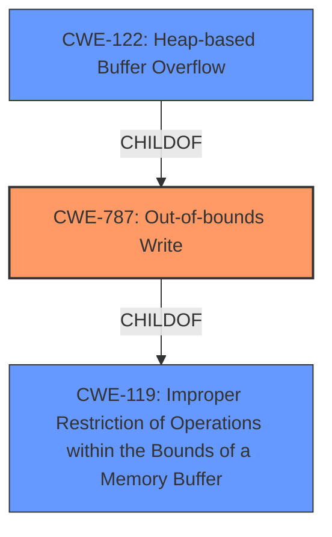

# Analysis Report for CVE-2021-37981

# Vulnerability Analysis Report: CVE-2021-37981

## Description


## Analysis (with Relationship Data)

# Summary
| CWE ID  | CWE Name                                                                        | Confidence | CWE Abstraction Level | CWE Vulnerability Mapping Label | CWE-Vulnerability Mapping Notes |
| :-------- | :------------------------------------------------------------------------------ | :---------- | :---------------------- | :------------------------------ | :-------------------------------- |
| CWE-787 | Out-of-bounds Write                                                             | 1          | Base                    | Primary CWE                     | Allowed                           |
| CWE-122 | Heap-based Buffer Overflow                                                        | 0.8        | Variant                  | Secondary Candidate           | Allowed                           |
| CWE-119 | Improper Restriction of Operations within the Bounds of a Memory Buffer | 0.6        | Class                    | Secondary Candidate           | Discouraged                           |

## Evidence and Confidence

*   **Confidence Score:** 0.9
*   **Evidence Strength:** HIGH

## Relationship Analysis
The primary relationship influencing the CWE selection is the child-parent relationship. CWE-787 (Out-of-bounds Write) and CWE-122 (Heap-based Buffer Overflow) are both children of CWE-119 (Improper Restriction of Operations within the Bounds of a Memory Buffer). The analysis focuses on selecting the most specific CWE possible. The vulnerability is a heap buffer overflow, which means it's an out-of-bounds write on the heap. This makes CWE-787 the most accurate base-level CWE. CWE-122 (Heap-based Buffer Overflow) is also a strong contender but it's less direct in specifying the **root cause** as an out-of-bounds write.



## Vulnerability Chain
The chain of events is as follows:
1.  **ROOT CAUSE**: **Heap buffer overflow** (CWE-787) occurs in Skia.
2.  IMPACT: A remote attacker can perform a sandbox escape.

## Summary of Analysis
The initial assessment strongly points to CWE-787 as the primary weakness, given the explicit mention of "**Heap buffer overflow**" in the vulnerability description and CVE reference summary. The vulnerability description key phrases also highlight "**Heap buffer overflow**" as the weakness. The CVE reference summary confirms "**Heap buffer overflow**" as the root cause.

While CWE-119 is a broader category encompassing out-of-bounds reads and writes, the specific nature of the vulnerability being a heap buffer overflow makes CWE-787 a more precise and appropriate classification.

CWE-122 (Heap-based Buffer Overflow) is also considered, as it directly relates to the heap. However, CWE-787 focuses on the **root cause** which is the out-of-bounds write.

The choice of CWE-787 is based on the provided evidence, its base-level abstraction, and the MITRE mapping guidance that encourages selecting the most specific CWE.

Relevant CWE Information:

# Enhanced Context (25 CWEs)

## CWE-1289: Improper Validation of Unsafe Equivalence in Input
**Abstraction Level**: Base
**Similarity Score**: 0.77
**Source**: dense

**Description**:
The product receives an input value that is used as a resource identifier or other type of reference, but it does not validate or incorrectly validates that the input is equivalent to a potentially-unsafe value.

**Mapping Guidance**:
- Usage: Allowed
- Rationale: This CWE entry is at the Base level of abstraction, which is a preferred level of abstraction for mapping to the root causes of vulnerabilities.

This CWE is not relevant because the vulnerability is not about input validation.

## CWE-843: Access of Resource Using Incompatible Type ('Type Confusion')
**Abstraction Level**: Base
**Similarity Score**: 0.76
**Source**: dense

**Description**:
The product allocates or initializes a resource such as a pointer, object, or variable using one type, but it later accesses that resource using a type that is incompatible with the original type.

**Mapping Guidance**:
- Usage: Allowed
- Rationale: This CWE entry is at the Base level of abstraction, which is a preferred level of abstraction for mapping to the root causes of vulnerabilities.

This CWE is not relevant because the vulnerability is not about type confusion.

## CWE-125: Out-of-bounds Read
**Abstraction Level**: Base
**Similarity Score**: 0.76
**Source**: dense

**Description**:
The product reads data past the end, or before the beginning, of the intended buffer.

**Mapping Guidance**:
- Usage: Allowed
- Rationale: This CWE entry is at the Base level of abstraction, which is a preferred level of abstraction for mapping to the root causes of vulnerabilities.

This CWE is not relevant because the vulnerability is about an out-of-bounds write, not a read.

## CWE-193: Off-by-one Error
**Abstraction Level**: Base
**Similarity Score**: 0.76
**Source**: dense

**Description**:
A product calculates or uses an incorrect maximum or minimum value that is 1 more, or 1 less, than the correct value.

**Mapping Guidance**:
- Usage: Allowed
- Rationale: This CWE entry is at the Base level of abstraction, which is a preferred level of abstraction for mapping to the root causes of vulnerabilities.

This CWE is not relevant because the vulnerability is not specifically related to an off-by-one error, but rather a more general buffer overflow.

## CWE-404: Improper Resource Shutdown or Release
**Abstraction Level**: Class
**Similarity Score**: 0.76
**Source**: dense

**Description**:
The product does not release or incorrectly releases a resource before it is made available for re-use.

**Mapping Guidance**:
- Usage: Allowed-with-Review
- Rationale: This CWE entry is a Class and might have Base-level children that would be more appropriate

This CWE is not relevant because the vulnerability is not about resource management.

## CWE-131: Incorrect Calculation of Buffer Size
**Abstraction Level**: Base
**Similarity Score**: 0.76
**Source**: dense

**Description**:
The product does not correctly calculate the size to be used when allocating a buffer, which could lead to a buffer overflow.

**Mapping Guidance**:
- Usage: Allowed
- Rationale: This CWE entry is at the Base level of abstraction, which is a preferred level of abstraction for mapping to the root causes of vulnerabilities.

While this could be a contributing factor, the description focuses on the overflow itself.

## CWE-226: Sensitive Information in Resource Not Removed Before Reuse
**Abstraction Level**: Base
**Similarity Score**: 0.75
**Source**: dense

**Description**:
The product releases a resource such as memory or a file so that it can be made available for reuse, but it does not clear or "zeroize" the information contained in the resource before the product performs a critical state transition or makes the resource available for reuse by other entities.

**Mapping Guidance**:
- Usage: Allowed
- Rationale: This CWE entry is at the Base level of abstraction, which is a preferred level of abstraction for mapping to the root causes of vulnerabilities.

This CWE is not relevant because the vulnerability is not about sensitive information.

## CWE-191: Integer Underflow (Wrap or Wraparound)
**Abstraction Level**: Base
**Similarity Score**: 0.75
**Source**: dense

**Description**:
The product subtracts one value from another, such that the result is less than the minimum allowable integer value, which produces a value that is not equal to the correct result.

**Mapping Guidance**:
- Usage: Allowed
- Rationale: This CWE entry is at the Base level of abstraction, which is a preferred level of abstraction for mapping to the root causes of vulnerabilities.

This CWE is not relevant because the vulnerability is not about integer underflow.

## CWE-667: Improper Locking
**Abstraction Level**: Class
**Similarity Score**: 0.75
**Source**: dense

**Description**:
The product does not properly acquire or release a lock on a resource, leading to unexpected resource state changes and behaviors.

**Mapping Guidance**:
- Usage: Allowed-with-Review
- Rationale: This CWE entry is a Class and might have Base-level children that would be more appropriate

This CWE is not relevant because the vulnerability is not about improper locking.

## CWE-197: Numeric Truncation Error
**Abstraction Level**: Base
**Similarity Score**: 0.75
**Source**: dense

**Description**:
Truncation errors occur when a primitive is cast to a primitive of a smaller


## CWE Relationship Analysis

Current CWEs represent these abstraction levels: .


### Vulnerability Chain Analysis

**Chain starting from CWE-667:**
- 667 (Improper Locking) - ROOT


**Chain starting from CWE-787:**
- 787 (Out-of-bounds Write) - ROOT


### CWE Relationship Diagram

```mermaid
graph TD
    classDef primary fill:#f96,stroke:#333,stroke-width:2px
    classDef secondary fill:#69f,stroke:#333
    classDef tertiary fill:#9e9,stroke:#333
```


*Report generated on 2025-04-02 12:27:22*
