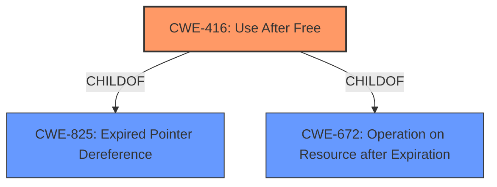

# Analysis for CVE-2021-37983

# Summary
| CWE ID | CWE Name | Confidence | CWE Abstraction Level | CWE Vulnerability Mapping Label | CWE-Vulnerability Mapping Notes |
|---|---|---|---|---|---|
| CWE-416 | Use After Free | 1.0 | Variant | Allowed | Primary CWE |

## Evidence and Confidence

*   **Confidence Score:** 1.0
*   **Evidence Strength:** HIGH

## Relationship Analysis
The analysis is focused on identifying the root cause of the vulnerability. CWE-416, Use After Free, is a variant-level CWE, providing a specific description of the vulnerability. It is a child of CWE-825 (Expired Pointer Dereference) and CWE-672 (Operation on Resource after Expiration). The graph helps to visualize the relationships and confirm the selection of the most specific CWE.

## Vulnerability Chain
The vulnerability chain consists of a **use after free** (**ROOT CAUSE**), leading to potential heap corruption (IMPACT).

## Summary of Analysis
The primary CWE is CWE-416, Use After Free.

The vulnerability description states "**Use after free** in Dev Tools in Google Chrome prior to 95.0.4638.54 allowed a remote attacker to potentially exploit heap corruption via a crafted HTML page." The key phrase section has "**rootcause:** **use after free**". The CVE Reference Links Content Summary also states the "**root_cause**: Use after free" and "**weaknesses**: [ "Use after free" ]".

The retriever results list CWE-416 as the top match. The CWE specifications for CWE-416 define it as: "The product reuses or references memory after it has been freed." This aligns directly with the vulnerability description, making it the most appropriate choice.

The CWE-416 is at the Variant level of abstraction, which is the preferred level. The Mapping Guidance Usage is Allowed and the Rationale states: "This CWE entry is at the Variant level of abstraction, which is a preferred level of abstraction for mapping to the root causes of vulnerabilities."

Other CWEs were considered but deemed less appropriate:
- CWE-787 (Out-of-bounds Write): While heap corruption is mentioned, the root cause is the use after free, not directly an out-of-bounds write.
- CWE-362 (Concurrent Execution using Shared Resource with Improper Synchronization ('Race Condition')): There is no mention of concurrency or race conditions in the vulnerability description.
- CWE-415 (Double Free): While related to memory management, the specific issue is use after free, not double freeing the same memory.

Based on the evidence and the CWE specifications, CWE-416 is the most accurate and specific CWE for this vulnerability.