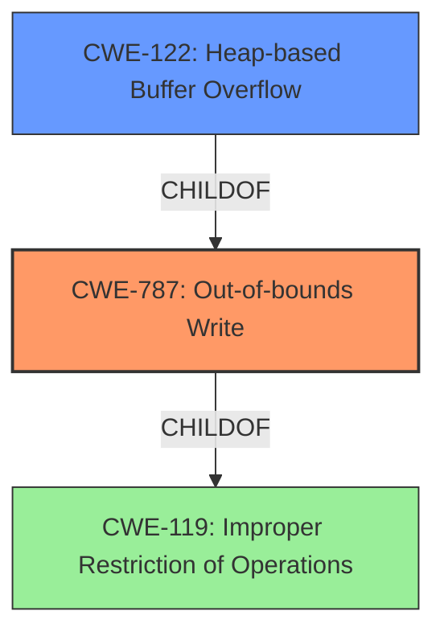

# Enhanced Analysis for CVE-2021-37984

# Summary
| CWE ID  | CWE Name  | Confidence | CWE Abstraction Level | CWE Vulnerability Mapping Label | CWE-Vulnerability Mapping Notes |
|--------------|----------------------------------------------------------------------|--------------------|---------------------------|------------------------------------|----------------------------------------------------------------------------------------------|
| **CWE-787** | Out-of-bounds Write | 1  | Base | Primary CWE | Allowed |
| CWE-122 | Heap-based Buffer Overflow | 0.75 | Variant | Secondary Candidate | Allowed |
| CWE-119 | Improper Restriction of Operations within the Bounds of a Memory Buffer | 0.5 | Class | Secondary Candidate | Discouraged |

## Evidence and Confidence

*   **Confidence Score:** 0.85
*   **Evidence Strength:** HIGH

## Relationship Analysis
The primary CWE is CWE-787 (Out-of-bounds Write), which is a base-level CWE. CWE-122 (Heap-based Buffer Overflow) is a variant of CWE-787, providing more specific context by indicating that the overflow occurs in the heap. CWE-119 (Improper Restriction of Operations within the Bounds of a Memory Buffer) is a class-level CWE and a parent of both CWE-787 and CWE-122. Choosing CWE-787 provides a balance between specificity and accuracy based on the provided evidence.



## Vulnerability Chain
The vulnerability chain starts with a crafted HTML page, leading to a **heap buffer overflow** in PDFium, which then allows a remote attacker to potentially exploit heap corruption. The root cause is the **heap buffer overflow** (CWE-787).

## Summary of Analysis
The initial assessment identified CWE-787 as the primary candidate based on the vulnerability description indicating a "**heap buffer overflow**". The **CWE for similar CVE Descriptions** also listed CWE-787 as the primary match. The "CVE Reference Links Content Summary" confirms the root cause as "**Heap buffer overflow**".

The Retriever Results suggested considering CWE-119 and CWE-190. However, CWE-119 is discouraged as a general classification, and CWE-190 (Integer Overflow or Wraparound) is not directly supported by the vulnerability description. CWE-122 (Heap-based Buffer Overflow) is a more specific variant of CWE-787, which aligns well with the "heap" context provided, but the evidence doesn't explicitly state a buffer *copy* without checking size, so sticking with the base CWE-787 is more accurate.

The final selection of CWE-787 is based on the direct evidence of a **heap buffer overflow**, its prevalence in similar CVEs, and its base-level abstraction, offering the best balance between specificity and accuracy.

Relevant CWE Information:

# Enhanced Context (25 CWEs)

## CWE-415: Double Free
**Abstraction Level**: Variant
**Similarity Score**: 0.76
**Source**: dense

**Description**:
The product calls free() twice on the same memory address, potentially leading to modification of unexpected memory locations.

**Mapping Guidance**:
- Usage: Allowed
- Rationale: This CWE entry is at the Variant level of abstraction, which is a preferred level of abstraction for mapping to the root causes of vulnerabilities.

*Not Selected:* While double free can cause memory corruption, the primary vulnerability is a **heap buffer overflow**, not a double free.

## CWE-226: Sensitive Information in Resource Not Removed Before Reuse
**Abstraction Level**: Base
**Similarity Score**: 0.76
**Source**: dense

**Description**:
The product releases a resource such as memory or a file so that it can be made available for reuse, but it does not clear or "zeroize" the information contained in the resource before the product performs a critical state transition or makes the resource available for reuse by other entities.

**Mapping Guidance**:
- Usage: Allowed
- Rationale: This CWE entry is at the Base level of abstraction, which is a preferred level of abstraction for mapping to the root causes of vulnerabilities.

*Not Selected:* This CWE is not relevant because the vulnerability is a **heap buffer overflow**, not related to sensitive information in a resource.

## CWE-131: Incorrect Calculation of Buffer Size
**Abstraction Level**: Base
**Similarity Score**: 0.75
**Source**: dense

**Description**:
The product does not correctly calculate the size to be used when allocating a buffer, which could lead to a buffer overflow.

**Mapping Guidance**:
- Usage: Allowed
- Rationale: This CWE entry is at the Base level of abstraction, which is a preferred level of abstraction for mapping to the root causes of vulnerabilities.

*Not Selected:* While this could be a contributing factor, the description focuses on the overflow itself, not the size calculation.

## CWE-366: Race Condition within a Thread
**Abstraction Level**: Base
**Similarity Score**: 0.75
**Source**: dense

**Description**:
If two threads of execution use a resource simultaneously, there exists the possibility that resources may be used while invalid, in turn making the state of execution undefined.

**Mapping Guidance**:
- Usage: Allowed
- Rationale: This CWE entry is at the Base level of abstraction, which is a preferred level of abstraction for mapping to the root causes of vulnerabilities.

*Not Selected:* The vulnerability is not explicitly related to a race condition.

## CWE-404: Improper Resource Shutdown or Release
**Abstraction Level**: Class
**Similarity Score**: 0.75
**Source**: dense

**Description**:
The product does not release or incorrectly releases a resource before it is made available for re-use.

**Mapping Guidance**:
- Usage: Allowed-with-Review
- Rationale: This CWE entry is a Class and might have Base-level children that would be more appropriate

*Not Selected:* Not relevant as the vulnerability is a **heap buffer overflow**.

## CWE-124: Buffer Underwrite ('Buffer Underflow')
**Abstraction Level**: Base
**Similarity Score**: 0.75
**Source**: dense

**Description**:
The product writes to a buffer using an index or pointer that references a memory location prior to the beginning of the buffer.

**Mapping Guidance**:
- Usage: Allowed
- Rationale: This CWE entry is at the Base level of abstraction, which is a preferred level of abstraction for mapping to the root causes of vulnerabilities.

*Not Selected:* The vulnerability is a **heap buffer overflow**, not an underflow.

## CWE-667: Improper Locking
**Abstraction Level**: Class
**Similarity Score**: 0.74
**Source**: dense

**Description**:
The product does not properly acquire or release a lock on a resource, leading to unexpected resource state changes and behaviors.

**Mapping Guidance**:
- Usage: Allowed-with-Review
- Rationale: This CWE entry is a Class and might have Base-level children that would be more appropriate

*Not Selected:* Not related to the described **heap buffer overflow**.

## CWE-191: Integer Underflow (Wrap or Wraparound)
**Abstraction Level**: Base
**Similarity Score**: 0.74
**Source**: dense

**Description**:
The product subtracts one value from another, such that the result is less than the minimum allowable integer value, which produces a value that is not equal to the correct result.

**Mapping Guidance**:
- Usage: Allowed
- Rationale: This CWE entry is at the Base level of abstraction, which is a preferred level of abstraction for mapping to the root causes of vulnerabilities.

*Not Selected:* Integer underflow is not directly related to the reported **heap buffer overflow**.

## CWE-193: Off-by-one Error
**Abstraction Level**: Base
**Similarity Score**: 0.74
**Source**: dense

**Description**:
A product calculates or uses an incorrect maximum or minimum value that is 1 more, or 1 less, than the correct value.

**Mapping Guidance**:
- Usage: Allowed
- Rationale: This CWE entry is at the Base level of abstraction, which is a preferred level of abstraction for mapping to the root causes of vulnerabilities.

*Not Selected:* The description doesn't give evidence of a off-by-one error.

## CWE-126: Buffer Over-read
**Abstraction Level**: Variant
**Similarity Score**: 0.74
**Source**: dense

**Description**:
The product reads from a buffer using buffer access mechanisms such as indexes or pointers that reference memory locations after the targeted buffer.

**Mapping Guidance**:


## CWE Relationship Analysis

Current CWEs represent these abstraction levels: .


### Vulnerability Chain Analysis

**Chain starting from CWE-667:**
- 667 (Improper Locking) - ROOT


**Chain starting from CWE-787:**
- 787 (Out-of-bounds Write) - ROOT


### CWE Relationship Diagram

```mermaid
graph TD
    classDef primary fill:#f96,stroke:#333,stroke-width:2px
    classDef secondary fill:#69f,stroke:#333
    classDef tertiary fill:#9e9,stroke:#333
```