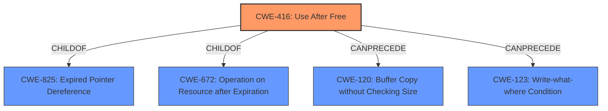

# Enhanced Analysis for CVE-2021-37987

# Summary
| CWE ID | CWE Name | Confidence | CWE Abstraction Level | CWE Vulnerability Mapping Label | CWE-Vulnerability Mapping Notes |
|---|---|---|---|---|---|
| CWE-416 | Use After Free | 1.0 | Variant | Allowed | Primary CWE |

## Evidence and Confidence

*   **Confidence Score:** 1.0
*   **Evidence Strength:** HIGH

## Relationship Analysis
The primary CWE is CWE-416, which is a variant. CWE-416 is a child of CWE-825 (Expired Pointer Dereference) and CWE-672 (Operation on Resource after Expiration). It can precede CWE-120 (Buffer Copy without Checking Size) and CWE-123 (Write-what-where Condition).



## Vulnerability Chain
The vulnerability chain starts with a **use after free** (CWE-416) in Network APIs, leading to potential heap corruption and potential for arbitrary code execution, denial of service, or information disclosure.

## Summary of Analysis
The vulnerability description clearly states a "**use after free**" condition in Network APIs of Google Chrome. The CVE Reference Links Content Summary reiterates this root cause. The primary CWE match from similar CVE descriptions is CWE-416. The Retriever Results also lists CWE-416 as the top combined result.

CWE-416 (Use After Free) is a Variant level CWE, which is a preferred level of abstraction. The description of CWE-416, "The product reuses or references memory after it has been freed," directly matches the vulnerability description.

Therefore, CWE-416 is the most appropriate CWE for this vulnerability.

Other CWEs considered but not used:

*   CWE-366 (Race Condition within a Thread): While race conditions can sometimes lead to use-after-free vulnerabilities, there's no explicit mention of a race condition in the provided description.
*   CWE-843 (Access of Resource Using Incompatible Type ('Type Confusion')): Type confusion is not mentioned in the vulnerability description.
*   CWE-122 (Heap-based Buffer Overflow): The vulnerability description indicates heap corruption, but doesn't specifically mention a buffer overflow. While a use-after-free could lead to a buffer overflow, it is not the direct root cause.
*   CWE-415 (Double Free): Double free is not mentioned in the vulnerability description.
*   CWE-113 (Improper Neutralization of CRLF Sequences in HTTP Headers ('HTTP Request/Response Splitting')): This CWE is related to HTTP header manipulation, and is not relevant to the described vulnerability.
*   CWE-123 (Write-what-where Condition): While a use-after-free could lead to an arbitrary write, it is not the direct root cause.
*   CWE-362 (Concurrent Execution using Shared Resource with Improper Synchronization ('Race Condition')): Similar to CWE-366, there's no explicit mention of a race condition.
*   CWE-911 (Improper Update of Reference Count): Reference count issues are not mentioned.
*   CWE-404 (Improper Resource Shutdown or Release): The issue is not about improper shutdown, but rather using memory after it's been freed.


## CWE Relationship Analysis

Current CWEs represent these abstraction levels: .


### Vulnerability Chain Analysis

**Chain starting from CWE-415:**
- 415 (Double Free) - ROOT


**Chain starting from CWE-113:**
- 113 (Improper Neutralization of CRLF Sequences in HTTP Headers ('HTTP Request/Response Splitting')) - ROOT


### CWE Relationship Diagram

```mermaid
graph TD
    classDef primary fill:#f96,stroke:#333,stroke-width:2px
    classDef secondary fill:#69f,stroke:#333
    classDef tertiary fill:#9e9,stroke:#333
```